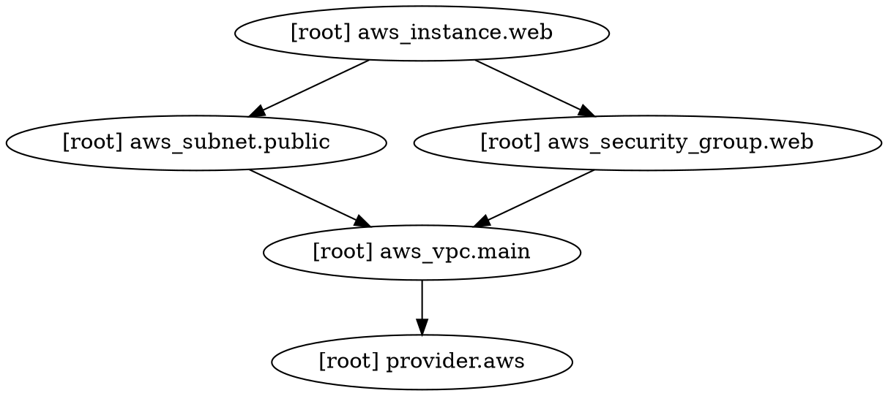

# Module 19: Expert-Level Topics

## Level: SUPER EXPERT | Estimated Time: 5 hours

---

## 19.1 The `removed` Block (Terraform 1.7+)

Remove a resource from Terraform management WITHOUT destroying it in the cloud:

```hcl
# Previously managed this resource:
# resource "aws_instance" "legacy" { ... }

# Now tell Terraform to forget it (keeps the real instance running)
removed {
  from = aws_instance.legacy

  lifecycle {
    destroy = false  # Don't destroy the real resource
  }
}
```

```bash
terraform plan
```

**Output:**
```
  # aws_instance.legacy will be removed from state (but not destroyed)
    resource "aws_instance" "legacy" {
        id            = "i-0abc123"
        instance_type = "t2.micro"
    }

Plan: 0 to add, 0 to change, 0 to destroy.
(1 resource will be removed from state)
```

### removed vs state rm

```
┌──────────────────────┬──────────────────────────────────────┐
│  removed block       │  terraform state rm                  │
├──────────────────────┼──────────────────────────────────────┤
│ Declarative (in code)│ Imperative (CLI command)             │
│ Tracked in Git       │ Not tracked                          │
│ Team-friendly        │ Only affects whoever runs it         │
│ Reviewed in PR       │ No review process                    │
│ Terraform 1.7+       │ All versions                         │
└──────────────────────┴──────────────────────────────────────┘
```

---

## 19.2 The `optional()` Type Constraint

Make object attributes optional with default values:

```hcl
variable "server_config" {
  type = object({
    name          = string
    instance_type = optional(string, "t3.micro")    # Optional with default
    monitoring    = optional(bool, false)             # Optional with default
    disk_size     = optional(number)                  # Optional, defaults to null
    tags          = optional(map(string), {})         # Optional with default
  })
}
```

```hcl
# All of these are valid:

# Minimal — only required fields
server_config = {
  name = "web-server"
}
# Result: { name="web-server", instance_type="t3.micro", monitoring=false, disk_size=null, tags={} }

# Partial override
server_config = {
  name          = "web-server"
  instance_type = "t3.large"
  monitoring    = true
}

# Full specification
server_config = {
  name          = "web-server"
  instance_type = "t3.large"
  monitoring    = true
  disk_size     = 100
  tags          = { Team = "platform" }
}
```

### Nested Optional Objects

```hcl
variable "app_config" {
  type = object({
    name = string
    database = optional(object({
      engine         = optional(string, "mysql")
      instance_class = optional(string, "db.t3.micro")
      multi_az       = optional(bool, false)
    }), {})  # Entire database block is optional
    cache = optional(object({
      engine    = optional(string, "redis")
      node_type = optional(string, "cache.t3.micro")
    }))  # null if not provided
  })
}
```

---

## 19.3 terraform init — All Flags

```bash
# Standard init
terraform init

# Upgrade providers to latest within constraints
terraform init -upgrade

# Reconfigure backend (discard existing state config)
terraform init -reconfigure

# Migrate state to a new backend
terraform init -migrate-state

# Use a specific backend config file
terraform init -backend-config=backend-prod.hcl

# Disable backend entirely (local only)
terraform init -backend=false

# Download modules only (skip backend)
terraform init -get=true -backend=false

# Specify plugin directory (air-gapped environments)
terraform init -plugin-dir=/path/to/plugins
```

### When to Use Each Flag

```
┌─────────────────────┬──────────────────────────────────────────────────┐
│ Flag                │ When to Use                                      │
├─────────────────────┼──────────────────────────────────────────────────┤
│ -upgrade            │ Provider/module version changed in config        │
│ -reconfigure        │ Switching backends, don't want to migrate state  │
│ -migrate-state      │ Switching backends, want to keep existing state  │
│ -backend-config     │ Different backend per environment                │
│ -backend=false      │ Testing modules without a backend                │
│ -plugin-dir         │ Air-gapped / offline environments                │
└─────────────────────┴──────────────────────────────────────────────────┘
```

### -reconfigure vs -migrate-state

```bash
# Scenario: Changing from S3 backend in us-east-1 to us-west-2

# Option A: Keep state → migrate
terraform init -migrate-state
# Copies state from old backend to new backend

# Option B: Start fresh → reconfigure
terraform init -reconfigure
# Ignores old state, starts with empty state in new backend
# ⚠️ Old state still exists in old backend but is no longer used
```

---

## 19.4 terraform show — Complete Reference

```bash
# Show current state (human-readable)
terraform show

# Show current state as JSON
terraform show -json

# Show a saved plan file
terraform show tfplan

# Show a saved plan as JSON (for CI/CD processing)
terraform show -json tfplan > plan.json

# Pipe to jq for specific info
terraform show -json | jq '.values.root_module.resources[] | {type, name, values: .values.tags}'
```

**Use cases:**
```bash
# Extract all resource IDs
terraform show -json | jq -r '.values.root_module.resources[].values.id'

# Find all public IPs
terraform show -json | jq -r '.values.root_module.resources[] | select(.type=="aws_instance") | .values.public_ip'

# Count resources by type
terraform show -json | jq '[.values.root_module.resources[].type] | group_by(.) | map({type: .[0], count: length})'
```

---

## 19.5 terraform graph — Dependency Visualization

```bash
# Generate DOT format dependency graph
terraform graph
```

**Output:**


```bash
# Generate a PNG image (requires graphviz)
sudo apt install -y graphviz
terraform graph | dot -Tpng > graph.png

# Generate SVG (better for large graphs)
terraform graph | dot -Tsvg > graph.svg

# Show only plan graph (what will change)
terraform graph -type=plan

# Show destroy graph
terraform graph -type=plan-destroy
```

---

## 19.6 Resource Targeting (-target)

Apply or destroy specific resources without affecting others:

```bash
# Plan for a single resource
terraform plan -target=aws_instance.web

# Apply only specific resources
terraform apply -target=aws_instance.web -target=aws_security_group.web

# Destroy only specific resources
terraform destroy -target=aws_s3_bucket.logs
```

**Output:**
```
Note: You are using the -target option. This may cause your state to
become inconsistent. Use with caution.

  # aws_instance.web will be created
  + resource "aws_instance" "web" { ... }

Plan: 1 to add, 0 to change, 0 to destroy.
```

### When to Use -target

```
✅ Appropriate:
  - Debugging a single resource that keeps failing
  - Applying a critical fix without touching other resources
  - Breaking a circular dependency during initial setup
  - Recovering from a partial apply failure

❌ Not appropriate:
  - Regular workflow (use it as exception, not rule)
  - Skipping resources you're "not ready" to apply
  - Avoiding plan review of other resources
```

### -target with Modules

```bash
# Target an entire module
terraform apply -target=module.networking

# Target a specific resource inside a module
terraform apply -target=module.networking.aws_vpc.main

# Target a for_each instance
terraform apply -target='aws_instance.web["app"]'

# Target a count instance
terraform apply -target='aws_instance.web[0]'
```

---

## 19.7 Ephemeral Resources (Terraform 1.10+)

Ephemeral resources exist only during the plan/apply cycle and are never stored in state:

```hcl
# Read a secret that should never be persisted in state
ephemeral "aws_secretsmanager_secret_version" "db_password" {
  secret_id = "prod/database/password"
}

resource "aws_rds_instance" "main" {
  engine         = "mysql"
  instance_class = "db.t3.micro"
  password       = ephemeral.aws_secretsmanager_secret_version.db_password.secret_string
}
```

**Why ephemeral?**
- Secrets are never written to state file
- Reduces blast radius if state is compromised
- Values are re-read on every plan/apply

---

## 19.8 Provider-Defined Functions (Terraform 1.8+)

Providers can now export custom functions:

```hcl
terraform {
  required_providers {
    aws = {
      source  = "hashicorp/aws"
      version = ">= 5.40.0"
    }
  }
}

# Use provider functions with the provider:: prefix
locals {
  decoded_arn = provider::aws::arn_parse("arn:aws:iam::123456789012:role/MyRole")
  # → { partition = "aws", service = "iam", region = "", account_id = "123456789012", resource = "role/MyRole" }

  built_arn = provider::aws::arn_build({
    partition  = "aws"
    service    = "s3"
    region     = ""
    account_id = ""
    resource   = "my-bucket/*"
  })
  # → "arn:aws:s3:::my-bucket/*"
}
```

---

## 19.9 terraform test — Mocks and Advanced Testing

### Mock Providers (Terraform 1.7+)

Test without making real API calls:

```hcl
# tests/with_mocks.tftest.hcl

mock_provider "aws" {
  # All AWS resources return mock data instead of calling real APIs
}

run "test_vpc_creation" {
  command = plan

  assert {
    condition     = aws_vpc.main.cidr_block == "10.0.0.0/16"
    error_message = "VPC CIDR should be 10.0.0.0/16"
  }
}
```

### Mock Provider with Override Data

```hcl
mock_provider "aws" {
  mock_data "aws_ami" {
    defaults = {
      id           = "ami-mock12345"
      architecture = "x86_64"
      name         = "mock-ami"
    }
  }

  mock_resource "aws_instance" {
    defaults = {
      public_ip  = "1.2.3.4"
      private_ip = "10.0.1.100"
    }
  }
}

run "test_instance_outputs" {
  command = plan

  assert {
    condition     = output.instance_public_ip == "1.2.3.4"
    error_message = "Should use mock IP"
  }
}
```

### Override Files in Tests

```hcl
# tests/overrides.tftest.hcl

override_resource {
  target = aws_instance.web
  values = {
    id        = "i-mock123"
    public_ip = "10.0.0.1"
  }
}

run "test_with_overrides" {
  command = plan

  assert {
    condition     = aws_instance.web.id == "i-mock123"
    error_message = "Should use override value"
  }
}
```

### Test Variables and Providers

```hcl
# tests/multi_env.tftest.hcl

variables {
  environment = "test"
  vpc_cidr    = "10.99.0.0/16"
}

provider "aws" {
  region = "us-west-2"  # Use a different region for tests
}

run "test_in_west_region" {
  command = plan

  assert {
    condition     = aws_vpc.main.cidr_block == "10.99.0.0/16"
    error_message = "Should use test CIDR"
  }
}
```

---

## 19.10 check Blocks (Continuous Validation)

Check blocks run assertions on every plan/apply but don't block operations:

```hcl
check "health_check" {
  data "http" "api" {
    url = "https://${aws_lb.main.dns_name}/health"
  }

  assert {
    condition     = data.http.api.status_code == 200
    error_message = "API health check failed!"
  }
}

check "certificate_expiry" {
  data "aws_acm_certificate" "main" {
    domain = "example.com"
  }

  assert {
    condition     = timecmp(data.aws_acm_certificate.main.not_after, timeadd(timestamp(), "720h")) > 0
    error_message = "SSL certificate expires within 30 days!"
  }
}
```

**Output when check fails:**
```
Warning: Check block assertion failed

  on main.tf line 8, in check "certificate_expiry":
   8:     condition = timecmp(...)

SSL certificate expires within 30 days!
```

> Checks produce warnings, not errors. They don't block apply.

---

## 19.11 Provider Mirrors and Air-Gapped Environments

### Create a Local Mirror

```bash
# Download providers to a local directory
terraform providers mirror /path/to/mirror
```

### Use the Mirror

```hcl
# ~/.terraformrc
provider_installation {
  filesystem_mirror {
    path    = "/path/to/mirror"
    include = ["registry.terraform.io/*/*"]
  }
  direct {
    exclude = ["registry.terraform.io/*/*"]
  }
}
```

### Network Mirror (HTTP Server)

```hcl
provider_installation {
  network_mirror {
    url = "https://terraform-mirror.internal.company.com/"
  }
}
```

---

## 19.12 Sensitive Data Handling — Complete Guide

### Variable-Level Sensitivity

```hcl
variable "db_password" {
  type      = string
  sensitive = true
}
```

**Plan output:**
```
  + resource "aws_rds_instance" "main" {
      + password = (sensitive value)
    }
```

### Output-Level Sensitivity

```hcl
output "db_password" {
  value     = aws_rds_instance.main.password
  sensitive = true
}
```

```bash
# Sensitive outputs are hidden
terraform output db_password
# → (sensitive)

# Force display
terraform output -raw db_password
# → MySecretPassword123
```

### Marking Values Sensitive in Locals

```hcl
locals {
  db_connection_string = sensitive("mysql://admin:${var.db_password}@${aws_rds_instance.main.endpoint}/mydb")
}
```

### nonsensitive() — Explicitly Unwrap

```hcl
# When you know a derived value is safe to show
output "db_host" {
  value = nonsensitive(split(":", aws_rds_instance.main.endpoint)[0])
  # Only the hostname, not the password
}
```

---

## 19.13 Advanced State Operations

### terraform state pull — Inspect Remote State

```bash
# Download remote state as JSON
terraform state pull | jq '.'

# Count resources
terraform state pull | jq '.resources | length'

# Find specific resource
terraform state pull | jq '.resources[] | select(.type == "aws_instance") | .instances[].attributes.id'

# Check state serial number
terraform state pull | jq '.serial'
```

### terraform state push — Disaster Recovery

```bash
# Upload a local state file to remote backend
terraform state push terraform.tfstate

# Force push (override serial check — DANGEROUS)
terraform state push -force recovered_state.tfstate
```

### terraform state replace-provider

```bash
# When migrating from community to official provider
terraform state replace-provider \
  "registry.terraform.io/hashicorp/aws" \
  "registry.terraform.io/custom/aws"
```

---

## 19.14 Advanced CLI Commands Reference

### Every terraform Command

```bash
# Core Workflow
terraform init              # Initialize project
terraform validate          # Check syntax
terraform plan              # Preview changes
terraform apply             # Execute changes
terraform destroy           # Tear down everything

# Inspection
terraform show              # Show state or plan
terraform output            # Show outputs
terraform graph             # Dependency graph
terraform providers         # List providers
terraform version           # Show version
terraform console           # Interactive REPL

# State Management
terraform state list        # List resources
terraform state show        # Show resource details
terraform state mv          # Move/rename resource
terraform state rm          # Remove from state
terraform state pull        # Download remote state
terraform state push        # Upload state
terraform state replace-provider  # Change provider

# Import
terraform import            # Import existing resource
terraform plan -generate-config-out=file.tf  # Generate config for imports

# Workspace
terraform workspace list    # List workspaces
terraform workspace new     # Create workspace
terraform workspace select  # Switch workspace
terraform workspace delete  # Delete workspace
terraform workspace show    # Show current

# Formatting & Testing
terraform fmt               # Format code
terraform test              # Run tests

# Recovery
terraform force-unlock      # Release stuck lock
terraform apply -replace    # Force recreate resource

# Advanced
terraform refresh           # Update state (deprecated, use apply -refresh-only)
terraform taint             # Mark for recreation (deprecated, use apply -replace)
terraform untaint           # Unmark (deprecated)
```

### Useful Flag Combinations

```bash
# Save plan and apply it (production workflow)
terraform plan -out=tfplan && terraform apply tfplan

# Plan with specific variables
terraform plan -var="env=prod" -var-file=prod.tfvars

# Apply without confirmation (CI/CD only)
terraform apply -auto-approve

# Destroy a specific resource
terraform destroy -target=aws_instance.web

# Plan showing only changes (exit code 2 = changes)
terraform plan -detailed-exitcode

# Fast plan (skip refresh)
terraform plan -refresh=false

# Control parallelism
terraform apply -parallelism=20

# Replace a misbehaving resource
terraform apply -replace=aws_instance.web

# Lock timeout (wait for lock instead of failing)
terraform plan -lock-timeout=5m
```

---

## 19.15 Terraform Internals

### How terraform plan Works Internally

```
1. Load configuration (.tf files)
2. Load state file
3. Refresh: Query cloud APIs for each resource in state
4. Build dependency graph (DAG - Directed Acyclic Graph)
5. Compare: desired state (config) vs actual state (refreshed)
6. Generate execution plan (list of actions)
7. Display plan to user
```

### How terraform apply Works Internally

```
1. Acquire state lock
2. Read saved plan (or generate new one)
3. Walk the dependency graph in topological order
4. For each resource:
   a. Call provider's Create/Update/Delete function
   b. Wait for completion
   c. Read back attributes
   d. Update state file
5. Write final state
6. Release state lock
```

### Dependency Graph (DAG)

```bash
terraform graph -type=plan | dot -Tpng > plan-graph.png
```

```
                    ┌──────────┐
                    │ provider │
                    │   aws    │
                    └────┬─────┘
                         │
                    ┌────▼─────┐
                    │ aws_vpc  │
                    │  main    │
                    └────┬─────┘
                    ┌────┴─────┐
               ┌────▼────┐ ┌──▼──────────┐
               │ subnet  │ │ security    │
               │ public  │ │ group web   │
               └────┬────┘ └──┬──────────┘
                    └────┬────┘
                    ┌────▼─────┐
                    │ instance │
                    │   web    │
                    └──────────┘

Resources at the same level can be created in parallel.
Resources with dependencies must be created sequentially.
```

### Parallelism

```bash
# Default: 10 concurrent operations
terraform apply

# Increase for large infrastructure
terraform apply -parallelism=30

# Decrease to avoid API rate limits
terraform apply -parallelism=2

# Set via environment variable
export TF_CLI_ARGS_apply="-parallelism=20"
```

---

## 19.16 Environment Variables Reference

```bash
# Authentication
export AWS_ACCESS_KEY_ID="..."
export AWS_SECRET_ACCESS_KEY="..."
export AWS_DEFAULT_REGION="us-east-1"
export AWS_PROFILE="my-profile"

# Terraform Variables
export TF_VAR_environment="prod"
export TF_VAR_instance_type="t3.large"

# Terraform Behavior
export TF_LOG=DEBUG                    # Logging level
export TF_LOG_PATH="terraform.log"    # Log to file
export TF_INPUT=0                     # Disable interactive prompts
export TF_IN_AUTOMATION=1             # CI/CD mode (less verbose)

# CLI Default Arguments
export TF_CLI_ARGS="-no-color"                    # All commands
export TF_CLI_ARGS_plan="-parallelism=20"         # Only plan
export TF_CLI_ARGS_apply="-auto-approve"          # Only apply (CI/CD)

# Plugin Cache (avoid re-downloading providers)
export TF_PLUGIN_CACHE_DIR="$HOME/.terraform.d/plugin-cache"
mkdir -p "$TF_PLUGIN_CACHE_DIR"

# Data Directory (override .terraform location)
export TF_DATA_DIR="/custom/path/.terraform"
```

---

## 19.17 Terraform Cloud / HCP Terraform Advanced

### Workspace Variables via CLI

```bash
# Set a variable in Terraform Cloud workspace
terraform cloud variable set \
  -workspace=my-workspace \
  -key=environment \
  -value=prod

# Set a sensitive variable
terraform cloud variable set \
  -workspace=my-workspace \
  -key=db_password \
  -value=secret123 \
  -sensitive
```

### Run Triggers (Workspace Chaining)

```
networking workspace → triggers → compute workspace → triggers → database workspace
```

When networking applies successfully, compute automatically plans.

### Cost Estimation

Terraform Cloud shows estimated monthly cost changes in the plan:

```
Cost Estimation:

  + aws_instance.web
    +$8.47/mo (+$0.0116/hr)

  + aws_rds_instance.main
    +$24.82/mo (+$0.034/hr)

Monthly cost will increase by $33.29
```

---

## 19.18 Performance Optimization

### Large State Files

```bash
# Check state size
terraform state pull | wc -c
# If > 10MB, consider splitting

# List resource count
terraform state list | wc -l
# If > 500, definitely split
```

### Splitting Strategies

```
# Before: 1 state with 800 resources
monolith/
└── main.tf

# After: 4 states with ~200 resources each
networking/    → VPC, subnets, routes, NAT
compute/       → EC2, ALB, ASG, Launch Templates
database/      → RDS, ElastiCache, DynamoDB
monitoring/    → CloudWatch, SNS, Lambda alerts
```

### Plugin Cache

```bash
# Avoid downloading providers for every project
export TF_PLUGIN_CACHE_DIR="$HOME/.terraform.d/plugin-cache"
mkdir -p "$TF_PLUGIN_CACHE_DIR"

# Now terraform init uses cached providers
terraform init  # Much faster on subsequent projects
```

---

## 19.19 Interview Answer Framework

When explaining Terraform concepts in interviews, use this five-part structure for clear, impactful answers:

```
┌─────────────────────────────────────────────────────────────┐
│              Interview Answer Structure                      │
├──────────┬──────────────────────────────────────────────────┤
│ 1. WHAT  │ Define the concept in one sentence               │
│ 2. WHY   │ Why does it exist? What problem does it solve?   │
│ 3. HOW   │ Show usage with a brief example or command       │
│ 4. RISKS │ What can go wrong? Failure modes and edge cases  │
│ 5. TEAMS │ How do you use it safely in a team/production?   │
└──────────┴──────────────────────────────────────────────────┘
```

### Example: "Explain Terraform State"

| Part | Answer |
|------|--------|
| **What** | A JSON file that maps your `.tf` configuration to real cloud resources (IDs, attributes, metadata) |
| **Why** | Enables diff-based planning, drift detection, and dependency tracking — without it, Terraform can't know what exists |
| **How** | Created automatically on `terraform apply`, stored locally or in a remote backend like S3 |
| **Risks** | State corruption, stale state from manual changes, secrets stored in plaintext, lock contention in teams |
| **Teams** | Remote backend (S3 + DynamoDB locking), least-privilege IAM for state bucket, encryption at rest, `terraform plan -refresh-only` for drift checks |

### Example: "Explain terraform import"

| Part | Answer |
|------|--------|
| **What** | Brings an existing cloud resource under Terraform management by adding it to state |
| **Why** | When infrastructure was created manually or by another tool and you want Terraform to manage it going forward |
| **How** | `terraform import aws_instance.web i-0123456789abcdef0` — or use the declarative `import` block (Terraform 1.5+) |
| **Risks** | Import only writes state — you must write matching `.tf` config manually, otherwise the next plan may propose destructive changes |
| **Teams** | Always run `terraform plan` immediately after import to verify the config matches, commit both the config and state changes together |

### Example: "Explain Drift Detection"

| Part | Answer |
|------|--------|
| **What** | When real infrastructure differs from what Terraform expects (state + config) |
| **Why** | Manual console changes, other tools, or external processes modify resources outside Terraform |
| **How** | `terraform plan` refreshes state and shows differences; `terraform apply` corrects drift back to code |
| **Risks** | Terraform reverts manual changes — if someone opened a security group for debugging, the next apply closes it. Data resources (RDS, DynamoDB) may be replaced if incompatible changes were made |
| **Teams** | Automated drift detection in CI (scheduled `terraform plan`), alerts on drift, policy preventing console changes to Terraform-managed resources |

### Common Interview Topics and Where to Find Them

```
┌──────────────────────────────────┬─────────────────────────────────┐
│ Interview Topic                  │ Course Module                   │
├──────────────────────────────────┼─────────────────────────────────┤
│ What is IaC / Terraform?         │ Module 01                       │
│ Terraform vs Ansible             │ Module 01                       │
│ HCL syntax, .tf file merging     │ Module 02                       │
│ Provider configuration           │ Module 04                       │
│ count vs for_each                │ Module 05                       │
│ Lifecycle rules                  │ Module 05                       │
│ Variable types and precedence    │ Module 06                       │
│ State management                 │ Module 07                       │
│ Drift detection                  │ Module 07                       │
│ terraform import                 │ Module 08                       │
│ import vs refresh                │ Module 08                       │
│ Remote backends / S3 + DynamoDB  │ Module 09                       │
│ Modules and module sources       │ Module 10                       │
│ Workspaces                       │ Module 11                       │
│ Provisioners                     │ Module 12                       │
│ Dynamic blocks                   │ Module 12                       │
│ Functions and expressions        │ Module 13                       │
│ Testing (terraform test)         │ Module 15                       │
│ CI/CD pipelines                  │ Module 16                       │
│ Debugging / TF_LOG               │ Module 18                       │
│ terraform graph / internals      │ Module 19                       │
│ Ephemeral resources              │ Module 19                       │
└──────────────────────────────────┴─────────────────────────────────┘
```

---

## 19.20 Zero-Downtime Deployments

Terraform does not natively orchestrate zero-downtime deployments, but several patterns minimize or eliminate downtime during infrastructure changes.

### Strategy 1: create_before_destroy

The most common approach — create the replacement resource before destroying the old one:

```hcl
resource "aws_instance" "web" {
  ami           = var.ami_id
  instance_type = "t3.micro"

  lifecycle {
    create_before_destroy = true
  }
}
```

**How it works:**
1. Terraform creates the new instance with the updated AMI
2. Once the new instance is healthy, Terraform destroys the old one
3. If the new instance fails to create, the old one remains untouched

### Strategy 2: Blue-Green with Load Balancer

Use two Auto Scaling Groups behind a load balancer:

```hcl
resource "aws_autoscaling_group" "blue" {
  name                = "blue-asg"
  desired_capacity    = var.blue_active ? 2 : 0
  max_size            = 5
  min_size            = 0
  target_group_arns   = [aws_lb_target_group.main.arn]
  launch_template {
    id      = aws_launch_template.blue.id
    version = "$Latest"
  }
}

resource "aws_autoscaling_group" "green" {
  name                = "green-asg"
  desired_capacity    = var.blue_active ? 0 : 2
  max_size            = 5
  min_size            = 0
  target_group_arns   = [aws_lb_target_group.main.arn]
  launch_template {
    id      = aws_launch_template.green.id
    version = "$Latest"
  }
}
```

**Workflow:**
1. Deploy new version to green ASG (set `blue_active = false`)
2. ALB health checks validate green instances
3. Traffic shifts to green
4. Blue ASG scales to 0

### Strategy 3: Rolling Updates via ASG

Let AWS handle rolling updates through the ASG's instance refresh:

```hcl
resource "aws_autoscaling_group" "web" {
  # ... other config ...

  instance_refresh {
    strategy = "Rolling"
    preferences {
      min_healthy_percentage = 50
    }
  }
}
```

**Sample `terraform apply` output:**

```
aws_autoscaling_group.web: Modifying... [id=web-asg]
aws_autoscaling_group.web: Still modifying... [id=web-asg, 30s elapsed]
aws_autoscaling_group.web: Modifications complete after 2m15s [id=web-asg]

Apply complete! Resources: 0 added, 1 changed, 0 destroyed.
```

### Real-Life Use Case

A media streaming service uses blue-green ASGs behind an ALB. When deploying a new application version, they update the green launch template, scale green to 2 instances, run smoke tests against the green target group, then flip the ALB listener to green. If issues arise, they flip back to blue in under 30 seconds.

---

## 19.21 Rollback Strategies in Terraform

Terraform has no built-in rollback command. Here are the practical approaches when something goes wrong.

### Strategy 1: Revert Code and Reapply

The safest and most common approach:

```bash
# Find the last known good commit
git log --oneline -10

# Revert to it
git checkout <commit-id> -- .

# Apply the previous configuration
terraform plan    # Review what will change
terraform apply   # Restore previous state
```

### Strategy 2: Restore State Backup

If the state file is corrupted or lost:

```bash
# Terraform automatically creates backups
ls -la terraform.tfstate.backup

# Restore from backup
cp terraform.tfstate.backup terraform.tfstate

# Verify
terraform plan
```

For remote backends with versioning (S3):

```bash
# List state file versions in S3
aws s3api list-object-versions \
  --bucket my-terraform-state \
  --prefix terraform.tfstate

# Download a previous version
aws s3api get-object \
  --bucket my-terraform-state \
  --key terraform.tfstate \
  --version-id "abc123" \
  terraform.tfstate.restored

# Push restored state
terraform state push terraform.tfstate.restored
```

### Strategy 3: Targeted Destroy and Recreate

When only specific resources are broken:

```bash
# Destroy only the problematic resource
terraform destroy -target=aws_instance.web

# Recreate it
terraform apply -target=aws_instance.web
```

### Strategy 4: Manual State Surgery

When Terraform state is out of sync with reality:

```bash
# Remove a resource from state (keeps the real resource)
terraform state rm aws_instance.broken

# Re-import it with correct configuration
terraform import aws_instance.broken i-0abc123def456

# Verify alignment
terraform plan
```

### What NOT to Do

| Anti-Pattern | Why It's Dangerous |
|---|---|
| Manually editing `terraform.tfstate` | Can corrupt state, lose resource tracking |
| Running `terraform apply` without `plan` first | May destroy resources unexpectedly |
| Deleting state and starting fresh | Orphans all existing resources |
| Using `-target` as a regular workflow | Creates state drift between resources |

### Real-Life Use Case

A team deploys a new RDS instance class change that causes connection timeouts. They immediately run `git revert HEAD && terraform apply` to restore the previous instance class. The state file tracks the change, and Terraform modifies the RDS instance back to the original class. Total recovery time: ~10 minutes (mostly waiting for RDS modification).

---

## 19.22 Terraform Limitations

Understanding Terraform's limitations helps you choose the right tool for each job and avoid common pitfalls.

### 1. No Native Rollback

Terraform does not have a `terraform rollback` command. Recovery requires reverting code in version control and reapplying, or restoring state backups manually.

### 2. State File Complexity

The state file is a single point of truth that must be carefully managed:

```
┌─────────────────────────────────────────────────────┐
│              State File Risks                       │
├─────────────────────────────────────────────────────┤
│ Corruption       → Resources become unmanageable    │
│ Conflicts        → Concurrent modifications clash   │
│ Sensitive data   → Secrets stored in plain text     │
│ Size growth      → Large states slow plan/apply     │
└─────────────────────────────────────────────────────┘
```

**Mitigation:** Use remote backends with locking (S3 + DynamoDB), enable encryption, and split large states into smaller ones.

### 3. Declarative-Only — No Procedural Logic

Terraform cannot express complex procedural workflows:

```hcl
# You CANNOT do this in Terraform:
# if database_migration_succeeded:
#     deploy_new_app_version()
# else:
#     rollback()
```

**Mitigation:** Use CI/CD pipelines (GitHub Actions, GitLab CI) to orchestrate multi-step workflows around Terraform.

### 4. Limited Provider Support for Niche Services

Not every API has a Terraform provider. New cloud services may take months to get provider support.

**Mitigation:** Use the `external` data source or `null_resource` with `local-exec` to call APIs directly:

```hcl
data "external" "custom_api" {
  program = ["python3", "${path.module}/scripts/call_api.py"]

  query = {
    endpoint = "https://api.example.com/resource"
  }
}
```

### 5. Slow Plans with Large Infrastructure

As infrastructure grows, `terraform plan` can take minutes:

```bash
# A large state file causes slow operations
$ time terraform plan
# real    4m32s   ← Too slow for rapid iteration
```

**Mitigation:**
- Split infrastructure into smaller state files (per service or per layer)
- Use `-target` for focused operations during development
- Increase parallelism: `terraform apply -parallelism=20`

### 6. No Built-in Secret Rotation

Terraform can set initial secrets but cannot rotate them automatically.

**Mitigation:** Use AWS Secrets Manager, HashiCorp Vault, or Azure Key Vault for secret lifecycle management. Terraform provisions the secret store; the store handles rotation.

### 7. Drift Between Applies

If someone modifies infrastructure outside Terraform (via console or CLI), the state file becomes stale:

```bash
# Detect drift
terraform plan

# Output shows unexpected changes:
# ~ aws_instance.web
#     instance_type: "t3.micro" → "t3.large"  # Someone changed this manually!
```

**Mitigation:** Run `terraform plan` on a schedule (e.g., daily via CI/CD) to detect drift early. Use `check` blocks (Terraform 1.5+) for continuous validation.

### Comparison: When to Use Terraform vs Other Tools

| Scenario | Best Tool |
|---|---|
| Provision cloud infrastructure | Terraform |
| Configure software on servers | Ansible, Chef, Puppet |
| Manage Kubernetes manifests | Helm, Kustomize |
| Secret rotation | Vault, AWS Secrets Manager |
| Complex deployment orchestration | CI/CD pipelines |
| One-off scripts | Bash, Python |

---

## Exercises

### Exercise 19.1: State Recovery
1. Deploy a VPC + EC2 instance
2. Manually delete `terraform.tfstate`
3. Recover using `terraform import` for each resource
4. Verify with `terraform plan` (should show no changes)

### Exercise 19.2: Mock Testing
1. Write a module that creates an EC2 instance
2. Write a test with `mock_provider "aws"` that validates the config without real API calls
3. Run `terraform test`

### Exercise 19.3: removed Block
1. Deploy an S3 bucket with Terraform
2. Add a `removed` block to stop managing it
3. Run `terraform apply` — verify the bucket still exists in AWS
4. Verify `terraform state list` no longer shows it

### Exercise 19.4: optional() Variables
1. Create a module with an `object` variable using `optional()` for most fields
2. Call the module with minimal input
3. Call it again with full input
4. Verify both work correctly

### Exercise 19.5: Dependency Graph
1. Deploy a multi-resource configuration
2. Run `terraform graph | dot -Tpng > graph.png`
3. Study the dependency order
4. Add an explicit `depends_on` and regenerate — observe the change

---

## Key Takeaways

- `removed` blocks are the declarative way to stop managing resources
- `optional()` makes complex variable types user-friendly
- `terraform init -reconfigure` vs `-migrate-state` — know when to use each
- Ephemeral resources keep secrets out of state
- Provider functions extend HCL with provider-specific logic
- Mock providers enable fast, safe testing without cloud access
- `check` blocks provide continuous validation without blocking applies
- `-target` is for emergencies, not regular workflow
- Plugin cache and parallelism settings improve performance
- Environment variables control Terraform behavior in CI/CD
- Zero-downtime deployments require `create_before_destroy` or blue-green patterns
- Rollback in Terraform means reverting code and reapplying — there is no `terraform rollback`
- Terraform's limitations (no rollback, state complexity, no procedural logic) are mitigated by CI/CD pipelines and complementary tools

---

## Official Documentation Links

| Topic | Link |
|-------|------|
| **Language Features** | |
| `removed` Block | [developer.hashicorp.com/terraform/language/resources/syntax#removing-resources](https://developer.hashicorp.com/terraform/language/resources/syntax#removing-resources) |
| `optional()` Type Constraint | [developer.hashicorp.com/terraform/language/expressions/type-constraints#optional](https://developer.hashicorp.com/terraform/language/expressions/type-constraints#optional) |
| Ephemeral Resources | [developer.hashicorp.com/terraform/language/resources/ephemeral](https://developer.hashicorp.com/terraform/language/resources/ephemeral) |
| Provider-Defined Functions | [developer.hashicorp.com/terraform/language/expressions/function-calls#provider-defined-functions](https://developer.hashicorp.com/terraform/language/expressions/function-calls#provider-defined-functions) |
| Check Blocks | [developer.hashicorp.com/terraform/language/checks](https://developer.hashicorp.com/terraform/language/checks) |
| Preconditions / Postconditions | [developer.hashicorp.com/terraform/language/expressions/custom-conditions](https://developer.hashicorp.com/terraform/language/expressions/custom-conditions) |
| **CLI Commands** | |
| `terraform init` — All Flags | [developer.hashicorp.com/terraform/cli/commands/init](https://developer.hashicorp.com/terraform/cli/commands/init) |
| `terraform show` | [developer.hashicorp.com/terraform/cli/commands/show](https://developer.hashicorp.com/terraform/cli/commands/show) |
| `terraform graph` | [developer.hashicorp.com/terraform/cli/commands/graph](https://developer.hashicorp.com/terraform/cli/commands/graph) |
| `terraform apply -target` | [developer.hashicorp.com/terraform/cli/commands/apply#target](https://developer.hashicorp.com/terraform/cli/commands/apply#target) |
| `terraform apply -replace` | [developer.hashicorp.com/terraform/cli/commands/apply#replace](https://developer.hashicorp.com/terraform/cli/commands/apply#replace) |
| `terraform apply -parallelism` | [developer.hashicorp.com/terraform/cli/commands/apply#parallelism](https://developer.hashicorp.com/terraform/cli/commands/apply#parallelism) |
| `terraform providers mirror` | [developer.hashicorp.com/terraform/cli/commands/providers/mirror](https://developer.hashicorp.com/terraform/cli/commands/providers/mirror) |
| **Testing** | |
| `terraform test` | [developer.hashicorp.com/terraform/language/tests](https://developer.hashicorp.com/terraform/language/tests) |
| Mock Providers | [developer.hashicorp.com/terraform/language/tests/mocking](https://developer.hashicorp.com/terraform/language/tests/mocking) |
| **Configuration** | |
| Environment Variables | [developer.hashicorp.com/terraform/cli/config/environment-variables](https://developer.hashicorp.com/terraform/cli/config/environment-variables) |
| CLI Configuration File | [developer.hashicorp.com/terraform/cli/config/config-file](https://developer.hashicorp.com/terraform/cli/config/config-file) |
| Provider Installation (Mirrors) | [developer.hashicorp.com/terraform/cli/config/config-file#provider-installation](https://developer.hashicorp.com/terraform/cli/config/config-file#provider-installation) |
| **Internals** | |
| Terraform Internals | [developer.hashicorp.com/terraform/internals](https://developer.hashicorp.com/terraform/internals) |
| Graph (DAG) | [developer.hashicorp.com/terraform/internals/graph](https://developer.hashicorp.com/terraform/internals/graph) |
| Debugging | [developer.hashicorp.com/terraform/internals/debugging](https://developer.hashicorp.com/terraform/internals/debugging) |
| **Terraform Cloud** | |
| HCP Terraform Overview | [developer.hashicorp.com/terraform/cloud-docs](https://developer.hashicorp.com/terraform/cloud-docs) |
| Run Tasks | [developer.hashicorp.com/terraform/cloud-docs/integrations/run-tasks](https://developer.hashicorp.com/terraform/cloud-docs/integrations/run-tasks) |
| Private Registry | [developer.hashicorp.com/terraform/cloud-docs/registry](https://developer.hashicorp.com/terraform/cloud-docs/registry) |
| Cost Estimation | [developer.hashicorp.com/terraform/cloud-docs/cost-estimation](https://developer.hashicorp.com/terraform/cloud-docs/cost-estimation) |

---

[← Previous Module](../module-18-troubleshooting-guide/README.md) | [Back to Course Index →](../README.md)
