# GEN AI + Agentic AI with Python Developer Program

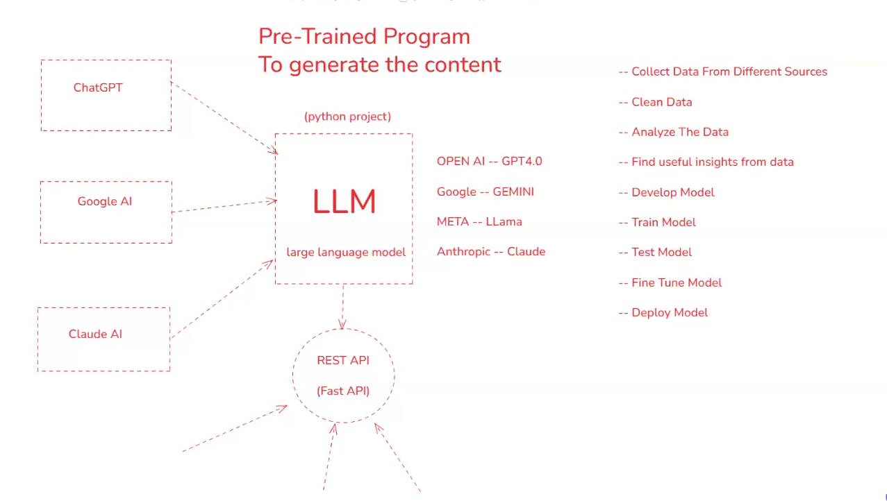

## Program Overview

Build your career in the fast-growing world of **Generative AI, Agentic AI, Python, Large Language Models (LLMs), RAG Systems, AI Agents, LangChain, LangGraph, Model Context Protocol (MCP), and MLOps**.

This program is designed to take learners from **basic concepts to advanced AI application and project development**, even if they have no prior programming experience.

### Our Goal

**Zero to Hero in Generative AI + Agentic AI with Python**

---

## Pre-Requisites

**No prior programming or AI experience is required.**

The program starts from the fundamentals and gradually progresses to advanced concepts and real-world implementations.

### What You Will Learn

- Python programming from scratch
- AI and Machine Learning fundamentals
- Natural Language Processing (NLP) and Deep Learning fundamentals
- Large Language Models (LLMs) and Transformers
- Generative AI application development
- Retrieval-Augmented Generation (RAG) systems
- Vector databases and embeddings
- LLM fine-tuning techniques
- AI agent development
- Agentic AI workflows
- LangChain and LangGraph
- Model Context Protocol (MCP)
- AI automation using n8n
- Real-world project implementation
- Application deployment and MLOps fundamentals
- Interview preparation and resume building

# Course Content

# Module 1: Python Programming

# Core Python + Advanced Python

In this module, students will learn Python programming from the fundamentals and gradually progress to advanced concepts and practical development.

# Topics Covered

- Introduction to Python
- Python Installation and Environment Setup
- Variables and Data Types
- Operators
- Conditional Statements
- Loops
- Strings
- Lists, Tuples, Sets, and Dictionaries
- Functions
- Modules and Packages
- File Handling
- Exception Handling
- Object-Oriented Programming (OOP)
- Advanced Python Concepts
- Working with APIs
- Database Connectivity
- Real-Time Python Coding Practices

---

## Module 2: Python Libraries for AI Development

This module introduces important Python libraries commonly used in **AI, Machine Learning, Data Science, and Generative AI development**.

### NumPy

- Arrays
- Matrix Operations
- Numerical Computations
- Data Processing Basics

### Pandas

- Series and DataFrames
- Data Cleaning
- Data Filtering
- Data Transformation
- CSV and Excel File Handling

### Matplotlib

- Data Visualization
- Line Charts
- Bar Charts
- Pie Charts
- Scatter Plots
- Visual Data Analysis

### Probability and Statistics

- Mean, Median, and Mode
- Variance and Standard Deviation
- Probability Basics
- Probability Distributions
- Correlation
- Hypothesis Testing Basics

### Scikit-Learn

- Machine Learning Model Development
- Data Preprocessing
- Model Training
- Model Testing
- Model Evaluation and Accuracy

### TensorFlow

- Deep Learning Basics
- Neural Networks
- Model Building
- Training Deep Learning Models

### FastAPI

- REST API Development
- Building AI APIs
- Connecting ML and Generative AI Models with Applications
- API Testing

---

## Module 3: Machine Learning and Deep Learning Algorithms

This module focuses on the **Machine Learning and Deep Learning fundamentals** required for AI development.

### Machine Learning Topics

- Introduction to Machine Learning
- Types of Machine Learning
  - Supervised Learning
  - Unsupervised Learning
  - Reinforcement Learning
- Regression Algorithms
- Classification Algorithms
- Clustering Algorithms
- Decision Trees
- Random Forest
- K-Nearest Neighbors (KNN)
- Support Vector Machines (SVM)
- Naive Bayes
- Model Training and Testing
- Model Evaluation Metrics
- Real-Time Machine Learning Project Implementation

### Deep Learning Topics

- Introduction to Deep Learning
- Artificial Neural Networks (ANN)
- Activation Functions
- Forward Propagation
- Backpropagation
- Optimizers
- Convolutional Neural Networks (CNN) Basics
- Recurrent Neural Networks (RNN) Basics
- Introduction to Transformers
- Deep Learning Model Building

---

## Module 4: LLMs and Prompt Engineering

This module helps students understand **Large Language Models (LLMs)** and how to work with popular Generative AI platforms and APIs.

### Topics Covered

- Introduction to Large Language Models (LLMs)
- How ChatGPT and LLM-Based Applications Work
- Tokens and Context Windows
- Temperature and Model Parameters
- Prompt Engineering Basics
- Advanced Prompt Engineering
- Zero-Shot Prompting
- Few-Shot Prompting
- Chain-of-Thought-Style Prompting
- Role-Based Prompting
- Prompt Templates
- OpenAI API Integration
- Google Gemini API Integration
- Anthropic Claude API Integration
- Building AI-Powered Applications Using APIs
- Prompt Design Best Practices

---

## Module 5: Generative AI Application Development and RAG Systems

This module focuses on building **real-world Generative AI applications and Retrieval-Augmented Generation (RAG) systems**.

### Topics Covered

- Introduction to Generative AI
- Text Generation Applications
- Chatbot Development
- Document Q&A Systems
- PDF-Based Question Answering
- Embeddings
- Vector Databases
- Semantic Search
- Introduction to RAG
- RAG Architecture
- Chunking Strategies
- Document Loading
- Vector Storage
- Retrieval Techniques
- Building End-to-End RAG Applications
- RAG with PDFs
- RAG with Websites
- RAG with Databases
- AI Chatbots with Custom Knowledge Bases
- Real-Time Generative AI Project Development

---

## Module 6: Agentic AI, LangChain, LangGraph, MCP, and AI Agents

This module focuses on building **intelligent AI agents and agentic systems** capable of using tools, maintaining state, executing workflows, and completing multi-step tasks.

### Agentic AI

- What Is Agentic AI?
- Generative AI vs. Agentic AI
- AI Agent Architecture
- Agentic Workflows
- Planning and Reasoning
- Tool Usage by AI Agents
- Multi-Step Task Execution
- Agent Memory
- Multi-Agent Systems

### LangChain

- Introduction to LangChain
- LLM Integration
- Prompt Templates
- Chains
- Memory
- Tools
- Agents
- RAG Using LangChain
- LangChain Project Implementation

### LangGraph

- Introduction to LangGraph
- Graph-Based AI Workflows
- Nodes and Edges
- State Management
- Conditional Workflows
- Multi-Agent Workflows
- Human-in-the-Loop Workflows
- LangGraph Project Implementation

### Model Context Protocol (MCP)

- Introduction to Model Context Protocol (MCP)
- Why MCP Is Useful
- MCP Architecture
- MCP Servers and Clients
- Connecting AI Applications with External Tools
- Tools and Resources
- Real-Time MCP Use Cases

### AI Agent Development

- Building Custom AI Agents
- Tool-Calling Agents
- Web Search Agents
- Database Agents
- File Analysis Agents
- Multi-Agent Systems
- Real-Time Agentic AI Projects

---

## Module 7: MLOps + LLMOps

This module introduces the fundamentals required to **deploy, manage, monitor, and maintain AI applications in production environments**.

### Topics Covered

- Git and GitHub
- Version Control
- Docker Basics
- Dockerizing Python Applications
- Kubernetes Basics
- CI/CD Pipeline Overview
- Cloud Deployment Basics
- Machine Learning Model Deployment
- AI Application Deployment
- API Deployment
- Monitoring AI Applications
- Logging and Exception Handling
- Production-Ready Project Structure
- Introduction to MLOps
- Introduction to LLMOps

---

## Module 8: Interview Preparation and Resume Building

This module prepares students for job opportunities across **Python, AI, Machine Learning, Generative AI, LLM, RAG, and Agentic AI roles**.

### Topics Covered

- Python Interview Questions
- Machine Learning Interview Questions
- Deep Learning Interview Questions
- Generative AI Interview Questions
- LLM Interview Questions
- RAG Interview Questions
- LangChain Interview Questions
- LangGraph Interview Questions
- AI Agent Interview Questions
- Project Explanation Preparation
- Resume Building
- GitHub Profile Preparation
- LinkedIn Profile Guidance
- Mock Interview Guidance
- Job Role Preparation

---

# Who Can Attend?

This program is suitable for:

1. Freshers
2. Software Developers
3. Operations Engineers
4. Testers and QA Professionals
5. Non-IT Students
6. Final-Year Students
7. Working Professionals Looking to Move into AI
8. Career-Gap Candidates
9. Anyone Interested in Learning AI Application Development from Scratch

**No prior AI or programming experience is required to begin the program.**

---

# Why Is This Course Important Today?

Software development is changing rapidly with the adoption of **Generative AI and AI-assisted development tools**.

### Earlier: Manual Coding

Traditionally, developers had to manually write, debug, test, and document a large portion of their applications.

### Today: AI-Assisted Development

Modern AI tools can assist developers with:

- Code Generation
- Code Explanation
- Debugging
- Testing
- Documentation
- Refactoring
- Application Design
- Development Productivity

Developers can increasingly focus on understanding the problem, defining requirements, designing the solution, validating AI-generated code, and building reliable applications.

This makes the following skills increasingly valuable:

- Problem-Solving
- Programming Fundamentals
- Application Logic
- AI Tools
- Prompt Engineering
- Application Architecture
- Testing and Validation
- Deployment
- AI Agent Development

Learning **Python + Generative AI + Agentic AI** provides a strong foundation for building modern AI-powered applications.

---

# What Students Will Get

- Live Online Training
- Soft-Copy Learning Materials
- Class Recordings
- Recording Access for 1 Year After Course Completion
- Practical Coding Sessions
- Real-Time Project Development
- Generative AI Projects
- Agentic AI Projects
- AI Tools Exposure
- Interview Preparation
- Resume Building Support
- Gen AI and Agentic AI Project Knowledge

---

# Job Roles After This Program

After completing the program and developing the required practical skills, students can prepare for roles such as:

1. AI Engineer
2. Generative AI Developer
3. Agentic AI Developer
4. AI Application Developer
5. LLM Application Developer
6. RAG Developer
7. AI Automation Developer
8. Python Developer
9. Machine Learning Engineer
10. AI/ML Tester
11. Junior Data Scientist

---

# Final Message

Join the **Gen AI + Agentic AI with Python Developer Program** and start building the skills required for the next generation of AI-powered software development.

Learn **Python, Machine Learning, Deep Learning, LLMs, Prompt Engineering, RAG, LangChain, LangGraph, MCP, AI Agents, MLOps, and LLMOps** — from fundamentals to practical application development.

# What Is Data Science?

Data is the starting point of Data Science.

Using data, we can create intelligence. Using intelligence, we can build systems that can:

- Learn from data
- Understand human language
- Generate content
- Make predictions
- Take actions

## Definition

**Data Science** is the process of collecting, cleaning, analyzing, and understanding data to make smart decisions.

### Simple Definition

> **Data Science means extracting useful information and insights from data.**

---

## Data Science Life Cycle

The Data Science life cycle generally contains the following steps:

### 1. Collect Data

Gather data from different sources such as:

- Files
- Databases
- Websites
- Sensors
- Applications
- APIs

### 2. Clean Data

Prepare the data by handling:

- Duplicate data
- Missing values
- Incorrect values
- Inconsistent data
- Unwanted information

### 3. Analyze Data

Study the data to identify:

- Patterns
- Trends
- Relationships
- Useful insights

### 4. Visualize Data

Represent data using:

- Charts
- Graphs
- Dashboards
- Reports

### 5. Build Model

Select and create a Machine Learning model based on the problem requirement.

### 6. Train Model

Train the model using historical data so that it can learn patterns and relationships.

### 7. Test Model

Evaluate the trained model using unseen data to check how accurately it performs.

### 8. Deploy Model

Make the trained model available for real-world or real-time usage in applications.

### 9. Monitor Results

Continuously monitor model performance and improve or retrain the model when required.

### Data Science Flow

**Collect Data → Clean Data → Analyze Data → Visualize Data → Build Model → Train → Test → Deploy → Monitor**

---

# What Is Artificial Intelligence?

**Artificial Intelligence (AI)** is a field of Computer Science focused on creating systems that can perform tasks that normally require human intelligence.

AI systems can perform activities such as:

- Learning
- Reasoning
- Understanding language
- Recognizing images
- Making decisions
- Solving problems
- Generating content

## Simple Definition

> **AI means making computers perform tasks that normally require human intelligence.**

In traditional programming, we explicitly define rules and instructions for the computer.

In AI-based systems:

1. The system receives data
2. It identifies or learns patterns
3. It uses those patterns to make predictions or decisions
4. Some AI systems can improve when trained with additional data or feedback

---

# Generative AI Tools — Examples

Some popular Generative AI tools include:

- **ChatGPT** — Text generation, reasoning, coding, image generation, and other AI tasks
- **Suno** — AI-based music and song generation
- **Gamma** — AI-assisted presentations and document creation
- **GitHub Copilot** — AI-assisted software development

---

# AI Real-Life Examples

Artificial Intelligence is used in many real-world applications, such as:

1. Self-driving and driver-assistance systems
2. Fraud detection systems in banks
3. Spam detection in emails
4. ChatGPT answering questions and generating content
5. GitHub Copilot assisting with code generation
6. Voice assistants such as Siri, Alexa, and Google Assistant
7. Product recommendations on Amazon and Flipkart
8. Movie and video recommendations on Netflix and YouTube

---

# Why Is AI Important Today?

Artificial Intelligence is important because it can help organizations and individuals:

1. Automate repetitive tasks
2. Reduce certain types of human errors
3. Save time and operational costs
4. Improve decision-making
5. Increase productivity
6. Analyze large amounts of data
7. Build intelligent applications

AI is used across many industries, including:

- Healthcare
- Agriculture
- Finance
- Education
- E-commerce
- Banking
- Software Development
- Transportation

---

# What Is Machine Learning?

**Machine Learning (ML)** is a subset of Artificial Intelligence.

Machine Learning enables computers to learn patterns from data instead of requiring programmers to explicitly write rules for every possible situation.

## Simple Definition

> **Machine Learning is a technique where computers learn patterns from data and use those patterns to make predictions or decisions.**

In Machine Learning:

1. We provide data to the computer
2. A Machine Learning algorithm identifies patterns in the data
3. A model is created through training
4. The trained model makes predictions or decisions on new data

## Important Note

Machine Learning does not rely only on manually written fixed rules like traditional programming.

Instead, the model learns patterns from examples and historical data.

---

# Example 1: Cat and Dog Image Classification

Suppose we provide a Machine Learning model with many labeled pictures of cats and dogs.

During training:

1. The model processes the images
2. It learns patterns that help distinguish cats from dogs
3. After training, we provide a new image
4. The model predicts whether the image contains a cat or a dog

---

# Example 2: Email Spam Filter

In an email spam filtering system:

1. The Machine Learning model is trained using many emails
2. It learns patterns associated with spam and legitimate emails
3. When a new email arrives, the model analyzes it
4. It predicts whether the email is spam or not

---

# Daily-Life Examples of Machine Learning

## 1. Netflix / YouTube Recommendations

Recommendation systems analyze user behavior and other signals to recommend relevant movies or videos.

## 2. Google Photos

Machine Learning can help recognize and organize:

- Faces
- Pets
- Objects
- Places

## 3. Online Shopping

E-commerce platforms can recommend products based on signals such as:

- Search history
- Browsing behavior
- Previous purchases
- Similar users' behavior

## 4. Credit Card Fraud Detection

Machine Learning systems can detect unusual transaction patterns and flag potentially fraudulent transactions.

## 5. Google Maps

Machine Learning can help predict:

- Traffic conditions
- Travel time
- Route conditions

This information can be used to recommend efficient routes.

---

# How Machine Learning Works in Projects

Machine Learning projects generally follow these basic steps:

## Step 1: Collect and Prepare Data

Collect relevant data from sources such as:

- Images
- Text
- Numbers
- Files
- Websites
- Databases
- APIs

The data is then cleaned and prepared for training.

## Step 2: Train the Model

Provide training data to a Machine Learning algorithm.

During training, the model learns patterns and relationships from the data.

## Step 3: Test the Model

Evaluate the trained model using data it has not seen during training.

This helps determine how well the model performs on new data.

## Step 4: Use the Model

Once the model performs satisfactorily, it can be used to make predictions on new, unseen data.

## Summary

> **Machine Learning = Learn from Data → Identify Patterns → Make Predictions**

---

# What Is Deep Learning?

**Deep Learning (DL)** is a subset of Machine Learning.

Deep Learning primarily uses **artificial neural networks with multiple layers** to learn complex patterns from data.

Deep Learning techniques are loosely inspired by the way biological neural systems process information.

They are especially powerful for complex data such as:

- Images
- Audio
- Video
- Text

### Relationship

**Artificial Intelligence → Machine Learning → Deep Learning**

---

# Machine Learning vs. Deep Learning

## Machine Learning

- Machine Learning is a subset of AI
- ML models learn patterns from data using algorithms
- Many ML algorithms work effectively with small to medium-sized datasets
- Commonly used with structured or tabular data
- Often requires manual feature engineering
- Training is generally less computationally expensive
- Many traditional ML models are easier to interpret

### Examples

- Linear Regression
- Logistic Regression
- Decision Trees
- Random Forest
- KNN
- SVM
- Naive Bayes

## Deep Learning

- Deep Learning is a subset of Machine Learning
- Uses neural networks with multiple layers
- Often benefits from large amounts of data
- Works particularly well with unstructured data
- Can automatically learn complex features from raw data
- Usually requires more computational resources
- GPUs are commonly used for training
- Powerful for complex AI problems

### Examples

- Artificial Neural Networks (ANN)
- Convolutional Neural Networks (CNN)
- Recurrent Neural Networks (RNN)
- LSTM
- Transformers

---

# Where Is Deep Learning Used?

Deep Learning is used in many advanced applications.

## 1. Face Recognition

Deep neural networks can detect and recognize faces in images and videos.

## 2. Speech-to-Text

Deep Learning models can convert spoken language into written text.

## 3. Text-to-Speech

AI models can convert written text into synthesized speech.

## 4. Self-Driving and Driver-Assistance Systems

Deep Learning can help identify:

- Traffic signals
- Road signs
- Pedestrians
- Vehicles
- Road conditions

## 5. Medical Imaging

Deep Learning can assist in analyzing:

- X-rays
- CT scans
- MRI scans
- Other medical images

## 6. Chatbots and AI Assistants

Modern AI assistants use Deep Learning and Transformer-based models to understand and generate language.

---

# When to Use Machine Learning?

Traditional Machine Learning can be a good choice when:

1. The available dataset is relatively small or medium-sized
2. The problem can be solved effectively using structured data
3. Model interpretability is important
4. Computational resources are limited
5. Traditional ML algorithms provide sufficient performance

### Examples

- Loan risk prediction
- Customer churn prediction
- Sales forecasting
- Spam detection
- Customer segmentation

---

# When to Use Deep Learning?

Deep Learning can be a good choice when:

1. Large amounts of suitable data are available
2. The data contains complex patterns
3. The data includes images, audio, video, or text
4. Traditional ML approaches are insufficient
5. Sufficient computational resources are available

### Examples

- Face Recognition
- Speech Recognition
- Image Classification
- Autonomous Driving Systems
- Natural Language Processing
- Generative AI Applications

---

# What Is NLP?

**NLP stands for Natural Language Processing.**

Natural Language Processing is a field of Artificial Intelligence that enables computers to **process, understand, analyze, and generate human language**.

## Simple Definition

> **NLP means enabling computers to work with human languages such as English, Telugu, Hindi, and many others.**

Humans communicate using:

- Words
- Sentences
- Grammar
- Context
- Meaning
- Tone

Computers process information numerically.

NLP provides techniques that allow computers to process human language and convert it into representations that AI and Machine Learning models can work with.

---

# What Can NLP Do?

Using NLP, computers can perform tasks such as:

1. Process and analyze text
2. Process spoken language when combined with speech technologies
3. Identify meaning and context
4. Perform sentiment analysis
5. Generate text
6. Translate languages
7. Summarize documents
8. Extract important information
9. Answer questions
10. Classify text

---

# NLP Real-Life Examples

## ChatGPT and Gemini

Large Language Model-based assistants can understand user prompts and generate natural-language responses.

## Google Translate

Machine translation systems translate text between different human languages.

For example:

**Telugu → English**

**Hindi → Tamil**

## Siri and Alexa

Voice assistants combine technologies such as:

**Speech Recognition → NLP → AI Processing → Response Generation**

This allows them to process spoken commands and respond to users.

## Email Spam Detection

NLP and Machine Learning techniques can analyze email content and other signals to help classify messages as spam or legitimate.

## Sentiment Analysis

Organizations can use NLP to analyze customer reviews, feedback, and social media text and classify sentiment such as:

- Positive
- Negative
- Neutral

---

# Quick Relationship Between the Concepts

```text
Data Science
│
├── Data Collection
├── Data Cleaning
├── Data Analysis
├── Data Visualization
└── Machine Learning / Statistical Modeling

Artificial Intelligence (AI)
│
└── Machine Learning (ML)
    │
    └── Deep Learning (DL)
        │
        ├── Neural Networks
        ├── NLP Models
        └── Transformers
            │
            └── Large Language Models (LLMs)
                │
                └── Generative AI Applications

```

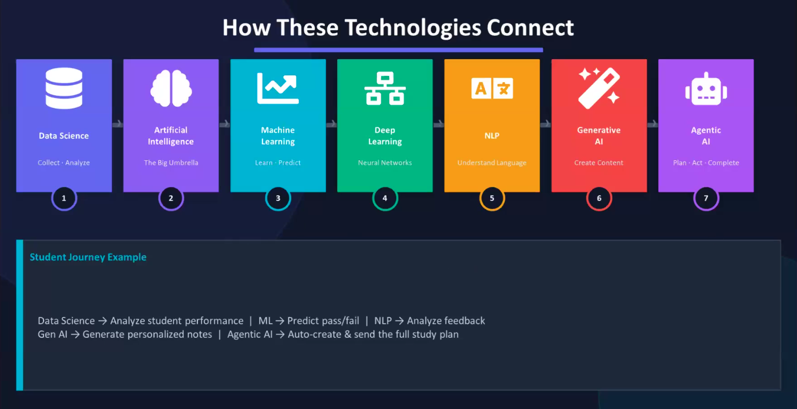
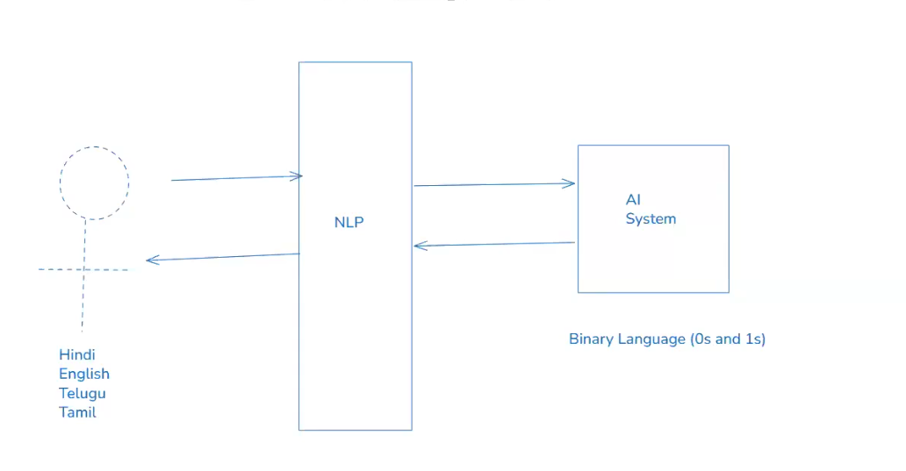

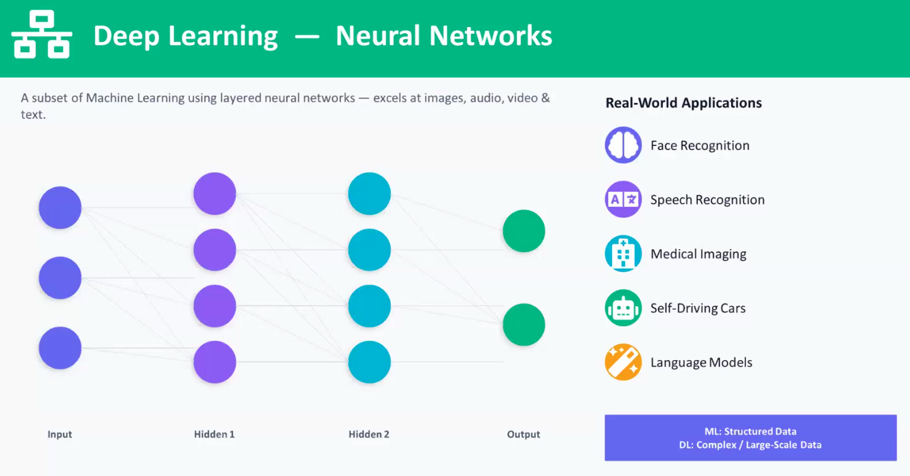
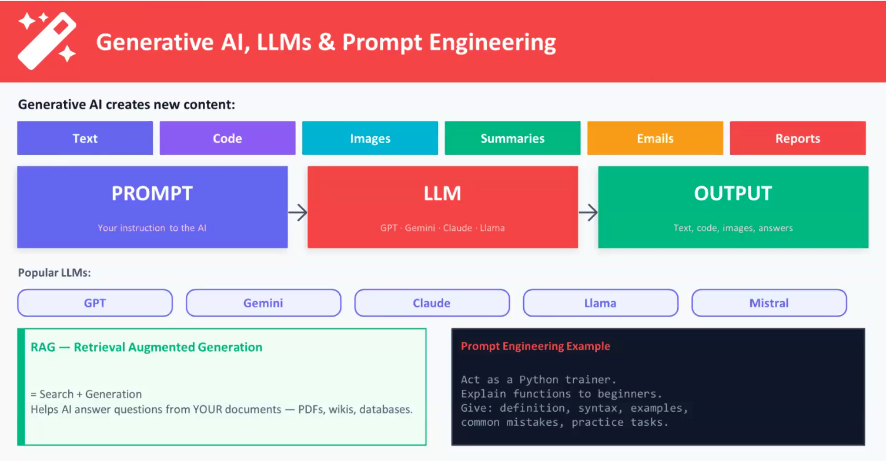
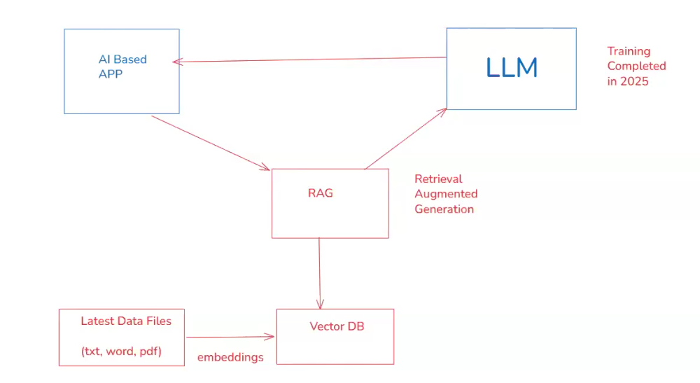

# Traditional Database vs Vector Database

Traditional database data is stored in form of rows and columns.

While in vector database data is stored in form of embeddings i.e numbers 0's and 1's.

**excalidraw.com** for drawing diagrams while teaching.

---

# Final Summary

Data Science, AI, ML, DL, and NLP are connected to each other.

- **Data Science** extracts useful information from data.
- **Artificial Intelligence** makes machines intelligent.
- **Machine Learning** allows machines to learn from data.
- **Deep Learning** uses neural networks to solve complex problems.
- **NLP** helps computers understand and generate human language.

In simple words:

**Data ==> Data Science ==> AI ==> ML ==> DL ==> NLP / Gen AI Applications**

These technologies are the foundation for modern intelligent applications like ChatGPT, Gemini, self-driving cars, recommendation systems, fraud detection systems, and AI-powered software tools.

---

# What is Generative AI?

Generative AI is a type of AI that can create new content.

It can generate:

1. Text
2. Code
3. Images
4. Audio
5. Video
6. Report
7. Email template

**=> GEN AI models don't just analyze the data, they generate something new...**

### Traditional AI focuses on:

- Classification (spam or not spam)
- Predication (price, weather)
- Detection (objects, fraud)

### But Generative AI goes beyond that.

=> It learns patterns from huge amounts of data and then uses those patterns to generate original content that looks like it was created by human.

## GEN AI Examples

- Chat GPT : Creates text
- MidJourney/DALL-E : Creates images
- Suno : Creates music
- RunWayML : Creates videos
- GitHub Copilot : Writes code
- Gamma : Create PPT

=> If you train GEN AI model with 1000 songs, then it can create new song which is not a copy of any single song.

---

# What is Agentic AI?

=> Agentic AI is a type of Artificial Intelligence that can think, decide, and take actions on its own to achieve a goal.

=> Agentic AI is used to develop intelligent AI assistant or AI agents.

=> Traditional AI can answer only our questions whereas Agentic AI can **"Plan + Act + Complete Task independently"**.

**Gen AI:** Only generates content + Needs user prompt + Static response

**Agentic AI:** Takes actions to achieve goals + Can work autonomously + Interactive, decision-making

**Note:** Agentic AI behaves like a digital worker.

# Agentic AI Examples

- An AI that books your flight tickets after comparing prices
- AI that reads your emails and drafts replies
- AI DevOps agents that deploy apps automatically
- AI customer support agents that solve issues end-to-end
- AI personal assistant that schedules meetings

---

# Summary

**Data Science --> Find useful insights from data to make smart business decisions**

**AI =>> Big Umbrella, it is used to make systems more intelligent.**

**ML =>> System learns from existing data and make decisions/predictions on new data**

**DL => ML that uses neural networks to find patterns on complex data**

**NLP => AI that understands human language**

**GEN AI => AI that creates new content**

**Agentic AI => AI that takes actions (AI Agent)**

# PYTHON

---

## 1. What is Python?

=> Python is a high-level, general-purpose programming language.

=> It is widely used in IT industry because it is:

- Simple
- Powerful
- Easy to learn
- Beginner friendly

---

## 2. Why Python so Popular?

=> Python is popular because its syntax is very close to English.

```python
print("Hello World")
```

=> This program is very easy to understand even for beginners.

In many programming languages, we need to write more code to display one message.

=> But in Python, we can display output with one simple line.

---

## 3. History of Python

=> Python was created by Guido van Rossum.

=> Python development started in the late 1980s.

=> Python was first released in 1991.

=> Python was designed to be simple, readable, and powerful.

```text
1980s : Python development started
1991  : Python First Released
2000  : Python 2 Released
2008  : Python 3 Released
Today : Python is widely used in web, AI, data science, automation, DevOps, and backend development
```

Python has two major historical versions:

- Python 2
- Python 3

Python 2 is old and no longer recommended for new projects.

Python 3 is the current and recommended version.

---

## Features of Python

1. Simple and easy to learn
2. Free and Open source
3. High Level Language
4. Platform Independent
5. Dynamically Typed
6. Object Oriented (class, object)
7. Powerful Third Party Libraries

---

## Python Usecases

1. Web Development
2. Data Science
3. Machine Learning
4. Artificial Intelligence
5. Automation
6. DevOps Practices
7. Cloud Computing
8. Cyber Security
9. Gaming
10. Web Scraping
11. API Development

---

## Python in Web Development and Microservices

Python we can use to develop web applications and APIs.

**Popular Frameworks: Django, Flask, FastAPI**

---

## Python in Data Science, AI & Machine Learning

=> Python is very popular in data science because of its libraries support.

**Python Libraries: NumPy, Pandas, Matplotlib, Seaborn, SciPy, Scikit-learn, TensorFlow, PyTorch, Keras**

---

## Python in Automation

=> Python is very useful for automation.

- Rename multiple files
- Send Emails Automatically
- Generate Reports

---

## Python in DevOps and Cloud

=> Python is used in DevOps for automation and scripting.

- Servers Automation
- Log Analysis
- AWS Automation
- Docker Scripts
- K8S Automation
- CI/CD Scripts

**Python Libraries: boto3, fabric, requests**

---

## Python in Cybersecurity

Python is also used in cybersecurity.

- Network Scanning
- Security Automation
- Malware Analysis
- Password strength checking
- Vulnerability testing tools

**Python Libraries: scapy, cryptography, requests**

---

## Python in Web Scraping

=> Web scraping means extracting data from websites.

**Python Libraries: BeautifulSoup, Scrapy**

---

## Python in Testing

=> Python is used for automation testing.

**Python Libraries: pytest, unittest, selenium**

---

# Python Setup

---

## 1. Download Python

Go to the official Python website:

https://www.python.org/downloads/

Download the latest Python version for your operating system.

## 2. Install Python

Run the downloaded installer.

Very important: Select this option before installing:

```text
Add Python to PATH
```

Then click:

```text
Install Now
```

## 3. Check Python Installation

Open Command Prompt or Terminal and type:

```bash
python --version
```

or

```bash
py --version
```

You should see output like:

```text
Python 3.x.x
```

## 4. Install Code Editor (IDE)

Install any one code editor:

- PyCharm
- Visual Studio Code

For beginners, PyCharm is easy to use for Python practice.

https://www.jetbrains.com/pycharm/download/?section=windows

---

# Python Program Execution Flow

---

## 1. Write Python Code

We write Python code in a file with `.py` extension.

```python
print("Hello Python")
```

File name:

```text
demo.py
```

## 2. Run the Python Code Using Below Command

Syntax:

```bash
python demo.py
```

## 3. Python Interpreter Reads Code

Python uses an interpreter to read the program.

**Interpreter means:** It reads and executes code line by line.

## 4. Source Code Converts into Byte Code

Python source code is converted into byte code.

```text
Source Code → Byte Code
```

Source code means the code written by programmer.

Byte code is an intermediate code understood by Python Virtual Machine.

## 5. Byte Code Goes to PVM

PVM means Python Virtual Machine.

PVM executes the byte code.

```text
Byte Code → Python Virtual Machine → Output to User
```

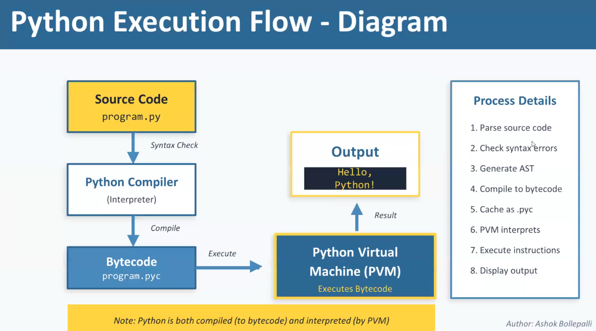

## Python Program Execution Flow

1. **Source Code (`.py`)** → The Python code you write.

2. **Parsing & Syntax Check** → Python reads the code and checks whether the syntax is valid.

3. **AST (Abstract Syntax Tree)** → Python converts the code into a tree-like structure that represents the meaning and structure of the code.

4. **Compilation** → The AST is converted into bytecode.

5. **Bytecode** → Intermediate instructions that the Python Virtual Machine can understand.

6. **PVM (Python Virtual Machine)** → Reads and executes the bytecode.

7. **Output** → The final result is displayed.

---

### Simple Flow

```text
Source Code → Parse/Syntax Check → AST → Compile → Bytecode → PVM → Output
```

### For an Interview, Remember This One Line

> **Python parses the source code, creates an AST, compiles it into bytecode, and the PVM executes that bytecode to produce the output.**
(Parse simply means to read the code and break it down to understand its structure.)

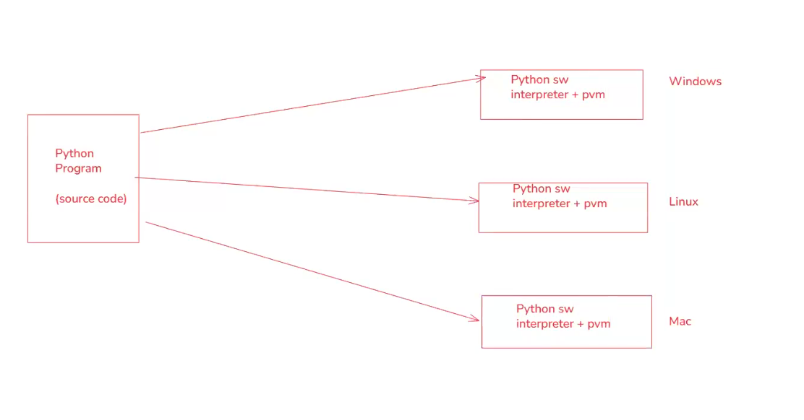

## Python Platform Independence

Because of the **Python Virtual Machine (PVM)**, Python is platform independent.

```text
Source Code → Interpreter → Bytecode → PVM → Machine Code → Machine → Output
```

---

# To Check the Version of Python

```bash
python --version
```

---

## Python Program Structure

A Python program is usually written in a step-by-step structure.

1. Comments
2. Import Statements
3. Global Variables
4. Functions
5. Function Calling

### Example

```python
# This is my first python program

import math

app_name = "python"
name = "ashokit"

def welcome():
    print("Welcome to Python Training")

welcome()
```

# Python Keywords

=> Keywords are reserved words in Python. These words have special meaning in Python.

=> Keywords are predefined reserved words in Python that are used to define the syntax and structure of Python programs.

=> We cannot use keywords as variable names, function names, class names, or identifiers.

### Reserved Words in Python

```python
['False', 'None', 'True', 'and', 'as', 'assert', 'async', 'await',
 'break', 'class', 'continue', 'def', 'del', 'elif', 'else', 'except',
 'finally', 'for', 'from', 'global', 'if', 'import', 'in', 'is',
 'lambda', 'nonlocal', 'not', 'or', 'pass', 'raise', 'return',
 'try', 'while', 'with', 'yield']
```

## This Program Is Used to Demonstrate Python Keywords

```python
import keyword

print(keyword.kwlist)
print(len(keyword.kwlist))
print(keyword.iskeyword("hi"))      # False
print(keyword.iskeyword("import"))  # True
```

---

# Python Literals

=> A literal is a fixed value written directly in the program.

=> A literal is a constant value assigned to a variable or used directly in code.

### Examples

```python
10                  # int
10.5                # float
"Python"            # str
True                # bool
False               # bool
None                # NoneType
[10, 20, 30]        # list
(10, 20, 30)        # tuple
{"name": "Ravi"}    # dict
```

# Types of Literals in Python

1. Numeric Literals
2. String Literals
3. Boolean Literals
4. None Literals
5. Collection Literals (List, Tuple, Set, Dict)

# Integer Literals

```python
age = 25
student_id = 101

print(age)         # 25
print(student_id)  # 101
```

# Floating Literals

```python
price = 99.99
percentage = 15.55

print(price)       # 99.99
print(percentage)  # 15.55
```

# String Literals

```python
name = 'Ashok'
city = "Hyd"
course = '''It's Python course'''

msg = """
    Welcome to Python Training
    with Realtime projects
"""
```

# Boolean Literals

```python
is_activated = True
is_completed = False

print(is_activated)  # True
print(is_completed)  # False
```

# None Literal

```python
result = None

print(result)  # None
```

# Collection Literals

## List Literal

List is mutable.

```python
students = ["Ashok", "Ramesh", "Raju", "Ashok"]

print(students)
```

## Tuple Literal

Tuple is immutable.

```python
courses = ("Python", "Java", "C++", "Python")

print(courses)
```

## Set Literal

Set does not allow duplicates and does not have a fixed order.

```python
cities = {"Hyd", "Pune", "Chennai", "Delhi", "Hyd"}

print(cities)
```

## Dictionary Literal

```python
student = {
    "id": 101,
    "name": "Ashok",
    "age": 35,
    "gender": "Male",
}

print(student)
```

## List of Dictionaries

```python
students = [
    {
        "id": 101,
        "name": "Ashok",
        "age": 35,
        "gender": "Male",
    },
    {
        "id": 102,
        "name": "John",
        "age": 25,
        "gender": "Male",
    }
]

print(students)
```

---

# Python Variables

=> A variable is a name used to store data.

=> A variable is a memory reference name that stores a value.

### Example

```python
a = 20
b = 19.5
name = "Ashok"
```

**Note:** In Python, we do not need to declare variable type.

=> In Python, variable type is decided automatically based on its value.

```python
x = 10

print(x)
print(type(x))  # <class 'int'>

name = "Ashok"

print(name)
print(type(name))  # <class 'str'>
```

# Rules for Variable Names in Python

- **Variable name can contain letters, numbers and underscore (`_`)**
- **Variable name shouldn't start with number**
- **Variable name shouldn't contain space**
- **Variable name should not use special symbols**
- **Variable name shouldn't be reserved keyword**
- **Variable names are case-sensitive**

### Examples

```python
_mobile = 68686868
id1 = 101
stud1 = "Rajesh"
course_fee = 4000
```

# Assigning Same Value to Multiple Variables

```python
var_1 = var_2 = var_3 = 100

print("Variable 1:", var_1)  # Output: Variable 1: 100
print("Variable 2:", var_2)  # Output: Variable 2: 100
print("Variable 3:", var_3)  # Output: Variable 3: 100
```

# Assigning Different Values to Multiple Variables in One Line

```python
var_8, var_9, var_10 = 80, 90, 100

print("Variable 8:", var_8)    # Output: Variable 8: 80
print("Variable 9:", var_9)    # Output: Variable 9: 90
print("Variable 10:", var_10)  # Output: Variable 10: 100
```

# Variable Swapping

```python
a = 10
b = 20

a, b = b, a

print(a)  # 20
print(b)  # 10
```

---

## Python Data Types

---

=> A data type defines the type of value stored in a variable.

=> Data type tells Python what kind of data a variable is storing.

```python
import sys

# Memory information
my_age = 30

print(my_age, type(my_age))
# 30 <class 'int'>

print("Size of my_age variable in bytes:", sys.getsizeof(my_age))
# Size of my_age variable in bytes: 28
# But in java it uses primitive type so requires only 4 bytes

my_name = "Ashok Bollepalli"
print(my_name, type(my_name))
# Ashok Bollepalli <class 'str'>

print("Size of my_name variable in bytes:", sys.getsizeof(my_name))
# Size of my_name variable in bytes: 65
```

If more bytes are used so program execution is slow, when compare to java for microservice deployment, webapplication development.etc

```python
import sys

# Float Data Type
price = 99.99
percentage = 85.5

print(price, type(price))
# 99.99 <class 'float'>

print("Size of price:", sys.getsizeof(price))
# Size of price: 24

print(percentage, type(percentage))
# 85.5 <class 'float'>

print("Size of percentage:", sys.getsizeof(percentage))
# Size of percentage: 24 (it object type is more bytes)
# But in java it uses primitive type so requires only 4 bytes

# Complex Data Type
num = 5 + 3j

print(num, type(num))
# (5+3j) <class 'complex'>

# List Data Type
students = ["Anil", "Sunil", "Gopi", "Anil"]

print(students)
# ['Anil', 'Sunil', 'Gopi', 'Anil']

print(type(students))
# <class 'list'>

# Tuple Data Type
courses = ("Java", "Python", "GEN AI", "Python")

print(courses)
# ('Java', 'Python', 'GEN AI', 'Python')

print(type(courses))
# <class 'tuple'>

# Set Data Type
skills = {"Java", "Python", "GEN AI", "DevOps", "Cloud", "Java"}

print(skills)
# {'Java', 'Python', 'GEN AI', 'DevOps', 'Cloud'}

print(type(skills))
# <class 'set'>

# Dictionary Data Type
student = {
    "id": 101,
    "name": "Ashok",
    "gender": "Male"
}

print(student)
# {'id': 101, 'name': 'Ashok', 'gender': 'Male'}

print(type(student))
# <class 'dict'>
```

---

## Reading Input From User

---

# input() is a built-in python function used to take data from the keyboard during program execution

---

```python
name = input("Enter Your Name : ")
age = input("Enter Your age : ")
salary = input("Enter Your Salary : ")

print("My Name : ", name)        # Output: My Name : Ashok
print("My Age : ", age)          # Output: My Age : 30
print("My Salary : ", salary)    # Output: My Salary : 50000

a, b = input("Enter two numbers : ").split(" ")

print("My First Number : ", a)   # Output: My First Number : 10
print("My Second Number : ", b)  # Output: My Second Number : 20

a = "Ashok"
b = "IT"

print(a + b)
# Output: AshokIT

i = 10
j = 20

print(i + j)
# Output: 30

a = input("First Number: ")      # input is stored as str
b = input("Second Number: ")     # input is stored as str

print(a + b)
# If input is 10 and 20
# Output: 1020

a = int(input("First Number: "))
b = int(input("Second Number: "))

print(a + b)
# If input is 10 and 20
# Output: 30
```

---

## Type Casting

---

=> Typecasting means converting one data type into another data type.

=> Typecasting is the process of converting a value from one data type to another data type.

# Why Do We Need Typecasting?

**In real-time programs, input values usually come as strings.**

**To perform calculations, we need to convert them into numbers.**

# Without Type Casting

```python
a = input("Enter first number: ")
b = input("Enter second number: ")

result = a + b  # Concatenation

print("Result Before Type Casting:", result)
# If input is 10 and 20: Result Before Type Casting: 1020

# With Type Casting
a = int(a)
b = int(b)

result = a + b  # Addition

print("Result After Type Casting:", result)
# If input is 10 and 20: Result After Type Casting: 30

# List Type Casting
course_name = "Python"
letters = list(course_name)

print(letters)
# ['P', 'y', 't', 'h', 'o', 'n']

# Note: list() converts every character of a string into a separate list element.

# Tuple Type Casting
numbers = [10, 20, 30]
result = tuple(numbers)

print(result)
# (10, 20, 30)

# Set Type Casting
numbers = [10, 20, 10, 30, 20]
unique_numbers = set(numbers)

print(unique_numbers)
# {10, 20, 30}

# Dictionary Type Casting
data = [("name", "Ashok"), ("course", "Python")]
student = dict(data)

print(student)
# {'name': 'Ashok', 'course': 'Python'}

# Implicit Casting
a = 10
b = 2.5
result = a + b

print("Result : ", result)
print(type(result))

# Explicit Casting
i = "10"
j = "20"
result = int(i) + int(j)

print("Result : ", result)
print(type(result))
```

---

## Python Operators

---

=> An operator is a symbol or keyword used to perform operations on values or variables.

=> Operators are special symbols used to perform operations like addition, comparison, assignment, logical checking, and more.

# Why Do We Need Operators?

- **Calculate students marks**
- **Calculate Total product price (Actual Price + GST)**
- **Check Login Credentials**
- **Check Citizen voting eligibilty**
- **Apply Discounts on products based on Coupons**
- **Credit or Debit Account balance amount**

### Types of Operators

1. Arithmetic Operators (+, -, *, /, //, %, +=, -=)
2. Assignment Operators (=)
3. Comparision Operators (==, !=, >, >=, <, <=)
4. Logical Operators (and, or, not)
5. Membership Operators (in, not in)
6. Identity Operators (is, is not)

## Arithmetic Operators

**Arithmetic operators are used to perform mathematical operations.**

```python
a = 10
b = 3

print(a + b)
# Output: 13

print(a - b)
# Output: 7

print(a * b)
# Output: 30

print(a / b)
# Output: 3.3333333333333335

print(a // b)
# Output: 3

print(a % b)
# Output: 1

print(a ** b)
# Output: 1000
```

## Assignment Operators

**Assignment operators are used to assign values to variables.**

```python
x = 10

print(x)
# Output: 10

x += 5     # x = x + 5

print(x)
# Output: 15

x -= 3     # x = x - 3

print(x)
# Output: 12

x *= 2     # x = x * 2

print(x)
# Output: 24

x /= 4     # x = x / 4

print(x)
# Output: 6.0

x //= 2    # x = x // 2

print(x)
# Output: 3.0

x %= 2     # x = x % 2

print(x)
# Output: 1.0
```

### Additional Assignment

```python
balance = 1000
deposit_amount = 500

# balance = balance + deposit_amount
balance += deposit_amount

print("Final balance : ", balance)
# Output: Final balance : 1500

withdraw_amount = 200

# balance = balance - withdraw_amount
balance -= withdraw_amount

print("Final balance : ", balance)
# Output: Final balance : 1300
```

## Comparison Operators

**Comparison operators are used to compare two values. They return True or False.**

```python
a = 10
b = 20

print(a == b)
# Output: False

print(a != b)
# Output: True

print(a > b)
# Output: False

print(a < b)
# Output: True

print(a >= b)
# Output: False

print(a <= b)
# Output: True
```

## Logical Operators

**Logical operators are used to combine multiple conditions.**

```python
age = 25
salary = 50000

print(age > 18 and salary > 30000)
# Output: True
# True because both conditions are True

print(age > 18 or salary > 80000)
# Output: True
# True because one condition is True

print(not age > 18)
# Output: False
# False because age > 18 is True, not True becomes False
```

## Membership Operators

**Membership operators are used to check whether a value is available inside a sequence like list, tuple, string, etc.**

```python
students = ["Ashok", "Ramesh", "Suresh"]

print("Ashok" in students)
# Output: True

print("Kiran" in students)
# Output: False

print("Kiran" not in students)
# Output: True
```

## Identity Operators

**Identity operators are used to compare memory location of objects.**

```python
a = 10
b = 10

print(a is b)
# Output: True

print(a is not b)
# Output: False
```

---

## Python Control Statements

---

**Control statements are used to control the flow of execution in a Python program.**

**Normally, Python executes statements from top to bottom.**

**But in real-time applications, we need to execute code based on conditions or repeat some code multiple times.**

### Example

```python
if uname == "admin" and pwd == "admin123":
    # Logic to display dashboard page
    print("Welcome to Dashboard")
else:
    # Logic to display error message
    print("Invalid username or password")
```

# Why Do We Need Control Statements?

**In real-time applications, we need decision-making and repetition.**

## Real-Time Examples

1. If use logged in, show dashboard page
2. If student marks are greater than 35, show pass
3. If account balance is sufficient, allow withdrawal / transfer
4. Print numbers from 1 to 100
5. Send certificates to all students
6. Display all products in cart
7. Search a student from a list
8. Repeat login until correct password is entered

**Without control statements, programs cannot make decisions or repeat tasks.**

**Python control statements are mainly divided into three types:**

1. Conditional Statements
2. Looping Statements
3. Jumping Statements (loop control statements)

---

## Conditional Statements

---

=> Conditional statemetns are used to execute the logic based on condition.

=> In conditional statements the logic will execute only once.

#### if Statement

**The if statement is used to execute a block of code only when the condition is true.**

## Syntax

```python
if condition:
    statement
```

## Example

```python
age = 25

if age >= 18:
    print("Eligible to vote")
    print("Please participate in voting")

# Output: Eligible to vote
# Output: Please participate in voting
```

# Indentation in Python

**Python uses indentation to define blocks of code.**

**Indentation means spaces at the beginning of a line.**

### Wrong Syntax

```python
age = 20

if age >= 18:
print("Eligible to vote")
```

## if-else Statement

### Syntax

```python
if condition:
    statement1
else:
    statement2
```

# Example

```python
age = 12

if age >= 18:
    print("Eligible to vote")
    print("plz participate in voting")
else:
    print("Not eligible to vote")

# Output: Not eligible to vote
```

---

## if-elif-else Statements

**When we want to check multiple conditions like below then we need to use if-elif-else concept.**

```text
marks >= 90 (A Grade)
marks >= 75 (B grade)
marks >= 60 (C grade)
marks >= 35 (Pass)
else ===> Fail
```

## Syntax

```python
if condition1:
    statement1
elif condition2:
    statement2
elif condition3:
    statement3
else:
    default_statement
```

## Example

```python
marks = int(input("Enter marks: "))

if marks >= 90:
    print("A Grade")
elif marks >= 75:
    print("B Grade")
elif marks >= 65:
    print("C Grade")
elif marks >= 35:
    print("Just Pass")
else:
    print("Failed")

# If input is 80
# Output: B Grade
```

---

## Nested If Statement

**Writing one if statement inside another if statement is called a nested if statement.**

```python
if username == "admin" and pwd == "admin123":
    if role == "student":
        print("Student dashboard")
    elif role == "trainer":
        print("Trainer dashboard")
    elif role == "admin":
        print("Admin dashboard")
    else:
        print("Invalid role")
else:
    print("Invalid credentials")

# If username = "admin", pwd = "admin123", role = "student"
# Output: Student dashboard
```

## Example-2

```python
balance = 5000
withdraw_amount = int(input("Enter amount to withdraw: "))

if balance > 0:
    if withdraw_amount <= balance:
        balance = balance - withdraw_amount
        print("Withdraw successful")
        print("Remaining balance: ", balance)
    else:
        print("Insufficient balance")
else:
    print("Funds not available")

# If input is 2000
# Output: Withdraw successful
# Output: Remaining balance: 3000
```

---

## match case

```python
print("1. Add Student")
print("2. View Student")
print("3. Update Student")
print("4. Delete Student")

choice = int(input("Enter your choice: "))

match choice:
    case 1:
        print("Student add operation selected")
    case 2:
        print("Student View Operation selected")
    case 3:
        print("Student Update Operation selected")
    case 4:
        print("Student Delete Operation selected")
    case _:
        print("Invalid Choice")

# Output:
# 1. Add Student
# 2. View Student
# 3. Update Student
# 4. Delete Student

# If input is 2
# Output: Student View Operation selected
```
---

## Looping Statements

---

**Looping statements are used to execute a block of code repeatedly.**

**Python supports two types of loops**

1. for loop
2. while loop

=> For loop is used to iterate over a sequence

=> Sequence can be

1. String
2. List
3. Tuple
4. Set
5. Dictionary
6. Range

### for loop syntax ::

```python
for variable in sequence:
    statements
```

### for loop example ::

```python
for i in range(1, 6):
    print(i)

# Output:
# 1
# 2
# 3
# 4
# 5
```

---

## what is range( ) ?

---

=> The range() function is used to generate a sequence of numbers.

### range( ) function syntax:

```python
range(stop)
range(start, stop)
range(start, stop, step)
```

# range(stop)

```python
for i in range(6):
    print(i)

# Output:
# 0
# 1
# 2
# 3
# 4
# 5
```

# range(start, stop)

```python
for i in range(1, 6):
    print(i)

# Output:
# 1
# 2
# 3
# 4
# 5
```

# range(start, stop, step)

```python
for i in range(1, 11, 2):
    print(i)

# Output:
# 1
# 3
# 5
# 7
# 9
```

# For loop with String

```python
name = "Ashok"

for ch in name:
    print(ch)

# Output:
# A
# s
# h
# o
# k
```

# For loop with List

```python
students = ["Ashok", "Ram", "John"]

for student in students:
    print(student)

# Output:
# Ashok
# Ram
# John
```

# For loop with Tuple

```python
courses = ("JAVA", "Python", "AI")

for course in courses:
    print(course)

# Output:
# JAVA
# Python
# AI
```

# For loop with Set

```python
places = {"Hyd", "Banglore", "Pune"}

for place in places:
    print(place)

# Output:
# Hyd
# Banglore
# Pune

# Output order can vary because a set is unordered.
```

# For loop with Dictionary

```python
student = {
    "id": 101,
    "name": "Ashok",
    "gender": "Male"
}

for key in student:
    print(key, "--", student[key])

# Output:
# id -- 101
# name -- Ashok
# gender -- Male
```

# Cart Price for Items

```python
cart_prices = [500, 300, 1200, 750]
total = 0

for price in cart_prices:
    total = total + price

print("Total Cart Price:", total)

# Output: Total Cart Price: 2750
```

# While Loop

**The while loop executes a block of code as long as the condition is True.**

### Syntax:

```python
while condition:
    statements
```

### Example:

```python
count = 1

while count <= 5:
    print(count)
    count = count + 1

# Output:
# 1
# 2
# 3
# 4
# 5
```

---

## for loop vs while loop

---

1. Both for loop and while loop are used to execute a block of code repeatedly.
2. for loop is used when we know how many times the loop should run.
3. while loop is used when we do not know exactly how many times the loop will run.
4. for loop works with sequences like range, list, tuple, string, etc.
5. while loop works based on a condition.
6. In for loop, initialization and increment are handled automatically by range() or sequence.
7. In while loop, initialization and increment/decrement should be handled manually.
8. for loop is mostly used for fixed iterations.
9. while loop is mostly used for condition-based iterations.
10. for loop has less chance of infinite loop.
11. while loop has more chance of infinite loop if the condition is not updated properly.

| For Loop | While Loop |
|---|---|
| Used when the number of iterations is known. | Used when the number of iterations is unknown. |
| Works with sequences such as `range`, list, tuple, and string. | Works using a condition. |
| Iteration is handled automatically. | Initialization and update must be written manually. |
| Best for fixed/repeated items. | Best for condition-based repetition. |
| Less likely to create an infinite loop. | Can create an infinite loop if the condition is not updated. |

---

## Requirement: Design an ATM System

When we run the application it should show Menu Options like below:

1. Check Balance
2. Deposit
3. Withdraw
4. Exit

=> Take input from user, based on given input perform the action.

# ATM System

```python
balance = 1000

while True:
    print("\n====== ATM MENU ======")
    print("1. Check Balance")
    print("2. Deposit")
    print("3. Withdraw")
    print("4. Exit")

    choice = input("Enter your choice (1-4): ")

    if choice == "1":
        print("Available Balance:", balance)

        # If input is 1
        # Output: Available Balance: 1000

    elif choice == "2":
        amount = float(input("Enter deposit amount: "))

        if amount > 0:
            balance = balance + amount
            print("Deposit successful")
            print("Available Balance:", balance)

            # If deposit amount is 500
            # Output: Deposit successful
            # Output: Available Balance: 1500.0

        else:
            print("Please enter a valid amount")

            # If deposit amount is -100
            # Output: Please enter a valid amount

    elif choice == "3":
        amount = float(input("Enter withdrawal amount: "))

        if amount <= 0:
            print("Please enter a valid amount")

            # If withdrawal amount is -100
            # Output: Please enter a valid amount

        elif amount > balance:
            print("Insufficient balance")

            # If balance is 1000 and withdrawal amount is 1500
            # Output: Insufficient balance

        else:
            balance = balance - amount
            print("Withdrawal successful")
            print("Available Balance:", balance)

            # If balance is 1000 and withdrawal amount is 200
            # Output: Withdrawal successful
            # Output: Available Balance: 800.0

    elif choice == "4":
        print("Thank you for using the ATM")
        break

        # If input is 4
        # Output: Thank you for using the ATM

    else:
        print("Invalid choice. Please select between 1 and 4.")

        # If input is 5
        # Output: Invalid choice. Please select between 1 and 4.
```

---

---

## Jumping Statements

---

**Jumping statements are used to control the flow of loop execution.**

**To control loop execution we have**

1. break
2. continue

## what is break statement ?

==> The break statement is used to stop the loop immediately.

**Stop the loop right now and come out of it.**

# break statement example

```python
for i in range(1, 11):
    if i == 5:
        break
    print(i)

# Output:
# 1
# 2
# 3
# 4
```

When i becomes 5, break immediately stops the loop.

```python
students = ["Raju", "John", "Steve", "Ashok", "Rani"]
search_name = "Ashok"

for student in students:
    print("Checking:", student)

    if search_name == student:
        print("Student Found:", student)
        break

# Output:
# Checking: Raju
# Checking: John
# Checking: Steve
# Checking: Ashok
# Student Found: Ashok
```

Here, the loop stops after finding "Ashok", so "Rani" is not checked.

## what is continue statement ?

**The continue statement is used to skip the current iteration and move to the next iteration.**

**Note:** It does not stop the loop completely.

# continue statement example

```python
for i in range(1, 11):
    if i == 5:
        continue
    print(i)

# Output:
# 1
# 2
# 3
# 4
# 6
# 7
# 8
# 9
# 10
```

When i is 5, continue skips that iteration and moves to the next value.

```python
students = [
    {"name": "Ravi", "marks": 80},
    {"name": "Kiran", "marks": 30},
    {"name": "Sita", "marks": 90}
]

for student in students:
    if student["marks"] < 35:
        continue

    print("Certificate Sent for:", student["name"])

# Output:
# Certificate Sent for: Ravi
# Certificate Sent for: Sita
```

Kiran is skipped because the marks are below 35.

---

---

## Python Data Structures

---

**Data structures are ways to store, organize, and manage data in a program.**

**In Python, the most commonly used built-in data structures are:**

1. List
2. Tuple
3. Set
4. Dictionary
5. String

**Note:** Each data structure has a different purpose.

---

## What is a List?

---

**A list is a built-in data structure in Python used to store multiple values in a single variable.**

### Syntax

```python
my_list = [value1, value2, value3]
```

# Examples

```python
marks = [80, 90, 75]
students = ["Ravi", "Sita", "Kiran"]      # Homogeneous list
mixed_data = ["Ravi", 25, 85.5, True]    # Heterogeneous list
```

**Ordered**

**Mutable / Changeable**

**Allow Duplicate Values**

**Can store different data types of data (homogenious & heterogenious)**

**We can access list elements using index order**

**in python index starts from 0**

# List Creation

```python
courses = ["JAVA", "Python", "DevOps", "GEN AI"]

# Access List Elements
print(courses[0])
# Output: JAVA

print(courses[1])
# Output: Python

print(courses[2])
# Output: DevOps

print(courses[3])
# Output: GEN AI


items = ["Laptop", "Mouse", "Keyboard", "Monitor"]

# Positive Indexing: starts from left to right
print(items[0])
# Output: Laptop

# Negative Indexing: starts from right to left
print(items[-1])
# Output: Monitor


# List Slicing: used to get a part of a list
# Syntax: list_name[start:end]

numbers = [10, 20, 30, 40, 50, 60]

print(numbers)
# Output: [10, 20, 30, 40, 50, 60]

print(numbers[1:4])
# Output: [20, 30, 40]

# Start index is inclusive; end index is exclusive.

print(numbers[:3])
# Output: [10, 20, 30]

print(numbers[2:])
# Output: [30, 40, 50, 60]

print(numbers[::2])
# Output: [10, 30, 50]

print(numbers[::-1])
# Output: [60, 50, 40, 30, 20, 10]
```

## List Operations

```python
# append : append() adds an element at the end of the list
# insert : insert() adds and element at specified index
# extends : extend() adds multiple elements to the list.
# remove : remove() removes the specified value
# pop : pop() removes element based on index. If index is not given, pop() removes the last element
# clear : clear() removes all elements from the list.
# del : del can delete an element or entire list.


# append(): adds one item at the end
courses = ["Python", "Java"]

courses.append("DevOps")
print(courses)
# Output: ['Python', 'Java', 'DevOps']


# insert(index, item): adds an item at a specified position
courses.insert(1, "GEN AI")

print(courses)
# Output: ['Python', 'GEN AI', 'Java', 'DevOps']


# extend(): adds all items from another list
frontend = ["HTML", "CSS"]
backend = ["Python", "Django"]

frontend.extend(backend)

print(frontend)
# Output: ['HTML', 'CSS', 'Python', 'Django']


# remove(item): removes the specified item
courses.remove("Java")

print(courses)
# Output: ['Python', 'GEN AI', 'DevOps']


# pop(): removes the last item
courses.pop()

print(courses)
# Output: ['Python', 'GEN AI']


# clear(): removes all items
courses.clear()

print(courses)
# Output: []


# del: removes an item using its index
courses = ["Python", "Java", "DevOps"]

del courses[1]

print(courses)
# Output: ['Python', 'DevOps']
```

## List Functions

```python
courses = ["Python", "Java", "DevOps"]

print(len(courses))
# Output: 3


numbers = [1, 3, 6, 9, 2]

print(len(numbers))
# Output: 5

print(min(numbers))
# Output: 1

print(max(numbers))
# Output: 9

print(sum(numbers))
# Output: 21


numbers.sort()

print(numbers)
# Output: [1, 2, 3, 6, 9]


numbers.sort(reverse=True)

print(numbers)
# Output: [9, 6, 3, 2, 1]
```

---

# List Comprehension in Python

---

**List comprehension is a short and clean way to create a new list from an existing sequence like range, list, tuple, or string.**

**It is mainly used to reduce multiple lines of loop code into a single line.**

# Normal Way

```python
numbers = []

for i in range(1, 6):
    numbers.append(i)

print(numbers)
# Output: [1, 2, 3, 4, 5]
```

# List Comprehension

```python
numbers = [i for i in range(1, 6)]

print(numbers)
# Output: [1, 2, 3, 4, 5]
```

# Square of Numbers: Normal Way

```python
squares = []

for i in range(1, 6):
    squares.append(i * i)

print(squares)
# Output: [1, 4, 9, 16, 25]
```

# Square of Numbers: List Comprehension

```python
squares = [i * i for i in range(1, 6)]

print(squares)
# Output: [1, 4, 9, 16, 25]
```

# Even Numbers: Normal Way

```python
even_numbers = []

for i in range(1, 11):
    if i % 2 == 0:
        even_numbers.append(i)

print(even_numbers)
# Output: [2, 4, 6, 8, 10]
```

# Even Numbers: List Comprehension

```python
even_numbers = [i for i in range(1, 11) if i % 2 == 0]

print(even_numbers)
# Output: [2, 4, 6, 8, 10]
```

# Convert Names to Uppercase

```python
names = ["ravi", "sita", "kiran"]

for name in names:
    print(name.upper())

# Output:
# RAVI
# SITA
# KIRAN
```

```python
names = ["ravi", "sita", "kiran"]
upper_names = [name.upper() for name in names]

print(upper_names)
# Output: ['RAVI', 'SITA', 'KIRAN']
```

# Student Grades

```python
marks = [80, 30, 90, 45, 20]

results = ["Pass" if mark >= 35 else "Fail" for mark in marks]

print(results)
# Output: ['Pass', 'Fail', 'Pass', 'Pass', 'Fail']
```

# GST: Add 18% GST to Each Price

```python
prices = [1000, 2000, 5000, 10000]

price_with_gst = [price + (price * 18 / 100) for price in prices]

print(price_with_gst)
# Output: [1180.0, 2360.0, 5900.0, 11800.0]
```

---

## What is a Tuple?

---

**A tuple is a built-in data structure in Python used to store multiple values in a single variable.**

**Tuple is similar to List, but the main difference is:**

- List is mutable
- Tuple is immutable / not changeable

**Ordered**

**Immutable**

**Allow duplicate values**

**Can store different data types**

**Faster than list**

**Used to store fixed data**

### Syntax

```python
my_tuple = (value-1, value-2, value-3)
```

# Tuple Creation

```python
courses = ("JAVA", "Python", "GEN AI", "DEVOPS", ".Net", "MERN")

print(courses)
# Output: ('JAVA', 'Python', 'GEN AI', 'DEVOPS', '.Net', 'MERN')

print(courses[0])
# Output: JAVA

print(courses[1])
# Output: Python

print(courses[-1])
# Output: MERN

print(courses[1:3])
# Output: ('Python', 'GEN AI')

print(courses[-1:-3:-1])
# Output: ('MERN', '.Net')

print(courses[:3])
# Output: ('JAVA', 'Python', 'GEN AI')

print(courses[2:])
# Output: ('GEN AI', 'DEVOPS', '.Net', 'MERN')

# courses[1] = "AWS"
# Not possible because tuples are immutable.

print(courses.index("GEN AI"))
# Output: 2
```

# Tuple Packing

```python
student = "Ashok", "Male", 66868686

print(student)
# Output: ('Ashok', 'Male', 66868686)
```

# Tuple Unpacking

```python
student = ("Ashok", "Male", 66868686)

name, gender, phone = student

print(name)
# Output: Ashok

print(gender)
# Output: Male

print(phone)
# Output: 66868686
```

# Tuple Functions

```python
numbers = (10, 15, 30, 20, 40, 25)

print(len(numbers))
# Output: 6

print(sum(numbers))
# Output: 140

print(min(numbers))
# Output: 10

print(max(numbers))
# Output: 40

# numbers.sorted()
# Invalid: tuples do not have a sort() or sorted() method.
# sorted() returns a new list.

sorted_numbers = sorted(numbers)

print(sorted_numbers)
# Output: [10, 15, 20, 25, 30, 40]

sorted_numbers = sorted(numbers, reverse=True)

print(sorted_numbers)
# Output: [40, 30, 25, 20, 15, 10]
```

# Convert Tuple to List

```python
courses = ("Python", "Java", "DevOps")

course_list = list(courses)
course_list[0] = "GEN AI"

print(course_list)
# Output: ['GEN AI', 'Java', 'DevOps']
```

# Check Whether a Value Exists in a Tuple

```python
if "GEN AI" in courses:
    print("GEN AI course available in Ashok IT")
else:
    print("GEN AI course not available in Ashok IT")

# Output: GEN AI course not available in Ashok IT
```

# Tuple Concatenation

```python
frontend = ("HTML", "CSS")
backend = ("Python", "Django")

fullstack = frontend + backend

print(fullstack)
# Output: ('HTML', 'CSS', 'Python', 'Django')

skills_list = list(fullstack)
skills_list.insert(-1, "DevOps")

print(skills_list)
# Output: ['HTML', 'CSS', 'Python', 'DevOps', 'Django']
```

But in `insert(index, value)`, `-1` means insert before the last item:

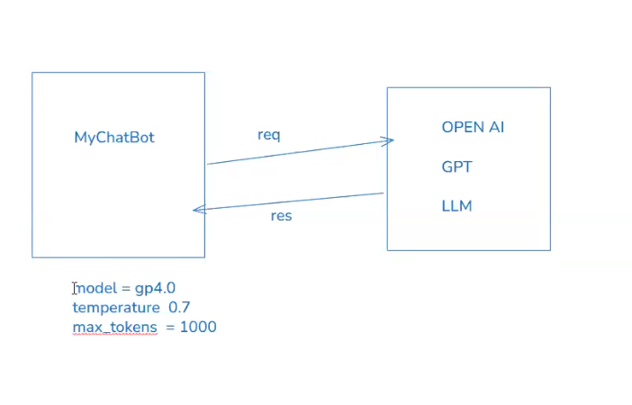

---

## Difference Between List and Tuple

---

| List | Tuple |
|---|---|
| List is mutable | Tuple is immutable |
| List uses square brackets `[]` | Tuple uses parentheses `()` |
| List is slower than tuple | Tuple is faster than list |
| List is used when data changes frequently | Tuple is used when data is fixed |
---

---

## What is a Set?

---

**A set is a built-in data structure in Python used to store multiple values in a single variable.**

**Set is mainly used when we want to store unique values.**

**Set does not allow duplicate values.**

## Set Features

**It is un-ordered**

**Mutable**

**Doesnot allow duplicates**

**Can store different data types**

**Doesn't support indexing**

**Doesn't support slicing**

# Set Syntax

```python
my_set = {value_1, value_2, value_3}

courses = {"Python", "JAVA", "Python", "DEVOPS"}

print(courses)
# Output: {'Python', 'JAVA', 'DEVOPS'}

# Order may differ because sets are unordered.
```
# Duplicate Handling

**Python uses hash values internally while storing elements in a set.**

**The `hash()` function is used to get the hash value of an object.**

```python
courses = {"Python", "JAVA", "DEVOPS", "Python"}

print(courses)
# Output: {'Python', 'JAVA', 'DEVOPS'}
# Output order may differ because sets are unordered.

python_hash1 = hash("Python")
java_hash = hash("JAVA")
python_hash2 = hash("Python")

print("Python Hash:", python_hash1)
# Output: Python Hash: <hash value>

print("JAVA Hash:", java_hash)
# Output: JAVA Hash: <hash value>

print("Python Hash Again:", python_hash2)
# Output: Python Hash Again: <same hash value as Python Hash>

print(python_hash1 == python_hash2)
# Output: True
```

**Example Output:**

```text
{'Python', 'JAVA', 'DEVOPS'}
Python Hash: 123456789
JAVA Hash: 987654321
Python Hash Again: 123456789
True
```

**Note:** The above hash numbers are only examples. The actual hash values may be different when the Python program is run again.

- `"Python"` gets a hash value.
- `"JAVA"` gets a different hash value.
- When `"Python"` appears again, it gets the same hash value during that program execution.
- Since `"Python"` is already present in the set, the duplicate value is not stored again.

```

# Set Operations

```python
courses = {"Python", "JAVA", "DEVOPS"}

# add(): adds one element
courses.add("GEN AI")

print(courses)
# Output: {'Python', 'JAVA', 'DEVOPS', 'GEN AI'}
# Output order may differ because sets are unordered.


# update(): adds multiple elements
courses.update(["GCP", "AWS", "aws", "Azure"])

print(courses)
# Output: {'Python', 'JAVA', 'DEVOPS', 'GEN AI', 'GCP', 'AWS', 'aws', 'Azure'}
# Output order may differ because sets are unordered.


# remove(): removes the specified element.
# It raises an error if the element does not exist.

# courses.remove("HTML")

print(courses)
# Output: Current set elements
# Output order may differ because sets are unordered.


# discard(): removes the specified element.
# It does not raise an error if the element does not exist.

courses.discard("AWS")

print(courses)
# Output: AWS is removed.
# Output order may differ because sets are unordered.


# pop(): removes and returns a random element.

removed_course = courses.pop()

print("Removed Course:", removed_course)
# Output: Removed Course: <removed element>
# The removed item can differ each time.

print(courses)
# Output: Remaining set elements
# Output order may differ because sets are unordered.


# clear(): removes all elements

courses.clear()

print(courses)
# Output: set()


# del: deletes the complete set

del courses

# print(courses)
# Output: NameError: name 'courses' is not defined
```

# Set Functions

```python
numbers = {10, 50, 20, 80, 30, 40}

print(len(numbers))
# Output: 6

print(min(numbers))
# Output: 10

print(max(numbers))
# Output: 80

print(sum(numbers))
# Output: 230

sorted_numbers = sorted(numbers, reverse=True)

print(sorted_numbers)
# Output: [80, 50, 40, 30, 20, 10]
```

# Remove Duplicates from a List Using set()

```python
skills = ["JAVA", "Python", "DevOps", "JAVA"]

print(set(skills))
# Output: {'JAVA', 'Python', 'DevOps'}

# Output order may differ.
```

---

## Difference Between List, Tuple and Set

---

- List is mutable
- List uses square brackets `[]`
- List is ordered
- List allows duplicates
- List is slower than tuple
- List is used when data changes frequently
- Tuple is immutable
- Tuple uses parentheses `()`
- Tuple is ordered
- Tuple allows duplicates
- Tuple is faster than list
- Tuple is used when data is fixed
- Set is Mutable
- Set uses `{ }`
- Set is un-ordered
- Set don't allow duplicates
- Set not supporting for indexing and slicing

---

| Feature | List | Tuple | Set |
|---|---|---|---|
| Syntax | Square brackets `[]` | Parentheses `()` | Curly braces `{}` |
| Example | `["Python", "Java", "Python"]` | `("Python", "Java", "Python")` | `{"Python", "Java", "Python"}` |
| Mutable | Yes | No | Yes |
| Ordered | Yes | Yes | No fixed order |
| Duplicates allowed | Yes | Yes | No |
| Indexing | Supported | Supported | Not supported |
| Slicing | Supported | Supported | Not supported |
| Add item | `append()` / `insert()` | Not possible | `add()` / `update()` |
| Remove item | `remove()` / `pop()` | Not possible | `remove()` / `discard()` / `pop()` |
| Performance | Slower than tuple | Faster than list | Fast for membership checks |
| Best use | Data changes frequently | Data is fixed | Unique values are needed |
| Membership check | `"Java" in courses` | `"Java" in courses` | `"Java" in courses` is generally fastest |
| Can contain mixed types | Yes | Yes | Yes, but each item must be hashable |
| Can be dictionary key | No | Yes, if all items are immutable | No |
| Empty collection | `[]` | `()` | `set()` — not `{}` because `{}` creates a dictionary |

---

## What is a Dictionary?

---

**A dictionary is a built-in data structure in Python used to store data in key-value pairs.**

**Dictionary is used when we want to store data with a meaningful name/key.**

## Dictionary Features

**Ordered**

**Mutable**

**Duplicate keys not allowed, Duplicate values allowed**

**Storing data in key-value pair**

**Keys must be unique**

**Value can be any data type**

### Syntax

```python
my_dict = {
    "key-1": "value-1",
    "key-2": "value-2"
}
```

### Example

```python
student = {
    "name": "Ravi",
    "age": 25,
    "course": "Python"
}
```

---

# Dictionary Creation

```python
student = {
    "name": "Ravi",
    "age": 25,
    "course": "Python",
    "marks": 85
}

print(student)
# Output: {'name': 'Ravi', 'age': 25, 'course': 'Python', 'marks': 85}


# Access Dictionary Values

print(student["name"])
# Output: Ravi

# If the key does not exist, it raises a KeyError.

print(student.get("gender"))
# Output: None

# If the key does not exist, get() returns None.

print(student.get("city", "Hyd"))
# Output: Hyd

# If the key does not exist, get() returns the specified default value.


# Adding a New Key-Value Pair

student["grade"] = "A"

print(student)
# Output: {'name': 'Ravi', 'age': 25, 'course': 'Python', 'marks': 85, 'grade': 'A'}


# Updating a Value

student["name"] = "Raj"

print(student)
# Output: {'name': 'Raj', 'age': 25, 'course': 'Python', 'marks': 85, 'grade': 'A'}


# Dictionary Operations

print(student.keys())
# Output: dict_keys(['name', 'age', 'course', 'marks', 'grade'])

print(student.values())
# Output: dict_values(['Raj', 25, 'Python', 85, 'A'])

print(student.items())
# Output: dict_items([('name', 'Raj'), ('age', 25), ('course', 'Python'), ('marks', 85), ('grade', 'A')])


# update(): updates existing values or adds new key-value pairs

student.update({"name": "Ashok"})

print(student)
# Output: {'name': 'Ashok', 'age': 25, 'course': 'Python', 'marks': 85, 'grade': 'A'}


# pop(): removes a key-value pair based on its key

student.pop("grade")

print(student)
# Output: {'name': 'Ashok', 'age': 25, 'course': 'Python', 'marks': 85}


# popitem(): removes the last inserted key-value pair

student.popitem()

print(student)
# Output: {'name': 'Ashok', 'age': 25, 'course': 'Python'}


# del: removes a specific key-value pair

del student["name"]

print(student)
# Output: {'age': 25, 'course': 'Python'}


# del: deletes the complete dictionary from memory

del student

# print(student)
# Output: NameError: name 'student' is not defined
```

# Working with Nested Dictionaries

```python
students = {
    "s1": {
        "name": "Raj",
        "age": 25,
        "course": "Python"
    },
    "s2": {
        "name": "Anil",
        "age": 35,
        "course": "GEN AI"
    }
}

print(students)
# Output:
# {'s1': {'name': 'Raj', 'age': 25, 'course': 'Python'},
#  's2': {'name': 'Anil', 'age': 35, 'course': 'GEN AI'}}

print(students["s1"])
# Output: {'name': 'Raj', 'age': 25, 'course': 'Python'}

print(students["s1"]["name"])
# Output: Raj

print(students["s1"].get("name"))
# Output: Raj

print(students["s2"])
# Output: {'name': 'Anil', 'age': 35, 'course': 'GEN AI'}

print(students["s2"]["name"])
# Output: Anil
```

# Looping Through a Nested Dictionary

```python
for student_id, student_data in students.items():
    print("Student ID:", student_id)

    for key, value in student_data.items():
        print(key, "--", value)

    print("-----------")

# Output:
# Student ID: s1
# name -- Raj
# age -- 25
# course -- Python
# -----------
# Student ID: s2
# name -- Anil
# age -- 35
# course -- GEN AI
# -----------
```

# Looping Through a Nested Dictionary

```python
students = {
    "s1": {
        "name": "Raj",
        "age": 25,
        "course": "Python"
    },
    "s2": {
        "name": "Anil",
        "age": 35,
        "course": "GEN AI"
    }
}

for student_id, student_data in students.items():
    print("Student ID:", student_id)

    for key, value in student_data.items():
        print(key, "--", value)

    print("-----------")

# Output:
# Student ID: s1
# name -- Raj
# age -- 25
# course -- Python
# -----------
# Student ID: s2
# name -- Anil
# age -- 35
# course -- GEN AI
# -----------
```

## How It Works

**`students.items()`** gives each outer key and its value.

In the first iteration:

```python
student_id = "s1"
student_data = {"name": "Raj", "age": 25, "course": "Python"}
```

In the second iteration:

```python
student_id = "s2"
student_data = {"name": "Anil", "age": 35, "course": "GEN AI"}
```

### Outer Loop

```python
for student_id, student_data in students.items():
```

The outer loop takes one student at a time.

- `student_id` stores the student ID like `"s1"` or `"s2"`.
- `student_data` stores that student's dictionary.

```python
print("Student ID:", student_id)
```

Prints the current student ID.

### Inner Loop

```python
for key, value in student_data.items():
```

The inner loop goes through each key-value pair of the current student.

For `"s1"`:

```text
key = "name", value = "Raj"
key = "age", value = 25
key = "course", value = "Python"
```

```python
print(key, "--", value)
```

Prints each student's detail.

```text
name -- Raj
age -- 25
course -- Python
```

After completing one student's details:

```python
print("-----------")
```

Prints a separator before displaying the next student.

---
---

## What is a String?

---

==> A string is a built-in data type in Python used to store text data.

==> String is a sequence of characters.

==> Characters can be letters, numbers, symbols, or spaces.

### Example

```python
name = "Ashok"
pan_number = "DB7979DDF"
pwd = "Ashok@685757"

print(name)
# Output: Ashok

print(pan_number)
# Output: DB7979DDF

print(pwd)
# Output: Ashok@685757
```

## String Features

**Ordered data structure**

Characters in a string maintain their position/order.

**Immutable / Not changeable**

Once a string is created, its characters cannot be changed directly.

**Supports Indexing**

We can access individual characters using their index position.

**Supports Slicing**

We can extract a part of a string using slicing.

**Allow Duplicate Characters**

The same character can appear multiple times in a string.

**Can be created using single quotes, double quotes, or triple quotes**

## String Creation

```python
name = 'Ashok'

msg = "Hello, how are you?"

text = """
I am learning python
python is easy
"""

print(name)
# Output: Ashok

print(msg)
# Output: Hello, how are you?

print(text)
# Output:
# I am learning python
# python is easy
```

# String Operations

## len()

**`len()` returns the total number of characters in a string, including spaces.**

```python
name = "Python"

print(len(name))
# Output: 6
```

## Index-Based Operations

**Indexing is used to access an individual character from a string using its position.**

**Positive indexing starts from `0` from left to right.**

**Negative indexing starts from `-1` from right to left.**

```python
name = "Python"

print(name[0])
# Output: P

print(name[-1])
# Output: n
```

## Slicing Operations

**Slicing is used to get a part of a string.**

**Syntax: `string[start:end]`**

**Start index is inclusive and end index is exclusive.**

```python
name = "Python"

print(name[0:3])
# Output: Pyt

print(name[3:])
# Output: hon
```

**Strings are immutable, so we cannot change an individual character directly.**

```python
# name[0] = "J"
# Output: TypeError: 'str' object does not support item assignment
```

## String Concatenation and Repetition

**Concatenation means joining two or more strings using the `+` operator.**

**Repetition means repeating a string multiple times using the `*` operator.**

```python
f_name = "Ashok"
l_name = "Bollepalli"

full_name = f_name + " " + l_name

print(full_name)
# Output: Ashok Bollepalli

print(full_name * 3)
# Output: Ashok BollepalliAshok BollepalliAshok Bollepalli
```

# String Methods

## title()

**`title()` converts the first character of every word into uppercase.**

```python
msg = "i like gen ai development"

print(msg.title())
# Output: I Like Gen Ai Development
```

## capitalize()

**`capitalize()` converts the first character of the string into uppercase and the remaining characters into lowercase.**

```python
msg = "i like gen ai development"

print(msg.capitalize())
# Output: I like gen ai development
```

## Check Whether a Value Exists

**The `in` operator checks whether a value or substring exists in a string.**

**It returns `True` if the value exists, otherwise it returns `False`.**

```python
course = "GEN AI and Agentic AI"

print("AI" in course)
# Output: True

print("Python" in course)
# Output: False
```

## String with for Loop

**A `for` loop can be used to access each character of a string one by one.**

```python
course = "GEN AI and Agentic AI"

for letter in course:
    print(letter)

# Output:
# G
# E
# N
#  
# A
# I
#  
# a
# n
# d
#  
# A
# g
# e
# n
# t
# i
# c
#  
# A
# I
```

## replace()

**`replace()` replaces a specified value in a string with another value.**

```python
message = "I like Java"

new_msg = message.replace("Java", "Python")

print(new_msg)
# Output: I like Python
```

## split()

**`split()` divides a string into multiple parts and returns them as a list.**

```python
courses_text = "Python,Java,DevOps,AWS"

result = courses_text.split(",")

print(result)
# Output: ['Python', 'Java', 'DevOps', 'AWS']
```

## join()

**`join()` joins multiple strings into a single string using a specified separator.**

```python
courses = ["Python", "Java", "DevOps"]

result = "#".join(courses)

print(result)
# Output: Python#Java#DevOps
```

## find()

**`find()` searches for a value in a string and returns the index position of its first occurrence.**

**If the value is not found, it returns `-1`.**

```python
text = "welcome to c and python"

print(text.find("c"))
# Output: 3

print(text.find("z"))
# Output: -1

print(text.find("python"))
# Output: 17
```

## index()

**`index()` searches for a value in a string and returns the index position of its first occurrence.**

**If the value is not found, it raises a `ValueError`.**

```python
text = "welcome to c and python"

print(text.index("python"))
# Output: 17

# print(text.index("z"))
# Output: ValueError: substring not found
```

## count()

**`count()` returns how many times a specified value occurs in a string.**

```python
message = "Python is easy and Python is powerful"

print(message.count("Python"))
# Output: 2
```

## startswith()

**`startswith()` checks whether a string starts with the specified value.**

**It returns `True` or `False`.**

```python
message = "Python is easy and Python is powerful"

print(message.startswith("Python"))
# Output: True
```

## endswith()

**`endswith()` checks whether a string ends with the specified value.**

**It returns `True` or `False`.**

```python
message = "Python is easy and Python is powerful"

print(message.endswith("Python"))
# Output: False
```

## isdigit()

**`isdigit()` checks whether all characters in a string are digits.**

**It returns `True` if all characters are digits, otherwise it returns `False`.**

```python
mobile = "85858658"

print(mobile.isdigit())
# Output: True

mobile = "8585A658"

print(mobile.isdigit())
# Output: False
```

## isalpha()

**`isalpha()` checks whether all characters in a string are alphabetic letters.**

**It returns `True` if all characters are letters and the string contains at least one character. Otherwise, it returns `False`.**

```python
person_name = "AshokIT"

print(person_name.isalpha())
# Output: True
```

### Example with Non-Alphabetic Characters

```python
person_name = "Ashok123"

print(person_name.isalpha())
# Output: False
```

**It returns `False` because the string contains numbers.**

## isalnum()

**`isalnum()` means "is alphanumeric".**

**It checks whether all characters in a string are alphabets or numbers.**

**It returns `True` if the string contains only letters and/or numbers and contains at least one character.**

**If the string contains spaces or special characters such as `@`, `#`, `$`, it returns `False`.**

```python
username = "Ashok123"

print(username.isalnum())
# Output: True
```

```python
pwd = "India@123"

print(pwd.isalnum())
# Output: False

# @ is neither an alphabet nor a number.
```

## Difference Between isalpha(), isdigit() and isalnum()

| Method | Checks For | Example | Output |
|---|---|---|---|
| `isalpha()` | Only alphabets | `"Ashok".isalpha()` | `True` |
| `isdigit()` | Only digits | `"12345".isdigit()` | `True` |
| `isalnum()` | Alphabets and/or numbers | `"Ashok123".isalnum()` | `True` |
| `isalnum()` | Special characters are present | `"Ashok@123".isalnum()` | `False` |

# String Formatting

**String formatting is used to insert variables or values into a string.**

## Using Commas

```python
name = "Ashok"
course = "Python"

print("Student name is", name, "and course is", course)
# Output: Student name is Ashok and course is Python
```

## Using String Concatenation

**The `+` operator can be used to join strings.**

```python
name = "Ashok"
course = "Python"

print("Student name is " + name + " and course is " + course)
# Output: Student name is Ashok and course is Python
```

## Using format()

**`format()` inserts values into `{}` placeholders in a string.**

```python
name = "Ashok"
course = "Python"

msg = "Student name is {} and course is {}".format(name, course)

print(msg)
# Output: Student name is Ashok and course is Python
```

## Using f-string

**An f-string is used to insert variables directly inside a string using `{}`.**

```python
name = "Ashok"
course = "Python"

msg = f"Student name is {name} and course is {course}"

print(msg)
# Output: Student name is Ashok and course is Python
```

# Reverse a String

**`reversed()` returns the characters of a string in reverse order.**

```python
text = "python"

rev_text = reversed(text)

print(list(rev_text))
# Output: ['n', 'o', 'h', 't', 'y', 'p']
```

**`join()` can be used with `reversed()` to convert the reversed characters back into a string.**

```python
text = "python"

print("".join(reversed(text)))
# Output: nohtyp
```

# Email Validation

**The following example checks whether the email contains both `@` and `.` characters.**

```python
email = input("Enter Email: ")

if "@" in email and "." in email:
    print("Valid Email")
else:
    print("Invalid Email")

# If input is ashok@gmail.com
# Output: Valid Email
```

**Note:** This is only a basic email validation example. It does not completely validate every rule of a real email address.

# Generate a Username Using Name and Last Four Phone Digits

**`lower()` converts all alphabetic characters in the string into lowercase.**

**`phno[-4:]` gets the last four digits of the phone number.**

```python
name = "Ashok"
phno = "868686868"

username = name.lower() + phno[-4:]

print(username)
# Output: ashok6868
```

**Use lowercase method names: `startswith()` and `endswith()` — not `startsWith()` or `endsWith()`.**

---

# Practice Programs

1. Reverse a String
2. Check Whether a Given String Is Palindrome or Not
3. Count Vowels and Consonants in a String
4. Count Occurrence of Each Character in a Given String
5. Remove Duplicate Characters from a String
6. Convert String into Uppercase Without Using `upper()`
7. Convert String into Lowercase Without Using `lower()`
8. Find the First Non-Repeated Character in a String
9. Find the Most Repeated Character in a String
10. Check Anagram Strings
11. Count Digits, Letters, and Special Characters in a Given String
12. Reverse Each Word in a Sentence
13. Find the Longest Word in a Sentence
14. Count Frequency of Each Word in a String

---

# 1. Reverse a String

**Concept:**

Reversing a string means arranging all characters from last to first.

In Python, slicing with `[::-1]` can be used to reverse a string.

```python
text = "Python"

result = text[::-1]

print(result)
# Output: nohtyP
```

---

# 2. Check Whether a String Is Palindrome

**Concept:**

A palindrome is a string that reads the same from left to right and right to left.

Examples:

- `madam`
- `level`
- `radar`

We can reverse the string using `[::-1]` and compare it with the original string.

```python
text = "madam"

if text == text[::-1]:
    print("Palindrome")
else:
    print("Not a Palindrome")

# Output: Palindrome
```

---

# 3. Count Vowels and Consonants

**Concept:**

Vowels are:

`a, e, i, o, u`

All other alphabetic characters are treated as consonants.

Here:

- `lower()` converts the string into lowercase.
- `isalpha()` checks whether the character is an alphabet.
- `ch in "aeiou"` checks whether the character is a vowel.

```python
text = "Ashok".lower()

vowels = 0
consonants = 0

for ch in text:
    if ch.isalpha():
        if ch in "aeiou":
            vowels += 1
        else:
            consonants += 1

print("Vowels:", vowels)
# Output: Vowels: 2

print("Consonants:", consonants)
# Output: Consonants: 3
```

---

# 4. Count Occurrence of Each Character

**Concept:**

Character occurrence means how many times each character appears in a string.

The `count()` method returns the number of occurrences of a character.

A `set` is used here to avoid printing the same character multiple times.

```python
text = "hello"

for ch in text:
    if text.index(ch) == text.find(ch):
        pass
```

A simpler approach is:

```python
text = "hello"

checked = set()

for ch in text:
    if ch not in checked:
        print(ch, "--", text.count(ch))
        checked.add(ch)

# Output:
# h -- 1
# e -- 1
# l -- 2
# o -- 1
```

**`checked` stores characters that have already been processed.**

---

# 5. Remove Duplicate Characters

**Concept:**

Duplicate characters are characters that occur more than once.

This program creates a new string and adds a character only if it is not already present.

```python
text = "programming"
result = ""

for ch in text:
    if ch not in result:
        result += ch

print(result)
# Output: progamin
```

---

# 6. Convert String into Uppercase Without Using upper()

**Concept:**

Every character has a numeric Unicode value.

For English letters:

- `ord()` returns the numeric value of a character.
- `chr()` converts a numeric value back into a character.

For basic English ASCII letters, the difference between lowercase and uppercase letters is `32`.

Example:

```text
a = 97
A = 65
Difference = 32
```

```python
text = "python"
result = ""

for ch in text:
    if "a" <= ch <= "z":
        result += chr(ord(ch) - 32)
    else:
        result += ch

print(result)
# Output: PYTHON
```

---

# 7. Convert String into Lowercase Without Using lower()

**Concept:**

For basic English ASCII letters, uppercase characters can be converted into lowercase by adding `32` to their character value.

```python
text = "PYTHON"
result = ""

for ch in text:
    if "A" <= ch <= "Z":
        result += chr(ord(ch) + 32)
    else:
        result += ch

print(result)
# Output: python
```

---

# 8. Find the First Non-Repeated Character

**Concept:**

A non-repeated character appears only once in a string.

The program checks each character using `count()`.

When it finds a character whose count is `1`, it prints that character and stops using `break`.

```python
text = "aabbcdde"

for ch in text:
    if text.count(ch) == 1:
        print(ch)
        break

# Output: c
```

---

# 9. Find the Most Repeated Character

**Concept:**

The most repeated character is the character that occurs the highest number of times.

The program keeps track of:

- `maximum_count` → highest occurrence found
- `most_repeated` → character having that occurrence

```python
text = "programming"

most_repeated = ""
maximum_count = 0

for ch in text:
    current_count = text.count(ch)

    if current_count > maximum_count:
        maximum_count = current_count
        most_repeated = ch

print(most_repeated, "--", maximum_count)
# Output: r -- 2
```

**Note:** In `"programming"`, multiple characters such as `r`, `g`, and `m` occur twice. This program returns the first character that reaches the highest count.

---

# 10. Check Anagram Strings

**Concept:**

Two strings are called anagrams if they contain the same characters with the same frequency but in a different order.

Example:

```text
listen
silent
```

The `sorted()` function sorts the characters of both strings.

If the sorted values are equal, the strings are anagrams.

```python
text1 = "listen"
text2 = "silent"

if sorted(text1) == sorted(text2):
    print("Anagram Strings")
else:
    print("Not Anagram Strings")

# Output: Anagram Strings
```

---

# 11. Count Digits, Letters, and Special Characters

**Concept:**

We can classify each character using:

- `isdigit()` → checks digits
- `isalpha()` → checks alphabets
- Otherwise, the character is treated as a special character

```python
text = "Ashok@123"

digits = 0
letters = 0
special_characters = 0

for ch in text:
    if ch.isdigit():
        digits += 1
    elif ch.isalpha():
        letters += 1
    else:
        special_characters += 1

print("Digits:", digits)
# Output: Digits: 3

print("Letters:", letters)
# Output: Letters: 5

print("Special Characters:", special_characters)
# Output: Special Characters: 1
```

---

# 12. Reverse Each Word in a Sentence

**Concept:**

In this program:

1. `split()` divides the sentence into words.
2. `[::-1]` reverses each word.
3. `append()` stores each reversed word in a list.
4. `" ".join()` combines the reversed words back into a sentence.

```python
sentence = "Python is easy"

words = sentence.split()
result = []

for word in words:
    result.append(word[::-1])

print(" ".join(result))
# Output: nohtyP si ysae
```

---

# 13. Find the Longest Word in a Sentence

**Concept:**

The sentence is first divided into words using `split()`.

`max()` with `key=len` finds the word having the maximum length.

```python
sentence = "Python programming is powerful"

words = sentence.split()

longest_word = max(words, key=len)

print(longest_word)
# Output: programming
```

---

# 14. Count Frequency of Each Word

**Concept:**

Word frequency means the number of times each word appears in a sentence.

Here:

- `lower()` converts all words into lowercase.
- `split()` converts the sentence into a list of words.
- `count()` counts how many times each word occurs.
- A `set` is used to avoid printing the same word multiple times.

```python
sentence = "Python is easy and Python is powerful"

words = sentence.lower().split()

checked = set()

for word in words:
    if word not in checked:
        print(word, "--", words.count(word))
        checked.add(word)

# Output:
# python -- 2
# is -- 2
# easy -- 1
# and -- 1
# powerful -- 1
```

---

## Important Concepts Used in These Programs

- **Slicing `[::-1]`** → Reverses a string.
- **`lower()`** → Converts characters into lowercase.
- **`isalpha()`** → Checks whether characters are alphabets.
- **`isdigit()`** → Checks whether characters are digits.
- **`count()`** → Counts occurrences of a character or value.
- **`split()`** → Splits a string into a list.
- **`join()`** → Joins multiple strings into one string.
- **`sorted()`** → Returns values in sorted order.
- **`ord()`** → Returns the Unicode value of a character.
- **`chr()`** → Converts a Unicode value into a character.
- **`max(..., key=len)`** → Finds the longest value based on length.
- **`break`** → Stops the loop immediately.
- **`set()`** → Stores unique values and helps avoid duplicate processing.

---
---

## What is a Function?

---

**A function is a block of reusable code.**

**A function is used to perform a specific task.**

**Instead of writing the same code again and again, we can write the code once inside a function and use it multiple times.** fileciteturn1file0L4-L7

---

## Why Functions?

Functions are used for:

1. Code reusability
2. Code readability
3. Code organization
4. Reducing duplicate code
5. Easy debugging
6. Easy maintenance

### Explanation

- **Code Reusability:** Write the code once and call it multiple times.
- **Code Readability:** Functions make programs easier to understand.
- **Code Organization:** Large programs can be divided into smaller tasks.
- **Reducing Duplicate Code:** The same code does not need to be written repeatedly.
- **Easy Debugging:** Errors can be identified and fixed inside individual functions.
- **Easy Maintenance:** Changes can be made in one function instead of multiple places.

---

## Function Syntax

```python
def function_name():
    # statements
    pass
```

### Explanation

- `def` is the keyword used to define a function.
- `function_name` is the name given to the function.
- `()` contains parameters if the function needs input.
- `:` indicates the beginning of the function body.
- The function body must be indented.

### Example

```python
# Define Function
def greet():
    print("Welcome to Python")

# Calling Function
greet()
# Output: Welcome to Python
```

---

## Important Points

**`def` keyword is used to define a function.**

**Function name should be meaningful.**

**Function body should be written with indentation.**

**Function will execute only when we call it.**

**Function can be called multiple times.**

**We should use `snake_case` for function naming convention.**

### What is snake_case?

`snake_case` means writing words in lowercase and joining them using an underscore `_`.

### Examples

```python
student_name = "Ashok"
course_fee = 10000

print(student_name)
# Output: Ashok

print(course_fee)
# Output: 10000
```

Other examples of `snake_case` names:

```text
find_biggest
calculate_total_amount
send_email_notification
```

---

# Function with Parameters

**Parameters are variables declared inside the function brackets.**

**They are used to receive input values into a function.**

### Explanation

Parameters make a function flexible because different values can be passed to the same function.

---

## Function with One Parameter

```python
def greet(name):
    print(name, "Welcome to Python")

greet("Ashok")
# Output: Ashok Welcome to Python

greet("John")
# Output: John Welcome to Python

greet("Steve")
# Output: Steve Welcome to Python
```

### Explanation

Here, `name` is a parameter.

When `greet("Ashok")` is called, `"Ashok"` is passed to the `name` parameter.

---

## Function with Multiple Parameters

**A function can receive more than one value by defining multiple parameters.**

```python
def print_student_data(name, course):
    print("Student Name is:", name)
    print("Student Course is:", course)

print_student_data("Ashok", "Python")
# Output:
# Student Name is: Ashok
# Student Course is: Python

print_student_data("John", "GEN AI")
# Output:
# Student Name is: John
# Student Course is: GEN AI
```

### Explanation

Here:

- `name` receives the student name.
- `course` receives the student course.
- The same function can be called with different student details.

---

# Difference Between Parameter and Argument

**Parameters are variables declared in the function definition.**

**Arguments are actual values passed when calling the function.**

```python
def add(a, b):
    print(a + b)

add(10, 20)
# Output: 30
```

Here:

- `a` and `b` are **parameters**.
- `10` and `20` are **arguments**.

---

# Function with Return Value

**The `return` keyword sends a result back from a function.**

```python
def add(i, j):
    return i + j

# Calling the function and storing the returned value in result
result = add(10, 20)

print(result)
# Output: 30
```

### Explanation

- `10` is passed to `i`.
- `20` is passed to `j`.
- `i + j` gives `30`.
- `return` sends `30` back to the caller.
- The returned value `30` is stored in `result`.

---

# Function Without Return Value

**If a function does not use `return`, Python returns `None` by default.**

```python
def greet():
    print("Welcome")
    # This only displays text.
    # There is no return statement.

result = greet()
# Output: Welcome

# greet() finishes and returns None to result.

print(result)
# Output: None
```

### Explanation

- `print("Welcome")` displays `Welcome`.
- There is no `return` statement.
- Python automatically returns `None`.
- Therefore, `result` stores `None`.

---

# return Keyword

**`return` is used to return a value from a function.**

**After the `return` statement executes, the function execution stops.**

**Any statement written after an executed `return` statement in the same block will not execute.**

```python
def test():
    print("Before return")
    return
    print("After return")
    # This line will never execute.

test()
# Output: Before return
```

### Explanation

- First, `"Before return"` is printed.
- `return` immediately exits the function.
- `"After return"` is never printed.
- Since `return` has no value, the function returns `None`.

### Example

```python
def test():
    print("Before return")
    return

result = test()
# Output: Before return

print(result)
# Output: None
```

---

# Function to Check Even or Odd

**A number is even if it is completely divisible by `2`. Otherwise, it is odd.**

```python
def check_even_odd(num):
    if num % 2 == 0:
        return "Even"
    else:
        return "Odd"

result = check_even_odd(11)

print(f"The given number is {result}")
# Output: The given number is Odd
```

### Explanation

- `%` is the modulus operator.
- `num % 2 == 0` checks whether the remainder is `0`.
- If the condition is true, `"Even"` is returned.
- Otherwise, `"Odd"` is returned.

---

# Function to Find Biggest Number

**This function compares two numbers and returns the bigger number.**

```python
def find_biggest(a, b):
    if a > b:
        return a
    else:
        return b

result = find_biggest(20, 35)

print(f"The biggest is {result}")
# Output: The biggest is 35
```

### Explanation

- `a > b` checks whether the first number is greater than the second.
- If true, `a` is returned.
- Otherwise, `b` is returned.

---

# Types of Arguments

Python supports different types of function arguments:

1. Positional Arguments
2. Keyword Arguments
3. Default Arguments
4. Variable Length Arguments
5. Keyword Variable Length Arguments

---

# Positional Arguments

**In positional arguments, values are assigned to parameters based on their position.**

```python
def student(name, course):
    print("Name:", name)
    print("Course:", course)

student("Ashok", "Python")
# Output:
# Name: Ashok
# Course: Python
```

### Explanation

Here:

- First argument `"Ashok"` goes to `name`.
- Second argument `"Python"` goes to `course`.

**Important:** Order is important in positional arguments.

### Example

```python
def student(name, course):
    print("Name:", name)
    print("Course:", course)

student("Python", "Ashok")
# Output:
# Name: Python
# Course: Ashok
```

The program does not know that the values were given in the wrong logical order. It assigns them according to their positions.

---

# Keyword Arguments

**In keyword arguments, values are passed using parameter names.**

```python
def student(name, course):
    print("Name:", name)
    print("Course:", course)

student(course="JAVA", name="John")
# Output:
# Name: John
# Course: JAVA
```

### Explanation

- `course="JAVA"` directly assigns `"JAVA"` to `course`.
- `name="John"` directly assigns `"John"` to `name`.
- Because parameter names are specified, their order does not matter.

**Important:** Order is not important when passing keyword arguments.

---

# Default Arguments

**Default arguments are used to provide default values to parameters.**

**If a value is not passed, the default value will be used.**

```python
def enroll_student(name, course="GEN AI"):
    print("Student Name:", name)
    print("Enrolled Course:", course)

enroll_student("Ashok", "DEVOPS")
# Output:
# Student Name: Ashok
# Enrolled Course: DEVOPS

enroll_student("Steve")
# Output:
# Student Name: Steve
# Enrolled Course: GEN AI
```

### Explanation

For:

```python
enroll_student("Ashok", "DEVOPS")
```

`"DEVOPS"` is provided, so it replaces the default value `"GEN AI"`.

For:

```python
enroll_student("Steve")
```

No course is provided, so Python uses the default value `"GEN AI"`.

### Important Note

**A parameter with a default value must come after parameters without default values.**

Correct:

```python
def student(name, course="Python"):
    print(name, course)

student("Ashok")
# Output: Ashok Python
```

Incorrect:

```python
# def student(course="Python", name):
#     print(name, course)

# Output: SyntaxError: non-default argument follows default argument
```

---

# Variable Length Arguments

Sometimes we do not know how many values will be passed to a function.

For example:

```text
add(10, 20)
add(10, 20, 40)
add(19, 78, 79, 797)
```

**Variable length arguments are used when we do not know how many positional values will be passed.**

**We use `*args` for variable length positional arguments.**

---

## *args: Variable-Length Arguments

```python
def print_numbers(*args):
    print(args)

print_numbers(10)
# Output: (10,)

print_numbers(20, 30)
# Output: (20, 30)

print_numbers(30, 40, 50)
# Output: (30, 40, 50)
```

### Explanation

- `*args` can receive any number of positional arguments.
- Python stores the received values in a **tuple**.
- The name `args` is commonly used by convention.

**Note:** `*args` stores values in tuple format.

---

# Sum of Numbers Using Variable Length Arguments

```python
def add_numbers(*args):
    total = 0

    for num in args:
        total = total + num

    return total

print(add_numbers(10, 20))
# Output: 30

print(add_numbers(10, 20, 30))
# Output: 60

print(add_numbers(10, 20, 30, 40))
# Output: 100
```

### Explanation

- `*args` collects all the numbers into a tuple.
- The `for` loop reads each number.
- Each number is added to `total`.
- `return total` sends the final total back.

---

## *args with a Keyword-Only Parameter

**Parameters written after `*args` are keyword-only parameters and must be passed using their parameter names.**

```python
def print_numbers(*args, model):
    print(args, model)

print_numbers(10, model="gpt")
# Output: (10,) gpt

print_numbers(20, 30, model="gpt")
# Output: (20, 30) gpt

print_numbers(30, 40, 50, model="gpt")
# Output: (30, 40, 50) gpt
```

### Explanation

Here:

- `*args` collects `10`, `20`, `30`, etc. into a tuple.
- `model` comes after `*args`.
- Therefore, `model` is a **keyword-only parameter**.
- We must pass it using `model="gpt"`.

**Note:** After `*args`, we can define keyword-only parameters.

---

# Keyword Variable Length Arguments

**Keyword variable length arguments are used to pass multiple key-value pairs.**

**We use `**kwargs` for keyword variable length arguments.**

---

## **kwargs: Variable-Length Keyword Arguments

```python
def student_details(**kwargs):
    print(kwargs)

student_details(name="Ashok", course="GEN AI")
# Output: {'name': 'Ashok', 'course': 'GEN AI'}

student_details(name="John", course="Python", fee=1000)
# Output: {'name': 'John', 'course': 'Python', 'fee': 1000}
```

### Explanation

- `**kwargs` accepts multiple keyword arguments.
- Python stores them in **dictionary** format.
- Parameter names become dictionary keys.
- Passed values become dictionary values.

For example:

```python
student_details(name="Ashok", course="GEN AI")
```

becomes:

```python
# {'name': 'Ashok', 'course': 'GEN AI'}
```

### Difference Between *args and **kwargs

| Feature | `*args` | `**kwargs` |
|---|---|---|
| Accepts | Positional arguments | Keyword arguments |
| Stores values as | Tuple | Dictionary |
| Example | `test(10, 20)` | `test(name="Ashok")` |

---

# Local Variable

**A variable declared inside a function is called a local variable.**

**A local variable can normally be used only inside that function.**

## Correct Example: Local Variable

```python
def test():
    msg = "Hello Python"
    print(msg)

test()
# Output: Hello Python
```

### Explanation

`msg` is created inside `test()`, so it is a local variable belonging to that function.

---

## Accessing a Local Variable Outside the Function

```python
def test():
    msg = "Hello Python"
    print(msg)

test()
# Output: Hello Python

# print(msg)
# Output: NameError: name 'msg' is not defined
```

### Explanation

The last `print(msg)` would fail because `msg` was created inside `test()` and is not available as a global variable outside the function.

---

# Global Variable

**A variable declared outside functions is called a global variable.**

**A global variable can be accessed inside functions and outside functions.**

```python
msg = "Welcome to AI Training"

def test():
    print(msg)

def demo():
    print(msg)

test()
# Output: Welcome to AI Training

demo()
# Output: Welcome to AI Training

print(msg)
# Output: Welcome to AI Training
```

### Explanation

`msg` is a global variable because it is declared outside the functions.

Therefore:

- `test()` can read `msg`.
- `demo()` can read `msg`.
- Code outside the functions can also read `msg`.

---

# global Keyword

**The `global` keyword is used when we want to assign a new value to a global variable from inside a function.**

```python
msg = "Welcome to AI Training"

def test():
    msg = "Welcome to Python"  # Local variable
    print(msg)

def demo():
    global msg
    msg = "Welcome to JAVA"  # Updates the global variable
    print(msg)

test()
# Output: Welcome to Python

demo()
# Output: Welcome to JAVA

print(msg)
# Output: Welcome to JAVA
```

### Explanation

Initially:

```python
msg = "Welcome to AI Training"
```

Inside `test()`:

```python
msg = "Welcome to Python"
```

This creates a **local variable**. It does not change the global `msg`.

Inside `demo()`:

```python
global msg
msg = "Welcome to JAVA"
```

`global msg` tells Python to use the global `msg`.

Therefore, the global value changes from:

```text
Welcome to AI Training
```

to:

```text
Welcome to JAVA
```

### Without global

```python
msg = "Welcome to AI Training"

def test():
    msg = "Welcome to Python"

test()

print(msg)
# Output: Welcome to AI Training
```

### With global

```python
msg = "Welcome to AI Training"

def test():
    global msg
    msg = "Welcome to Python"

test()

print(msg)
# Output: Welcome to Python
```

---

# Function Inside Function

**We can define one function inside another function.**

**A function defined inside another function is called an inner function or nested function.**

## Example 1

```python
def outer():
    print("outer function")

    def inner():
        print("inner function")

    inner()

outer()

# Output:
# outer function
# inner function
```

### Explanation

- `outer()` is the outer function.
- `inner()` is defined inside `outer()`.
- `inner()` is called from inside `outer()`.
- Calling `outer()` executes both functions.

---

# Example 2: Generate Bill Receipt for Student Course Payment

```python
def process_payment(student_name, course_fee, paid_amount):

    def validate_payment():
        if paid_amount <= 0:
            return False

        if paid_amount > course_fee:
            return False

        return True

    def calculate_balance():
        return course_fee - paid_amount

    def generate_receipt(balance):
        print("Payment Receipt")
        print("----------------")
        print("Student Name:", student_name)
        print("Course Fee:", course_fee)
        print("Paid Amount:", paid_amount)
        print("Balance:", balance)

    if validate_payment():
        balance = calculate_balance()
        generate_receipt(balance)
    else:
        print("Invalid Payment")


process_payment(
    student_name="Ashok",
    course_fee=12000,
    paid_amount=5000
)

# Output:
# Payment Receipt
# ----------------
# Student Name: Ashok
# Course Fee: 12000
# Paid Amount: 5000
# Balance: 7000
```

### Explanation

`process_payment()` is the outer function.

It contains three nested functions:

1. `validate_payment()`
2. `calculate_balance()`
3. `generate_receipt()`

### validate_payment()

**Checks whether the payment amount is valid.**

```python
def validate_payment():
    if paid_amount <= 0:
        return False

    if paid_amount > course_fee:
        return False

    return True
```

- Payment cannot be `0` or negative.
- Payment cannot be greater than the course fee.
- If both conditions are valid, it returns `True`.

### calculate_balance()

**Calculates the remaining course fee.**

```python
def calculate_balance():
    return course_fee - paid_amount
```

For this example:

```text
12000 - 5000 = 7000
```

### generate_receipt()

**Displays the payment information and remaining balance.**

`validate_payment()`, `calculate_balance()`, and `generate_receipt()` are nested functions because they are defined inside `process_payment()`.

---

# Requirement: Shopping Cart Bill Calculation

When a customer places an order, we need to:

1. Calculate Total Cart Amount
2. Apply Discount
3. Add Delivery Charges
4. Generate Final Bill

### Discount Rules

- If `cart_amount >= 5000`, apply `2%` discount.
- If `cart_amount >= 3000`, apply `1%` discount.
- Otherwise, no discount.

### Delivery Charge Rule

- If `cart_amount >= 1000`, delivery charge is `0`.
- Otherwise, delivery charge is `50 INR`.

---

## Shopping Cart Bill Calculation

```python
cart_amount = float(input("Enter cart amount: "))

# Apply Discount
if cart_amount >= 5000:
    discount_percentage = 2
elif cart_amount >= 3000:
    discount_percentage = 1
else:
    discount_percentage = 0

discount_amount = cart_amount * discount_percentage / 100
amount_after_discount = cart_amount - discount_amount

# Add Delivery Charges
if cart_amount >= 1000:
    delivery_charge = 0
else:
    delivery_charge = 50

# Generate Final Bill
final_bill = amount_after_discount + delivery_charge

print("\n------ Shopping Cart Bill ------")
print("Cart Amount:", cart_amount)
print("Discount:", discount_amount)
print("Delivery Charge:", delivery_charge)
print("Final Bill:", final_bill)

# If input is 5000
# Output:
# ------ Shopping Cart Bill ------
# Cart Amount: 5000.0
# Discount: 100.0
# Delivery Charge: 0
# Final Bill: 4900.0
```

### Explanation

If the cart amount is `5000`:

**Step 1: Calculate Discount**

```text
2% of 5000 = 100
```

**Step 2: Amount After Discount**

```text
5000 - 100 = 4900
```

**Step 3: Delivery Charge**

Since the cart amount is greater than or equal to `1000`:

```text
Delivery Charge = 0
```

**Step 4: Final Bill**

```text
4900 + 0 = 4900
```

Therefore:

```text
Final Bill = 4900
```

---

# Function Without Type Hints

**A normal Python function can be created without specifying the expected data types of parameters and return values.**

```python
def f1(a, b):
    return a + b

result = f1(10, 20)

print(result)
# Output: 30
```

---

# Function with Type Hints

**Type hints indicate the expected data types of function parameters and return values.**

```python
def f2(a: int, b: int) -> int:
    return a + b

result = f2(10, 20)

print(result, type(result))
# Output: 30 <class 'int'>
```

### Explanation

In:

```python
def f2(a: int, b: int) -> int:
```

- `a: int` indicates that `a` is expected to be an integer.
- `b: int` indicates that `b` is expected to be an integer.
- `-> int` indicates that the function is expected to return an integer.

However, Python does not automatically enforce these type hints at runtime.

For example:

```python
def f2(a: int, b: int) -> int:
    return a + b

result = f2("Hi", "Hello")

print(result, type(result))
# Output: HiHello <class 'str'>
```

### Why Does This Work?

Even though the function says:

```python
a: int
b: int
-> int
```

Python still allows strings to be passed.

Because:

```python
"Hi" + "Hello"
```

is valid string concatenation.

Therefore:

```text
Hi + Hello = HiHello
```

### Important Note

**Type hints are mainly used to help developers, IDEs, code editors, and type-checking tools understand the expected data types.**

**Python does not automatically enforce type hints during normal runtime execution.**

---
---

## What is a Module?

---

**A module is a Python file that contains reusable code.**

A module can contain:

- Variables
- Functions
- Classes
- Statements

### Module File Extension is `.py`

Examples:

```text
calculator.py
student.py
backend.py
frontend.py
```

---

## Why Modules?

---

Modules are used for:

- Code reusability
- Code organization
- Reducing duplicate code
- Easy maintenance
- Splitting large programs into small files
- Using built-in Python features

---

## Simple Meaning

---

**Module means one Python file.**

**If we write functions, variables, or classes in one Python file and use them in another Python file, that Python file can be used as a module.**

---

## Types of Modules

---

Python has mainly 3 types of modules:

1. Built-in Modules
2. User-Defined Modules
3. External Modules / Third-Party Modules

---

## Built-in Modules

---

**Built-in modules are already available with Python.**

**We can use them directly by importing them.**

Examples:

1. `math`
2. `random`
3. `datetime`
4. `os`
5. `sys`
6. `json`
7. `keyword`

---

## Example of Built-in Modules

```python
import keyword
import sys
import math
import random
import datetime
import os


# keyword Module

print(keyword.kwlist)
# Output: ['False', 'None', 'True', 'and', 'as', ...]
# The complete list can vary depending on the Python version.


# sys Module

a = 20

print(type(a), sys.getsizeof(a))
# Example Output: <class 'int'> 28
# The size can vary depending on the Python version and system.


# math Module

print(math.sqrt(25))
# Output: 5.0

print(math.pow(2, 3))
# Output: 8.0

print(math.ceil(10.2))
# Output: 11

print(math.floor(10.2))
# Output: 10

print(math.factorial(5))
# Output: 120

print(math.pi)
# Output: 3.141592653589793


# random Module

print(random.randint(1, 10))
# Example Output: 7
# Output can be any random integer from 1 to 10, inclusive.

print(random.randint(100000, 999999))
# Example Output: 583214
# Output can be any random six-digit integer.


# datetime Module

today = datetime.date.today()
now = datetime.datetime.now()

print("Today Date:", today)
# Example Output: Today Date: 2026-09-09

print("Today Date & Time:", now)
# Example Output: Today Date & Time: 2026-09-09 12:30:45.123456
# Actual output depends on the current date and time.


# os Module

print(os.getcwd())
# Example Output: C:\Users\Ashok\PythonProject
# Actual output depends on the current working directory.


# Python Version

print(sys.version)
# Example Output: 3.x.x (...)
# Actual output depends on the installed Python version.
```

---

## External Modules

---

**External modules are not available by default with Python.**

**We need to install them using `pip`.**

**Note:** `pip` is a package manager for Python. It is used to install external Python packages.

Examples:

1. `numpy`
2. `pandas`
3. `matplotlib`
4. `requests`
5. `fastapi`
6. `django`

---

### How to Install an External Module

Example:

```bash
pip install matplotlib
```

This command installs the `matplotlib` package.

---

## Create a Simple Line Plot Using Matplotlib

---

```python
import matplotlib.pyplot as plt

x = [1, 2, 3, 4, 5]
y = [10, 20, 30, 40, 50]

plt.plot(x, y)

plt.title("Simple Line Chart")
plt.xlabel("X Values")
plt.ylabel("Y Values")

plt.show()

# Output:
# Displays a line chart with X values from 1 to 5
# and Y values from 10 to 50.
```

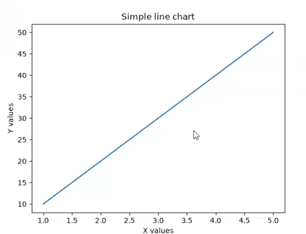

---

## Create a Simple Bar Graph Using Matplotlib

```python
import matplotlib.pyplot as plt

students = ["Ravi", "Anil", "Priya", "Sneha"]
marks = [75, 85, 90, 80]

plt.bar(students, marks)

plt.title("Student Marks")
plt.xlabel("Student Names")
plt.ylabel("Marks")

plt.show()

# Output:
# Displays a bar chart showing the marks of
# Ravi, Anil, Priya, and Sneha.
```


---

## requirements.txt File

A `requirements.txt` file is used to store the external Python packages required for a project.

Create a file named:

```text
requirements.txt
```

Add the required packages:

```text
fastapi
matplotlib
numpy
pandas
```

Then, in the project terminal, run:

```bash
pip install -r requirements.txt
```

On Windows, this can also be written as:

```bash
pip install -r .\requirements.txt
```

This installs all the packages listed inside the `requirements.txt` file.

---

## import Keyword

---

**The `import` keyword is used to use one module inside another Python file.**

### Syntax

```python
import module_name
```

### Example

```python
import math
import sys
import os

print(math.sqrt(25))
# Output: 5.0
```

---

## Modules with Alias Name

**We can give another name to a module using the `as` keyword.**

### Example

```python
import math as m

print(m.sqrt(5))
# Output: 2.23606797749979
```

Here:

- `math` is the original module name.
- `m` is the alias name.
- After creating the alias, we can use `m.sqrt()` instead of `math.sqrt()`.

---

## from import

---

**`from ... import` is used to import a specific function, class, or variable from a module.**

### Syntax

```python
from module_name import function_name
```

We can also import multiple items:

```python
from module_name import function_name1, function_name2, function_name3
```

---

## Example

```python
from math import sqrt, factorial

print(sqrt(5))
# Output: 2.23606797749979

print(factorial(5))
# Output: 120
```

`sqrt(5)` finds the square root of `5`.

`factorial(5)` calculates:

```text
5 × 4 × 3 × 2 × 1 = 120
```

---

## Create a User-Defined Module

---

A user-defined module is a Python file created by the developer to store reusable code.

---

## Step 1: Create a File Named `calculator.py`

---

### calculator.py

```python
def add(a, b):
    return a + b


def sub(a, b):
    return a - b


def mul(a, b):
    return a * b


def div(a, b):
    return a / b
```

---

## Step 2: Use the User-Defined Module in `main.py`

---

### Method 1: Import the Complete Module

```python
import calculator

print(calculator.add(10, 20))
# Output: 30

print(calculator.mul(10, 20))
# Output: 200
```

---

### Method 2: Import Module with an Alias

```python
import calculator as calc

print(calc.add(10, 20))
# Output: 30

print(calc.mul(10, 20))
# Output: 200
```

---

### Method 3: Import Specific Functions

```python
from calculator import add, mul

print(add(10, 20))
# Output: 30

print(mul(10, 20))
# Output: 200
```

**For this simple example, `calculator.py` and `main.py` should be in the same folder.**

Example project structure:

```text
project/
│
├── calculator.py
└── main.py
```

---
# Python OOPS

---

## What is OOPS?

**OOP = Object-Oriented Programming System**

OOP is a programming approach where we design software using:

```text
Classes + Objects
```

In real-world applications, entities can be represented as objects.

Examples:

```text
Student      → name, email, phone, course, fee
Employee     → id, name, salary, project
BankAccount  → account_number, balance, branch_name
```

An object can contain:

```text
Properties + Behaviours
```

- **Properties** → Variables used to store data.
- **Behaviours** → Methods used to perform actions.

---

## Without OOP

Without OOP, we may write related variables and functions separately.

```python
student_name = "Ashok"
student_email = "ashok@gmail.com"
student_course = "Python"


def display_student():
    print(student_name)
    print(student_email)
    print(student_course)


display_student()

# Output:
# Ashok
# ashok@gmail.com
# Python
```

This works for a small program.

But if we have:

```text
100 students
1000 students
```

managing separate variables and functions becomes difficult.

OOP helps us group related:

```text
Data + Functions
```

together.

---

# Why OOP?

OOP helps with:

- Code reusability
- Code organization
- Controlled access to data
- Easy maintenance
- Reducing duplicate/boilerplate code
- Building large-scale applications

---

# Main Concepts of OOP

1. Class
2. Object
3. `self`
4. Constructor
5. Instance Variable
6. Instance Method
7. Class Variable
8. Static Method
9. Encapsulation
10. Inheritance
11. Method Overriding
12. `super()`
13. Polymorphism
14. Method Overloading
15. Abstraction
16. Abstract Class

### Concept Flow

```text
Class
  ↓
Object
  ↓
self
  ↓
Constructor
  ↓
Instance Variables
  ↓
Instance Methods
```

```text
Class
  ↓
Encapsulation
  ↓
Public / Private-style Data
```

```text
Inheritance
  ↓
Method Overriding
  ↓
Polymorphism
```

```text
Inheritance
  ↓
super()
```

```text
Abstraction
  ↓
Abstract Class
  ↓
Abstract Method
  ↓
Child Implementation
```

---

# What is a Class?

**A class is a blueprint, template, model, or plan used to create objects.**

A class defines:

```text
Properties + Behaviours
```

### Properties

Properties are variables used to store data.

### Behaviours

Behaviours are methods used to perform actions.

### Example 1

```text
Student = Class

Properties:
name
email
phone
course

Behaviours:
study()
attend_class()
write_exam()
```

### Example 2

```text
Employee = Class

Properties:
id
name
salary

Behaviours:
work()
attend_meetings()
take_leave()
take_salary()
```

---

## Class Syntax

```python
class ClassName:
    pass

# Output:
# No output
```

`pass` means:

```text
Do nothing.
```

It is a placeholder when Python requires a block of code but we do not want to implement anything yet.

---

## Class Example

```python
class Student:
    id = 100
    name = "Ashok"

    def display(self):
        print(self.name)
        print(self.id)


student = Student()
student.display()

# Output:
# Ashok
# 100
```

### Explanation

```python
class Student:
```

creates the class.

```python
student = Student()
```

creates an object.

```python
student.display()
```

calls the `display()` method using that object.

### Concept Connection

```text
Class
  ↓
Blueprint
  ↓
Object
```

---

## `pass` Example

```python
a = 10

if a > 10:
    pass
else:
    print("hi")

# Output:
# hi
```

Because:

```python
a > 10
```

is `False`, the `else` block executes.

Another example:

```python
a = 12

if a > 10:
    pass
else:
    print("hi")

# Output:
# No output
```

Here the condition is `True`, so `pass` executes and does nothing.

---

# What is an Object?

**An object is an instance created from a class.**

```python
class Student:
    pass


s1 = Student()

# Output:
# No output
```

Here:

```text
Student → Class
s1      → Object
```

---

## One Class Can Create Multiple Objects

```python
class Student:
    id = 100
    name = "Ashok"

    def display(self):
        print(self.name)
        print(self.id)


s1 = Student()
s1.display()

# Output:
# Ashok
# 100


s2 = Student()
s2.display()

# Output:
# Ashok
# 100


s3 = Student()
s3.display()

# Output:
# Ashok
# 100
```

Here:

```text
Student → One Class

s1 → Object 1
s2 → Object 2
s3 → Object 3
```

### Concept Connection

After creating objects, Python needs to know:

```text
Which object is currently calling a method?
```

That leads to:

```python
self
```

---

# What is `self`?

**`self` is a reference to the current object.**

`self` is used inside instance methods to access:

- Instance variables
- Other instance methods

Whenever an object calls an instance method, Python automatically passes that object to the first parameter, conventionally named `self`.

`self` is **not a Python keyword**, but it is the standard naming convention.

---

## `self` Example

```python
class Student:
    id = 100
    name = "Ashok"

    def display(self):
        print(self.name)
        print(self.id)

    def study(self):
        print(self.name, "Student studying...")


s1 = Student()

s1.display()

# Output:
# Ashok
# 100

s1.study()

# Output:
# Ashok Student studying...
```

When we write:

```python
s1.display()
```

Python works approximately like:

```python
Student.display(s1)
```

Therefore:

```text
self = s1
```

---

## `self` with Another Parameter

```python
class Student:

    def study(self, name):
        print(name, "Student studying...")


s1 = Student()

s1.study("Ashok")

# Output:
# Ashok Student studying...
```

Python internally works approximately like:

```python
Student.study(s1, "Ashok")
```

Therefore:

```text
self → s1
name → "Ashok"
```

---

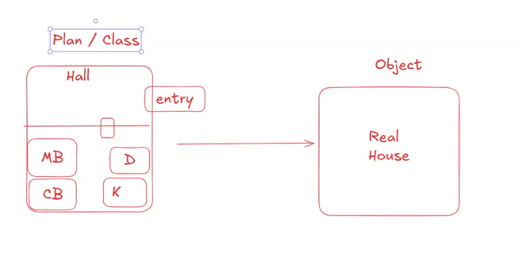

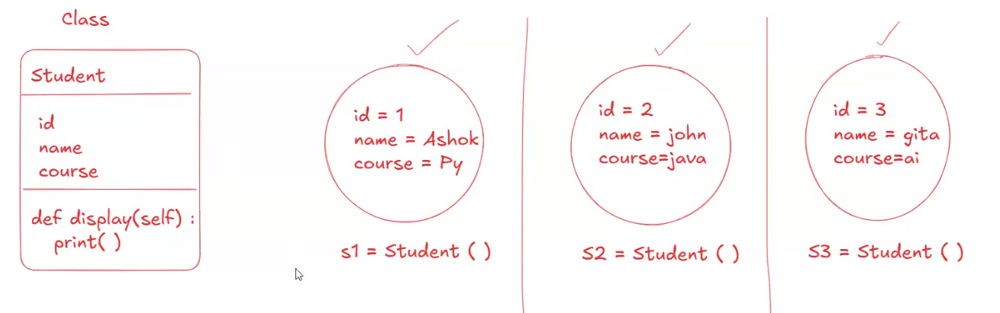

---

# Constructor

**A constructor is used to initialize object data when an object is created.**

In Python, `__init__()` is commonly referred to as the constructor.

For normal object creation:

```text
Create Object
     ↓
__init__() runs automatically
     ↓
Object data is initialized
```

### Important

Creating an object:

```python
s1 = Student()
```

causes initialization to happen.

Calling another method later:

```python
s1.display()
```

does **not** call `__init__()` again.

---

## Constructor Syntax

```python
class ClassName:

    def __init__(self):
        pass

# Output:
# No output
```

---

## Constructor Example

```python
class Student:

    def __init__(self, name, course):
        self.name = name
        self.course = course

    def display(self):
        print(self.name, "--", self.course)


s1 = Student("Ashok", "Python")
s1.display()

# Output:
# Ashok -- Python


s2 = Student("John", "JAVA")
s2.display()

# Output:
# John -- JAVA


s3 = Student("GITA", "AI")
s3.display()

# Output:
# GITA -- AI
```

### Explanation

When:

```python
s1 = Student("Ashok", "Python")
```

is executed, `__init__()` initializes:

```python
self.name = "Ashok"
self.course = "Python"
```

For:

```python
s2 = Student("John", "JAVA")
```

it initializes:

```python
self.name = "John"
self.course = "JAVA"
```

Therefore:

```text
Same Class
   ↓
Different Objects
   ↓
Different Object Data

s1 → Ashok, Python
s2 → John, JAVA
s3 → GITA, AI
```

### Concept Connection

The constructor introduces the next concept:

```text
Constructor
    ↓
Initializes
    ↓
Instance Variables
```

because:

```python
self.name
self.course
```

are instance variables.

---

# Instance Variables

**Instance variables are variables that belong to individual objects.**

They are commonly created using:

```python
self.variable_name
```

Each object can have different values.

---

## Example

```python
class Student:

    def __init__(self, name, course):
        self.name = name
        self.course = course


s1 = Student("Ashok", "Python")
s2 = Student("John", "AI")


print(s1.name)
# Output: Ashok

print(s2.name)
# Output: John

print(s1.course)
# Output: Python

print(s2.course)
# Output: AI
```

### Explanation

```python
self.name
self.course
```

are instance variables.

Each object stores its own values.

```text
s1
├── name   = Ashok
└── course = Python

s2
├── name   = John
└── course = AI
```

### Concept Connection

```text
Constructor
    ↓
Creates/Initializes
    ↓
Instance Variables
    ↓
Used by
    ↓
Instance Methods
```

---

# Instance Methods

**Instance methods are methods that receive the current object through `self`.**

They commonly work with object data.

```python
class Student:

    def __init__(self, name, marks):
        self.name = name
        self.marks = marks

    def display_result(self):
        if self.marks >= 35:
            print(self.name, "Passed")
        else:
            print(self.name, "Failed")


s1 = Student("John", 100)
s2 = Student("Michael", 25)


s1.display_result()
# Output: John Passed

s2.display_result()
# Output: Michael Failed
```

### Correction

Using:

```python
self.marks >= 35
```

means `35` is also considered a passing mark.

Using:

```python
self.marks > 35
```

would make `35` fail.

---

## Concept Connection

```text
Object
  ↓
self
  ↓
Instance Variables
  ↓
Instance Methods
```

---

# Class Variables

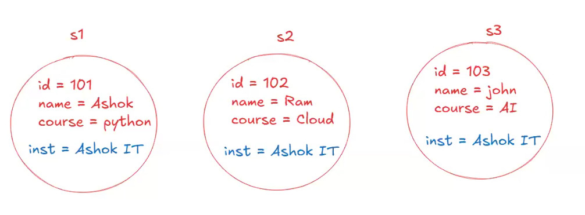

**A class variable is declared inside the class but outside methods.**

It belongs to the class and is normally shared by its objects.

Use a class variable when the value represents something common to the class.

Example:

```text
Student Name       → Changes from object to object
Institute Name     → Common for all students
```

Therefore:

```text
Student Name   → Instance Variable
Institute Name → Class Variable
```

---

## Example

```python
class Student:
    inst_name = "Ashok IT"  # Class variable

    def __init__(self, name):
        self.name = name  # Instance variable

    def display_result(self):
        print(self.name, "--", Student.inst_name)


s1 = Student("John")
s2 = Student("Michael")


s1.display_result()
# Output: John -- Ashok IT

s2.display_result()
# Output: Michael -- Ashok IT
```

### Explanation

```python
self.name
```

changes between objects.

```python
Student.inst_name
```

is shared at the class level.

---

# Instance Variable vs Class Variable

| Instance Variable | Class Variable |
|---|---|
| Commonly created using `self` | Created inside class but outside methods |
| Belongs to object | Belongs to class |
| Each object can have different values | Normally shared by objects |
| Example: `self.name` | Example: `inst_name` |

### Concept Connection

```text
Object-specific data
       ↓
Instance Variable

Shared class-level data
       ↓
Class Variable
```

---

# Static Method

**A static method is a method logically related to a class but does not automatically receive `self` or `cls`.**

It is declared using:

```python
@staticmethod
```

---

## Example

```python
class Student:
    inst_name = "Ashok IT"

    def __init__(self, name):
        self.name = name

    def display_result(self):
        print(self.name, "--", Student.inst_name)

    @staticmethod
    def m1():
        print("m1 method called...")


s1 = Student("John")
s2 = Student("Michael")


s1.display_result()
# Output: John -- Ashok IT

s2.display_result()
# Output: Michael -- Ashok IT

Student.m1()
# Output: m1 method called...
```

### Explanation

`m1()` does not require:

```python
self
```

because it does not depend on a particular object's data.

---

## Practical Static Method Example

```python
class Student:
    institute_name = "Ashok IT"

    def __init__(self, name, marks):
        self.name = name
        self.marks = marks

    def display_result(self):
        print("Student Name:", self.name)
        print("Marks:", self.marks)

        if Student.is_pass(self.marks):
            print("Result: Pass")
        else:
            print("Result: Fail")

    @staticmethod
    def is_pass(marks):
        return marks >= 35


s1 = Student("Ravi", 80)
s2 = Student("Kiran", 25)


s1.display_result()

# Output:
# Student Name: Ravi
# Marks: 80
# Result: Pass


print("----------------")
# Output: ----------------


s2.display_result()

# Output:
# Student Name: Kiran
# Marks: 25
# Result: Fail
```

### Explanation

`is_pass()` only needs:

```python
marks
```

It does not automatically need:

```python
self
```

or:

```python
cls
```

Therefore, it is suitable as a static method.

---
institute_name = "Ashok IT"
→ Class variable
→ Shared at class level

__init__(self, name, marks)
→ Constructor / initializer
→ Runs when a new object is created

self.name = name
→ Instance variable
→ Different value for each object

self.marks = marks
→ Instance variable
→ Different value for each object

display_result(self)
→ Instance method
→ Uses current object's data

self.name
→ Current object's name

self.marks
→ Current object's marks

Student.is_pass(self.marks)
→ Calls static method using current object's marks

@staticmethod
is_pass(marks)
→ Static method
→ Does not receive self
→ Checks whether marks >= 35

return marks >= 35
→ Returns True or False

if True
→ Pass

if False
→ Fail
---
---

# Instance Method vs Static Method

| Instance Method | Static Method |
|---|---|
| Receives `self` | Does not automatically receive `self` |
| Commonly works with object data | Commonly performs independent/helper logic |
| Usually called using an object | Commonly called using class name |
| No special decorator | Uses `@staticmethod` |

### Correction

`@staticmethod` is **not optional** if you want Python to treat a function defined inside the class as a static method in the normal way.

---

# Encapsulation

**Encapsulation means keeping related data and methods together and controlling how data is accessed or modified.**

A class itself groups:

```text
Data + Methods
```

Encapsulation can also be used to control direct access to internal data.

### Concept Connection

This repeats concepts already learned:

```text
Class
  ↓
Contains
  ↓
Variables + Methods
```

Encapsulation adds:

```text
Variables + Methods
       ↓
Keep Together
       +
Control Access
```

---

# Public Variables

**Public attributes can be accessed and modified directly from outside the class.**

```python
class Student:

    def __init__(self, name):
        self.name = name


s1 = Student("Ashok")


print(s1.name)
# Output: Ashok


s1.name = "John"


print(s1.name)
# Output: John
```

`name` is public.

---

# Private-style Variables

Python commonly uses double underscore:

```python
__variable
```

to trigger **name mangling**.

Example:

```python
self.__balance
```

This is commonly used for internal/private-style attributes.

---

## Getter and Setter

```python
class BankAccount:

    def __init__(self, balance):
        self.__balance = balance

    def get_balance(self):
        return self.__balance

    def set_balance(self, balance):
        self.__balance = balance


account = BankAccount(200)


print(account.get_balance())
# Output: 200


account.set_balance(100)


print(account.get_balance())
# Output: 100
```

### Getter

```python
get_balance()
```

reads the value.

### Setter

```python
set_balance()
```

updates the value.

---

## Direct Access

```python
class BankAccount:

    def __init__(self, balance):
        self.__balance = balance


account = BankAccount(200)


# print(account.__balance)

# Output:
# AttributeError:
# 'BankAccount' object has no attribute '__balance'
```

Python performs name mangling.

Conceptually:

```text
__balance
    ↓
_BankAccount__balance
```

### Important Correction

Python does not provide strict private variables in the same way as languages such as Java.

Double underscore:

```python
__balance
```

does not make the data completely inaccessible.

It mainly triggers name mangling and helps prevent accidental direct access or name collisions.

---

## Creating a Public Variable Does Not Modify `__balance`

```python
class BankAccount:

    def __init__(self, balance):
        self.__balance = balance

    def get_balance(self):
        return self.__balance


b1 = BankAccount(100)


b1.balance = 200


print(b1.balance)
# Output: 200


print(b1.get_balance())
# Output: 100
```

These are two different attributes:

```text
balance   → 200
__balance → 100
```

### Concept Connection

Encapsulation uses concepts already learned:

```text
Class
+
Constructor
+
Instance Variables
+
Instance Methods
```

---

# Inheritance

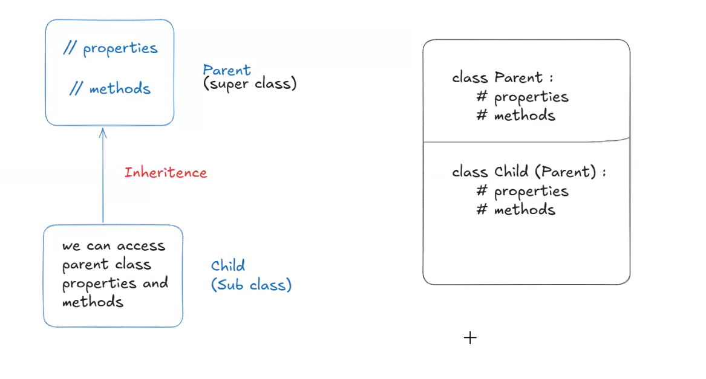

**Inheritance means one class can acquire/reuse and extend the properties and methods of another class.**

Inheritance helps achieve:

```text
Code Reusability
```

Terminology:

```text
Parent Class = Base Class = Superclass

Child Class = Derived Class = Subclass
```

---

## Basic Inheritance Example

```python
class Parent:

    def house(self):
        print("Parent House")


class Child(Parent):

    def bike(self):
        print("Child Bike")


c = Child()


c.bike()
# Output: Child Bike

c.house()
# Output: Parent House
```

### Explanation

```python
class Child(Parent):
```

means:

```text
Child inherits Parent
```

Therefore:

```text
Child Object
    ↓
Own Methods
+
Inherited Methods
```

### Concept Connection

Inheritance is the foundation for:

```text
Inheritance
   ├── Method Overriding
   ├── super()
   ├── Polymorphism
   └── Abstract Classes
```

---

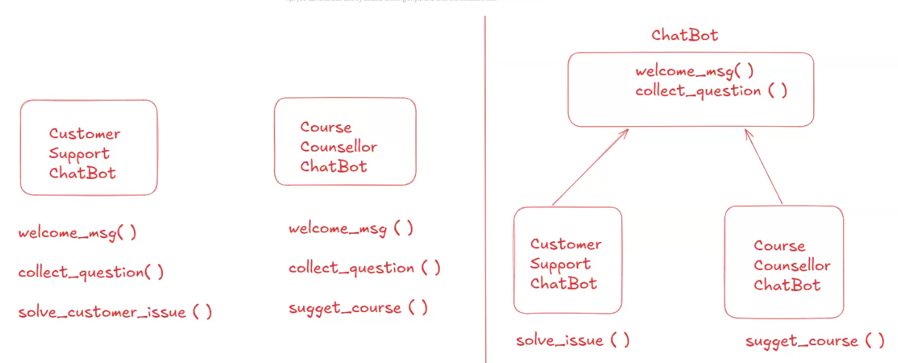

## Inheritance Example with AI Bots

```python
class ChatBot:

    def welcome_user(self):
        print("Welcome to GEN AI Chatbot..")

    def collect_question(self, question):
        print("User Question:", question)


class CustomerSupportBot(ChatBot):

    def solve_customer_issue(self):
        print("Solving customer issue using AI")


class CourseCounsellingBot(ChatBot):

    def suggest_course(self):
        print("Suggesting best course using AI")


bot1 = CustomerSupportBot()

bot1.welcome_user()
# Output: Welcome to GEN AI Chatbot..

bot1.collect_question("Why is my Outlook not working?")
# Output: User Question: Why is my Outlook not working?

bot1.solve_customer_issue()
# Output: Solving customer issue using AI


print("--------------------------")
# Output: --------------------------


bot2 = CourseCounsellingBot()

bot2.welcome_user()
# Output: Welcome to GEN AI Chatbot..

bot2.collect_question("Which course is best for me?")
# Output: User Question: Which course is best for me?

bot2.suggest_course()
# Output: Suggesting best course using AI
```

Both child classes inherit:

```python
welcome_user()
collect_question()
```

from `ChatBot`.

---

# Types of Inheritance

1. Single Inheritance
2. Multiple Inheritance
3. Multilevel Inheritance
4. Hierarchical Inheritance
5. Hybrid Inheritance

---

# Single Inheritance

**One child class inherits from one parent class.**

```text
Parent
  ↓
Child
```

```python
class Parent:

    def parent_method(self):
        print("Parent method")


class Child(Parent):

    def child_method(self):
        print("Child method")


obj = Child()


obj.parent_method()
# Output: Parent method

obj.child_method()
# Output: Child method
```

---

# Multiple Inheritance

**One child class inherits from multiple parent classes.**

```text
Father     Mother
   \       /
      Child
```

Python uses **MRO — Method Resolution Order** to determine where methods should be searched.

---

## Example

```python
class Father:

    def father_property(self):
        print("Father property")

    def m1(self):
        print("Father m1 method")


class Mother:

    def mother_property(self):
        print("Mother property")

    def m1(self):
        print("Mother m1 method")


class Child(Father, Mother):

    def child_property(self):
        print("Child property")

    def m1(self):
        print("Child m1 method")


obj = Child()


obj.father_property()
# Output: Father property

obj.mother_property()
# Output: Mother property

obj.child_property()
# Output: Child property

obj.m1()
# Output: Child m1 method
```

`Child` has its own `m1()`.

Therefore, Python finds it first and executes it.

---

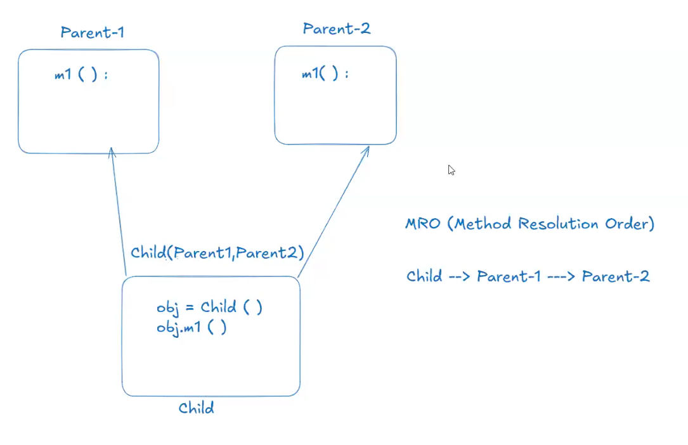

# MRO - Method Resolution Order

**MRO determines the order Python follows when searching for methods in an inheritance hierarchy.**

For:

```python
class Child(Father, Mother):
```

the simple inheritance hierarchy above gives:

```text
Child
  ↓
Father
  ↓
Mother
  ↓
object
```

We can check the actual MRO:

```python
print(Child.mro())

# Example Output:
# [<class '__main__.Child'>,
#  <class '__main__.Father'>,
#  <class '__main__.Mother'>,
#  <class 'object'>]
```

### Concept Connection

MRO becomes especially important when using:

```python
super()
```

because `super()` follows the MRO.

---

# Multilevel Inheritance

**Multilevel inheritance occurs when a class inherits from another class that itself inherits from another class.**

```text
GrandParent
    ↓
Parent
    ↓
Child
```

```python
class GrandParent:

    def grandparent_method(self):
        print("Grand Parent method")


class Parent(GrandParent):

    def parent_method(self):
        print("Parent method")


class Child(Parent):

    def child_method(self):
        print("Child Method")


obj = Child()


obj.child_method()
# Output: Child Method

obj.parent_method()
# Output: Parent method

obj.grandparent_method()
# Output: Grand Parent method
```

---

# Hierarchical Inheritance

**Multiple child classes inherit from the same parent class.**

```text
       Parent
       /    \
   Child1   Child2
```

```python
class Parent:

    def parent_method(self):
        print("Parent method")


class Child1(Parent):

    def child1_method(self):
        print("Child1 method")


class Child2(Parent):

    def child2_method(self):
        print("Child2 method")


c1 = Child1()
c2 = Child2()


c1.parent_method()
# Output: Parent method

c1.child1_method()
# Output: Child1 method


print("------------------")
# Output: ------------------


c2.parent_method()
# Output: Parent method

c2.child2_method()
# Output: Child2 method
```

---

# Hybrid Inheritance

**Hybrid inheritance combines two or more inheritance types in the same program.**

Structure:

```text
        A
       / \
      B   C
       \ /
        D
```

Here:

```text
A → B and C
```

is hierarchical inheritance.

```text
B + C → D
```

is multiple inheritance.

---

## Example

```python
class A:

    def method_a(self):
        print("Method from class A")


class B(A):

    def method_b(self):
        print("Method from class B")


class C(A):

    def method_c(self):
        print("Method from class C")


class D(B, C):

    def method_d(self):
        print("Method from class D")


obj = D()


obj.method_a()
# Output: Method from class A

obj.method_b()
# Output: Method from class B

obj.method_c()
# Output: Method from class C

obj.method_d()
# Output: Method from class D
```

### Concept Connection

Hybrid inheritance may contain multiple inheritance.

Therefore:

```text
Hybrid Inheritance
       ↓
Multiple Inheritance
       ↓
MRO
```

---

# Method Overriding

**Method overriding occurs when a child class provides its own implementation of a method inherited from the parent class.**

---

## Example

```python
class Parent:

    def display(self):
        print("Parent display method")


class Child(Parent):

    def display(self):
        print("Child display method")


obj = Child()

obj.display()

# Output:
# Child display method
```

### Explanation

The parent has:

```python
display()
```

and the child also has:

```python
display()
```

The child version overrides the inherited version for child objects.

---

## Without Method Overriding

```python
class Parent:

    def display(self):
        print("Parent display method")


class Child(Parent):
    pass


obj = Child()

obj.display()

# Output:
# Parent display method
```

Since `Child` does not define `display()`, it inherits the parent's implementation.

---

## AI Example

```python
class AIModel:

    def generate_response(self, prompt):
        print("Generating response using general AI Model")


class OpenAIModel(AIModel):

    def generate_response(self, prompt):
        print("Generating response using OpenAI GPT Model")
        print("Prompt:", prompt)


class GeminiModel(AIModel):

    def generate_response(self, prompt):
        print("Generating response using Gemini Model")
        print("Prompt:", prompt)


model1 = OpenAIModel()

model1.generate_response("Explain Python Decorators")

# Output:
# Generating response using OpenAI GPT Model
# Prompt: Explain Python Decorators


print("====================================================")
# Output: ====================================================


model2 = GeminiModel()

model2.generate_response("Explain Python File Handling")

# Output:
# Generating response using Gemini Model
# Prompt: Explain Python File Handling
```

### Concept Connection

This concept comes directly from inheritance:

```text
Inheritance
    ↓
Parent Method
    ↓
Child provides its own version
    ↓
Method Overriding
    ↓
Different behaviour
    ↓
Polymorphism
```

---

# `super()`

**`super()` is used to access the next appropriate implementation in the inheritance/MRO chain.**

For simple single inheritance, you can initially understand it as:

```text
super() → Access Parent Behaviour
```

More accurately:

```text
super() → Follow MRO to the next implementation
```

---

# `super()` with Method

```python
class Parent:

    def display(self):
        print("Parent display method")


class Child(Parent):

    def display(self):
        print("Child display method")


obj = Child()

obj.display()

# Output:
# Child display method
```

Because the child overrides `display()`, only the child implementation executes.

To execute inherited behaviour as well:

```python
class Parent:

    def display(self):
        print("Parent display method")


class Child(Parent):

    def display(self):
        super().display()
        print("Child display method")


obj = Child()

obj.display()

# Output:
# Parent display method
# Child display method
```

### Explanation

```python
super().display()
```

calls the next `display()` implementation according to MRO.

Then:

```python
print("Child display method")
```

continues the child method.

### Concept Connection

This repeats:

```text
Inheritance
+
Method Overriding
+
MRO
+
super()
```

---

# `super()` with Constructor

```python
class Person:

    def __init__(self, name):
        self.name = name


class Student(Person):

    def __init__(self, name, course):
        super().__init__(name)
        self.course = course

    def display(self):
        print(self.name)
        print(self.course)


s1 = Student("Ashok", "Python")

s1.display()

# Output:
# Ashok
# Python
```

### Explanation

The child defines its own constructor:

```python
Student.__init__()
```

Inside it:

```python
super().__init__(name)
```

runs the next constructor according to MRO.

In this example, that is:

```python
Person.__init__()
```

which initializes:

```python
self.name
```

Then:

```python
self.course = course
```

initializes the child-specific data.

### Concept Connection

This example combines earlier concepts:

```text
Constructor
+
Instance Variables
+
Inheritance
+
super()
```

---

# Constructor with Inheritance

### If Child Does Not Have `__init__()`

```python
class Parent:

    def __init__(self):
        print("Parent Constructor")


class Child(Parent):
    pass


c = Child()

# Output:
# Parent Constructor
```

The child inherits the parent's `__init__()`.

---

### If Child Has Its Own `__init__()`

```python
class Parent:

    def __init__(self):
        print("Parent Constructor")


class Child(Parent):

    def __init__(self):
        print("Child Constructor")


c = Child()

# Output:
# Child Constructor
```

The child has its own constructor.

The parent constructor does not automatically run in this example.

---

### To Run Both

```python
class Parent:

    def __init__(self):
        print("Parent Constructor")


class Child(Parent):

    def __init__(self):
        super().__init__()
        print("Child Constructor")


c = Child()

# Output:
# Parent Constructor
# Child Constructor
```

### Remember

```text
Create object
     ↓
Appropriate __init__() runs
```

With inheritance:

```text
Child has no __init__()
        ↓
Inherited __init__() can be used
```

```text
Child has own __init__()
        ↓
Child __init__() runs
        ↓
Use super().__init__()
if inherited initialization is also required
```

---

# Polymorphism

**Polymorphism means one interface/name can have many forms or behaviours.**

Simple meaning:

```text
One Name
Many Behaviours
```

---

## Real-Life Understanding

One person can behave differently depending on context:

```text
At class     → Trainer
At office    → Employee
At institute → Director
At home      → Family Member
```

Same person, different roles.

---

## Example 1

```python
class Dog:

    def sound(self):
        print("Dog Barks")


class Cat:

    def sound(self):
        print("Cat Meows")


def animal_sound(animal):
    animal.sound()


dog = Dog()
cat = Cat()


animal_sound(dog)
# Output: Dog Barks

animal_sound(cat)
# Output: Cat Meows
```

### Explanation

The same function:

```python
animal_sound()
```

works with different objects.

It calls:

```python
sound()
```

but the result depends on the object.

---

## Payment Example

```python
class UpiPayment:

    def pay(self, amount):
        print(f"Paid: {amount} using UPI")


class CreditCardPayment:

    def pay(self, amount):
        print(f"Paid: {amount} using Credit Card")


class DebitCardPayment:

    def pay(self, amount):
        print(f"Paid: {amount} using Debit Card")


class CashPayment:

    def pay(self, amount):
        print(f"Paid: {amount} using Hand Cash")


def make_payment(payment_method, amount):
    payment_method.pay(amount)


make_payment(CreditCardPayment(), 1000)
# Output: Paid: 1000 using Credit Card

make_payment(DebitCardPayment(), 2000)
# Output: Paid: 2000 using Debit Card

make_payment(CashPayment(), 5000)
# Output: Paid: 5000 using Hand Cash

make_payment(UpiPayment(), 10000)
# Output: Paid: 10000 using UPI
```

### Explanation

Every object provides:

```python
pay()
```

but each implementation behaves differently.

### Concept Connection

You already saw this idea in method overriding:

```text
Method Overriding
       ↓
Same Method Name
       ↓
Different Child Implementations
       ↓
Polymorphism
```

However, polymorphism in Python does not always require inheritance.

The payment example above works because every object provides the expected `pay()` method.

This is related to:

```text
Duck Typing
```

which can be studied later.

---

# Method Overloading

**Traditional method overloading means defining multiple methods with the same name but different parameter lists.**

Python does **not** directly support traditional method overloading by repeatedly defining the same method name.

---

## Example

```python
class Calculator:

    def add(self, a, b):
        return a + b

    def add(self, a, b, c):
        return a + b + c


cal = Calculator()


# print(cal.add(1, 2))

# Output:
# TypeError:
# Calculator.add() missing 1 required positional argument: 'c'


print(cal.add(1, 2, 3))
# Output: 6
```

### Explanation

The second:

```python
add()
```

replaces the first definition in the class namespace.

---

# Similar Behaviour Using Default Arguments

```python
class Calculator:

    def add(self, a, b, c=0):
        return a + b + c


cal = Calculator()


print(cal.add(1, 2))
# Output: 3


print(cal.add(1, 2, 3))
# Output: 6
```

### Concept Connection

This is not a completely new idea.

It comes from the earlier **Functions** chapter:

```text
Functions
   ↓
Default Arguments
   ↓
Flexible Number of Inputs
```

You can also use:

```python
*args
```

for more flexible method arguments.

---

# Abstraction

**Abstraction means hiding unnecessary implementation details and exposing only the required functionality.**

### Real-Life Example

When driving a car, we use:

```text
Steering
Brake
Accelerator
```

We do not need to know every internal engine operation.

The internal complexity is hidden while the required controls are exposed.

That is abstraction.

---

# Abstract Class

**An abstract class is a class used to define a common structure or requirements for child classes.**

Python provides Abstract Base Classes using the:

```python
abc
```

module.

```text
ABC = Abstract Base Class
```

Import:

```python
from abc import ABC, abstractmethod

# Output:
# No output
```

---

# Abstract Method

**An abstract method is a method marked using `@abstractmethod`.**

It defines behaviour that concrete child classes are required to implement before they can be instantiated.

```python
from abc import ABC, abstractmethod


class Payment(ABC):

    @abstractmethod
    def pay(self, amount):
        pass

# Output:
# No output
```

### Important Correction

A common beginner definition is:

```text
Abstract Method = Method without body
```

That is not completely correct in Python.

The more accurate definition is:

```text
Abstract Method
      ↓
Method marked with @abstractmethod
```

An abstract method can technically contain code.

`pass` is commonly used when no implementation is required in the abstract method itself.

---

# Concrete Method

**A concrete method is a normal implemented method that already provides usable behaviour.**

```python
def payment_success_msg(self):
    print("Payment is successful. Thank you!")
```

---

# Abstract Method vs Concrete Method

| Abstract Method | Concrete Method |
|---|---|
| Marked with `@abstractmethod` | Normal implemented method |
| Defines required behaviour | Provides usable behaviour |
| Concrete child must satisfy the abstract requirement | Child can directly inherit it |
| Can technically contain code | Contains implementation |

---

# Abstract Class Example

```python
from abc import ABC, abstractmethod


class Payment(ABC):

    def __init__(self):
        print("ABC Constructor")

    @abstractmethod
    def pay(self, amount):
        pass

    def payment_success_msg(self):
        print("Payment is successful")


class UpiPayment(Payment):

    def pay(self, amount):
        print("Paid using UPI:", amount)
        super().payment_success_msg()


class CreditCardPayment(Payment):

    def pay(self, amount):
        print("Paid using Credit Card:", amount)
        super().payment_success_msg()


upi = UpiPayment()
# Output: ABC Constructor


upi.pay(120)

# Output:
# Paid using UPI: 120
# Payment is successful


creditcard = CreditCardPayment()
# Output: ABC Constructor


creditcard.pay(12000)

# Output:
# Paid using Credit Card: 12000
# Payment is successful
```

---

# Understanding the Abstract Class Example

This example combines many concepts already learned.

## 1. Abstract Class

```python
class Payment(ABC):
```

`Payment` is an Abstract Base Class.

---

## 2. Abstract Method

```python
@abstractmethod
def pay(self, amount):
    pass
```

This creates a requirement:

```text
Concrete Payment Child
        ↓
Must provide required pay() implementation
```

---

## 3. Inheritance

```python
class UpiPayment(Payment):
```

and:

```python
class CreditCardPayment(Payment):
```

use inheritance.

This comes from the earlier:

```text
Inheritance
Parent → Child
```

concept.

---

## 4. Method Overriding

The child classes provide:

```python
def pay(self, amount):
```

This connects to the earlier:

```text
Method Overriding
```

concept because child classes provide their own implementation of an inherited method requirement.

---

## 5. Polymorphism

Both classes have:

```python
pay()
```

but the implementations are different.

```text
UPI Object
  ↓
pay() → UPI behaviour

Credit Card Object
  ↓
pay() → Credit Card behaviour
```

This connects to:

```text
Polymorphism
```

---

## 6. `super()`

```python
super().payment_success_msg()
```

reuses inherited concrete behaviour.

This comes from the earlier:

```text
Inheritance
  ↓
super()
```

concept.

---

## 7. Constructor

When:

```python
upi = UpiPayment()
```

is executed, `UpiPayment` has no `__init__()` of its own.

Therefore, the inherited:

```python
Payment.__init__()
```

is used.

That is why:

```text
ABC Constructor
```

is printed.

This comes from the earlier:

```text
Constructor
+
Inheritance
```

concept.

---

# Can We Create an Object of `Payment`?

```python
from abc import ABC, abstractmethod


class Payment(ABC):

    @abstractmethod
    def pay(self, amount):
        pass


# payment = Payment()

# Output:
# TypeError:
# Can't instantiate abstract class Payment
# with abstract method pay
```

`Payment` cannot be instantiated because it has an unsatisfied abstract method requirement.

---

# What If Child Does Not Implement `pay()`?

```python
from abc import ABC, abstractmethod


class Payment(ABC):

    @abstractmethod
    def pay(self, amount):
        pass


class UpiPayment(Payment):
    pass


# upi = UpiPayment()

# Output:
# TypeError:
# Can't instantiate abstract class UpiPayment
# with abstract method pay
```

`UpiPayment` remains abstract because it has not satisfied the `pay()` requirement.

### Important Correction

Instead of saying:

```text
Every child class must implement all abstract methods.
```

a more accurate statement is:

```text
A child class must satisfy all inherited abstract-method requirements
before that child class can be instantiated as a concrete class.
```

A child class can remain abstract and leave some abstract methods unimplemented.

---

# Abstract Class with Constructor

```python
from abc import ABC, abstractmethod


class Payment(ABC):

    def __init__(self):
        print("Payment Class Constructor")

    @abstractmethod
    def pay(self, amount):
        pass

    def payment_success_msg(self):
        print("Payment is successful")


class UpiPayment(Payment):

    def pay(self, amount):
        print("Paid using UPI:", amount)
        super().payment_success_msg()


class CreditCardPayment(Payment):

    def __init__(self):
        super().__init__()

    def pay(self, amount):
        print("Paid using Credit Card:", amount)
        super().payment_success_msg()


upi = UpiPayment()

# Output:
# Payment Class Constructor


upi.pay(120)

# Output:
# Paid using UPI: 120
# Payment is successful


credit = CreditCardPayment()

# Output:
# Payment Class Constructor


credit.pay(35000)

# Output:
# Paid using Credit Card: 35000
# Payment is successful
```

---

# Why Does `UpiPayment()` Call `Payment.__init__()`?

`UpiPayment` does not define:

```python
__init__()
```

Therefore, Python finds the inherited constructor.

```text
UpiPayment()
     ↓
No __init__() in UpiPayment
     ↓
Find inherited __init__()
     ↓
Payment.__init__()
     ↓
Payment Class Constructor
```

### Concept Connection

This is not a new abstract-class rule.

It is the same:

```text
Constructor
+
Inheritance
```

rule learned earlier.

---

# Why Does `CreditCardPayment` Use `super().__init__()`?

`CreditCardPayment` defines its own:

```python
__init__()
```

Therefore, if we want the inherited initialization to execute, we call:

```python
super().__init__()
```

Flow:

```text
CreditCardPayment()
       ↓
CreditCardPayment.__init__()
       ↓
super().__init__()
       ↓
Payment.__init__()
       ↓
Payment Class Constructor
```

Again, this repeats:

```text
Inheritance
+
Constructor
+
super()
```

---

# What Can an Abstract Class Contain?

An abstract class can contain:

- Abstract methods
- Concrete methods
- Constructors
- Instance variables
- Class variables
- Instance methods
- Static methods
- Class methods

So an abstract class is still a normal Python class with additional abstract requirements.

---

# Why Use an Abstract Class?

Use an abstract class when you want to define a common standard that related child classes should follow.

Example:

```text
Payment System

Every payment type MUST provide:
pay()

But HOW payment happens can differ.
```

Structure:

```text
                Payment
                   ↓
              pay(amount)
            @abstractmethod
                   ↓
       -------------------------
       ↓           ↓           ↓
      UPI      CreditCard    PayPal
       ↓           ↓           ↓
     pay()       pay()        pay()
```

The parent defines:

```text
WHAT must exist
```

and child classes decide:

```text
HOW it works
```

---

# Abstract Class Concept Connection

Abstract classes bring several earlier OOP concepts together:

```text
Abstract Class
      ↓
Inheritance
      ↓
Abstract Method Requirement
      ↓
Child Implementation
      ↓
Method Overriding
      ↓
Polymorphism
```

At the same time:

```text
Abstract Class
      ↓
Concrete Parent Method
      ↓
Child
      ↓
super()
      ↓
Reuse Parent Behaviour
```

And constructors still follow:

```text
Constructor
+
Inheritance
+
super()
```

---

# Abstraction vs Encapsulation

These concepts may look similar, but their main purposes are different.

### Abstraction

```text
Hide unnecessary implementation details
and expose required functionality.
```

Question it answers:

```text
What does the object allow me to do
without needing to know all internal details?
```

### Encapsulation

```text
Keep data and related behaviour together
and control how that data is accessed or modified.
```

Question it answers:

```text
How is the object's internal data organized
and controlled?
```

Simple memory:

```text
Abstraction   → Hide complexity

Encapsulation → Control internal data/access
```

---

# Python Interfaces

Python does not have a separate:

```python
interface
```

keyword like Java.

However, saying:

```text
Python has no interface concept at all
```

is too strong.

Python can define interface-like contracts using:

```text
Abstract Base Classes
Protocols
Duck Typing
```

For the current OOP level, remember:

```text
ABC + @abstractmethod
        ↓
Can define interface-like requirements
```

Later, with advanced Python/type hints, you can learn:

```python
typing.Protocol
```

---

# Complete OOP Concept Map

```text
OOP
│
├── Class
│     │
│     └── Object
│           │
│           ├── self
│           │
│           ├── Constructor
│           │      ↓
│           │   Instance Variables
│           │
│           └── Instance Methods
│
├── Class Variables
│
├── Static Methods
│
├── Encapsulation
│     │
│     ├── Public Attributes
│     └── Private-style Attributes
│
├── Inheritance
│     │
│     ├── Single
│     ├── Multiple
│     ├── Multilevel
│     ├── Hierarchical
│     └── Hybrid
│
│     ├── MRO
│     │     ↓
│     │   super()
│     │
│     └── Method Overriding
│             ↓
│         Polymorphism
│
├── Method Overloading
│     ↓
│   Not directly supported traditionally
│     ↓
│   Default Arguments / *args
│
└── Abstraction
      │
      └── Abstract Class
            │
            ├── Abstract Methods
            └── Concrete Methods
```

---

# Important Concept Connections

## Class → Object

```text
Class
  ↓
Blueprint
  ↓
Object
```

---

## Object → `self`

```text
Object calls instance method
          ↓
Python passes object
          ↓
self
```

---

## Object → Constructor

```text
Create Object
     ↓
__init__()
     ↓
Initialize Object
```

---

## Constructor → Instance Variables

```text
__init__()
    ↓
self.name
self.course
self.balance
    ↓
Instance Variables
```

---

## Instance Variables → Instance Methods

```text
Object Data
    ↓
Instance Variables
    ↓
Used by
    ↓
Instance Methods
```

---

## Class Variable

```text
Common Data
    ↓
Class Variable
    ↓
Normally Shared by Objects
```

---

## Encapsulation

```text
Class
  ↓
Data + Methods
  ↓
Controlled Access
```

---

## Inheritance

```text
Parent
  ↓
Child
  ↓
Reuse / Extend Behaviour
```

---

## Inheritance → Method Overriding

```text
Parent Method
     ↓
Inherited by Child
     ↓
Child provides own version
     ↓
Method Overriding
```

---

## Method Overriding → Polymorphism

```text
Same Method Name
       ↓
Different Objects
       ↓
Different Behaviour
       ↓
Polymorphism
```

---

## Inheritance → MRO → `super()`

```text
Inheritance Hierarchy
       ↓
MRO
       ↓
Determines Lookup Order
       ↓
super()
       ↓
Next Implementation
```

---

## Abstraction → Abstract Class

```text
Abstraction
     ↓
Hide unnecessary implementation
     ↓
Abstract Class
     ↓
Define common requirements
```

---

## Abstract Class → Inheritance

```text
Abstract Parent
      ↓
Child Classes
      ↓
Satisfy Required Behaviour
```

---

## Abstract Method → Method Overriding

```text
Parent

@abstractmethod
pay()
   ↓
Child
   ↓
pay()
   ↓
Child Implementation
```

This connects directly with the method overriding concept.

---

## Abstract Class → Polymorphism

```text
              Payment
                 ↓
        Common pay() contract
                 ↓
      -----------------------
      ↓          ↓          ↓
     UPI     CreditCard   PayPal
      ↓          ↓          ↓
    pay()      pay()       pay()
```

Same:

```python
pay()
```

interface, different implementations.

That gives polymorphic behaviour.

---

# Important Corrections to Remember

### 1. `__init__()` and Object Creation

For normal class instantiation:

```text
Create Object
     ↓
Initialization process runs
     ↓
__init__() is normally called
```

Calling another method does not call `__init__()` again.

---

### 2. Instance Variable

A beginner-friendly rule is:

```text
self.variable → Instance Variable
```

More precisely, instance variables are attributes stored on individual objects.

---

### 3. Class Variable

Do not think:

```text
Class Variable = Value can never change
```

A class variable **can change**.

The important idea is:

```text
Class Variable = Class-level/shared data
```

---

### 4. Static Method

Use:

```python
@staticmethod
```

for a method that does not automatically need:

```python
self
```

or:

```python
cls
```

---

### 5. Private Variable

Python's:

```python
__balance
```

uses:

```text
Name Mangling
```

It is not absolute security.

---

### 6. `super()`

Beginner meaning:

```text
Call Parent
```

More accurate meaning:

```text
Continue method lookup according to MRO
```

This difference becomes important with multiple inheritance.

---

### 7. Abstract Method

Do not remember only:

```text
Abstract Method = Method without body
```

Remember:

```text
Abstract Method
      ↓
Marked with @abstractmethod
      ↓
Creates an abstract requirement
```

---

### 8. Abstract Child Class

A child does not always have to immediately implement every abstract method.

If it does not satisfy all inherited abstract requirements:

```text
Child remains abstract
```

and cannot be instantiated as a concrete class.

---

### 9. Method Overloading

Python does not support traditional overloading by repeatedly defining:

```python
def add(...):
```

because the later definition replaces the earlier one.

Use concepts already learned from functions:

```text
Default Arguments
*args
**kwargs
```

when appropriate.

---

# Final OOP Flow to Remember

```text
CLASS
  ↓
Blueprint

OBJECT
  ↓
Instance of Class

self
  ↓
Current Object

CONSTRUCTOR
  ↓
Initializes Object

INSTANCE VARIABLES
  ↓
Store Object-specific Data

INSTANCE METHODS
  ↓
Work with Object Data

CLASS VARIABLES
  ↓
Store Shared/Class-level Data

STATIC METHODS
  ↓
Utility Behaviour without automatic self/cls

ENCAPSULATION
  ↓
Keep Data + Methods Together
and Control Access

INHERITANCE
  ↓
Reuse and Extend Existing Classes

MRO
  ↓
Determine Method Lookup Order

METHOD OVERRIDING
  ↓
Child Changes Inherited Behaviour

super()
  ↓
Continue to Next Implementation in MRO

POLYMORPHISM
  ↓
Same Interface, Different Behaviour

ABSTRACTION
  ↓
Hide Unnecessary Implementation Details

ABSTRACT CLASS
  ↓
Define Common Requirements

ABSTRACT METHODS
  ↓
Required Behaviour for Concrete Children
```

---

# One-Line Revision

```text
Class             → Blueprint
Object            → Instance of class
self              → Current object
Constructor       → Initializes object
Instance Variable → Object-specific data
Instance Method   → Method receiving current object
Class Variable    → Shared/class-level data
Static Method     → No automatic self/cls
Encapsulation     → Data + methods + controlled access
Inheritance       → Reuse/extend parent functionality
MRO               → Method lookup order
Overriding        → Child provides own inherited method implementation
super()           → Continue according to MRO
Polymorphism      → Same interface, different behaviour
Overloading       → Traditional form not directly supported by redefinition
Abstraction       → Hide unnecessary implementation details
Abstract Class    → Defines common requirements
Abstract Method   → Method marked with @abstractmethod
Concrete Method   → Normal implemented method
```
---
# Python Exception Handling

---

## What is an Exception?

An **exception** is an unexpected event or error that occurs while a program is running and interrupts the normal flow of program execution.

If an exception occurs and we do not handle it, Python normally stops the program at that point.

```text
Normal Program Flow
        ↓
Exception Occurs
        ↓
Exception is not handled
        ↓
Program stops abnormally
```

As programmers, we can use **exception handling** to deal with expected runtime problems gracefully.

### Simple Meaning

```text
Exception
    ↓
Problem that occurs while the program is running
```

Example:

```python
a = 10
b = 0

result = a / b

print("Result:", result)

# Output:
# ZeroDivisionError: division by zero
```

Python cannot divide `10` by `0`, so it raises a `ZeroDivisionError`.

Because the exception is not handled:

```python
print("Result:", result)
```

is never executed.

---

# Why Exception Handling?

Exception handling is useful for:

1. Handling runtime problems
2. Preventing unexpected program termination
3. Displaying meaningful error messages
4. Allowing the program to continue where appropriate
5. Performing cleanup operations
6. Handling invalid user input
7. Handling missing files or unavailable resources
8. Creating application-specific errors

---

# Important Correction

It is common for beginners to say:

```text
Exception = Runtime Error
```

This is useful as a simple starting point, but more accurately:

```text
Exception
    ↓
An event represented by an exception object that interrupts normal execution
```

Also, Python has an actual built-in exception class named:

```python
RuntimeError
```

So we should not confuse the general term **runtime error** with the specific `RuntimeError` class.

---

# Types of Programming Problems

At a beginner level, we can divide common problems into:

1. Syntax Errors
2. Exceptions during execution
3. Logical Errors

---

# 1. Syntax Error

A **syntax error** occurs when Python code does not follow Python's grammar.

Example:

```python
# Incorrect code

# print("Hello

# Output:
# SyntaxError: '(' was never closed
```

Python cannot properly parse the program.

### Important

Syntax errors generally must be corrected before that code can run.

For example:

```python
print("Hello")
# Output: Hello
```

### Can `try-except` Handle a Syntax Error in the Same Invalid Code?

Normally, no.

For example, this program itself cannot start correctly:

```python
# try:
#     print("Hello
# except SyntaxError:
#     print("Syntax problem")
```

Python must first parse the source code before executing it.

So malformed syntax must normally be fixed manually.

---

# 2. Runtime Exception

A runtime exception occurs while otherwise valid Python code is executing.

Example:

```python
a = 10
b = 0

print(a / b)

# Output:
# ZeroDivisionError: division by zero
```

The syntax is valid.

The problem happens only when Python performs:

```python
10 / 0
```

Runtime exceptions can often be handled using:

```python
try
except
```

---

# 3. Logical Error

A logical error is different.

The program runs successfully, but produces the wrong result because the logic is incorrect.

Example:

```python
price = 100
quantity = 2

total = price + quantity

print(total)
# Output: 102
```

There is no exception.

But if we intended:

```text
Total = Price × Quantity
```

then the correct code should be:

```python
price = 100
quantity = 2

total = price * quantity

print(total)
# Output: 200
```

### Important

Exception handling does not automatically detect logical mistakes.

---

# Common Exceptions in Python

Some common exceptions are:

1. `ZeroDivisionError`
2. `ValueError`
3. `TypeError`
4. `IndexError`
5. `KeyError`
6. `FileNotFoundError`
7. `NameError`
8. `AttributeError`
9. `ImportError`
10. `ModuleNotFoundError`
11. `MemoryError`

Some errors such as:

- `SyntaxError`
- `IndentationError`

belong to Python's syntax/parsing error family and normally prevent malformed source code from running.

---

# `ZeroDivisionError`

This exception occurs when we try to divide a number by zero.

```python
a = 10
b = 0

print(a / b)

# Output:
# ZeroDivisionError: division by zero
```

Another example:

```python
print(25 // 0)

# Output:
# ZeroDivisionError: integer division or modulo by zero
```

---

# `ValueError`

A `ValueError` occurs when a function receives a value of the correct general type, but the value itself is inappropriate.

Example:

```python
num = int(input("Enter value: "))

print(num)
```

If the input is:

```text
10
```

then:

```text
# Output:
# 10
```

But if the input is:

```text
abc
```

Python tries:

```python
int("abc")
```

which is not a valid integer conversion.

```text
# Output:
# ValueError: invalid literal for int() with base 10: 'abc'
```

### Concept Connection

This connects to the earlier concepts:

```text
input()
   ↓
Always returns string
   ↓
int(...)
   ↓
Conversion
   ↓
Invalid value
   ↓
ValueError
```

---

# `TypeError`

A `TypeError` occurs when an operation is performed on incompatible types or a function receives an inappropriate type.

Example:

```python
result = "10" + 20

print(result)

# Output:
# TypeError: can only concatenate str (not "int") to str
```

Here:

```text
"10" → str
20   → int
```

Python cannot directly perform:

```python
str + int
```

Correct versions include:

```python
result = "10" + str(20)

print(result)
# Output: 1020
```

or:

```python
result = int("10") + 20

print(result)
# Output: 30
```

---

# `IndexError`

An `IndexError` occurs when we try to access an index that does not exist in a sequence such as a list, tuple, or string.

```python
numbers = [10, 20, 30]

print(numbers[5])

# Output:
# IndexError: list index out of range
```

Available indexes are:

```text
0 → 10
1 → 20
2 → 30
```

Index `5` does not exist.

### Concept Connection

This comes from the earlier sequence concepts:

```text
List / Tuple / String
        ↓
Indexing
        ↓
Invalid index
        ↓
IndexError
```

---

# `KeyError`

A `KeyError` occurs when we access a dictionary key that does not exist.

```python
student = {
    "name": "Ashok",
    "course": "GEN AI"
}

print(student["age"])

# Output:
# KeyError: 'age'
```

The available keys are:

```text
name
course
```

but:

```text
age
```

does not exist.

### Safer Dictionary Access

The `.get()` method can be used when a missing key is acceptable.

```python
student = {
    "name": "Ashok",
    "course": "GEN AI"
}

print(student.get("age"))

# Output:
# None
```

Or give a default value:

```python
print(student.get("age", "Age not available"))

# Output:
# Age not available
```

### Concept Connection

This comes from:

```text
Dictionary
    ↓
Keys
    ↓
Missing key with []
    ↓
KeyError
```

---

# `FileNotFoundError`

This exception occurs when we attempt to open a file that does not exist at the given path.

```python
file = open("students.txt", "r")

print(file.read())

# Example Output:
# FileNotFoundError: [Errno 2] No such file or directory: 'students.txt'
```

The exact operating-system message may vary.

---

# `NameError`

A `NameError` occurs when Python tries to use a variable or name that has not been defined.

```python
print(course)

# Output:
# NameError: name 'course' is not defined
```

Correct example:

```python
course = "Python"

print(course)

# Output:
# Python
```

---

# `AttributeError`

An `AttributeError` occurs when we try to access a method or attribute that an object does not have.

```python
numbers = [10, 20, 30]

numbers.upper()

# Output:
# AttributeError: 'list' object has no attribute 'upper'
```

Why?

```python
upper()
```

is a string method.

It is not a list method.

Correct example:

```python
name = "python"

print(name.upper())

# Output:
# PYTHON
```

### Concept Connection

This connects strongly with OOP:

```text
Object
   ↓
Available Attributes / Methods
   ↓
Request unavailable attribute
   ↓
AttributeError
```

---

# `IndentationError`

An `IndentationError` occurs when indentation is incorrect.

Incorrect code:

```python
# if True:
# print("Hello")

# Output:
# IndentationError: expected an indented block
```

Correct code:

```python
if True:
    print("Hello")

# Output:
# Hello
```

### Important

`IndentationError` is a subclass of `SyntaxError`.

The malformed code must normally be fixed before normal execution can begin.

---

# `MemoryError`

Python can raise a `MemoryError` when an operation cannot allocate enough memory.

Example concept:

```python
numbers = []

while True:
    numbers.append("Python")

# Possible eventual result:
# MemoryError
```

### Important

Do **not** run this example unnecessarily.

It intentionally keeps consuming memory and could slow down or crash the Python process before a clean `MemoryError` is displayed.

For notes, understand the concept without executing it.

---

# `ImportError`

An `ImportError` occurs when Python cannot import a requested name from a module.

Example:

```python
# from math import addition

# Output:
# ImportError: cannot import name 'addition' from 'math'
```

This happens because the `math` module does not contain a function called:

```python
addition
```

Correct example:

```python
from math import sqrt

print(sqrt(25))

# Output:
# 5.0
```

---

# `ModuleNotFoundError`

A closely related exception is:

```python
ModuleNotFoundError
```

Example:

```python
# import some_unknown_module

# Output:
# ModuleNotFoundError: No module named 'some_unknown_module'
```

### Difference

```text
ModuleNotFoundError
→ Python cannot find the module itself

ImportError
→ Module may exist, but requested import cannot be completed
```

`ModuleNotFoundError` is a subclass of `ImportError`.

### Concept Connection

This connects to your earlier **Modules** chapter.

---

# Exception Handling Keywords

The main exception-handling keywords are:

1. `try`
2. `except`
3. `else`
4. `finally`
5. `raise`

Basic flow:

```text
try
 ↓
Run risky code
 ↓
Did exception occur?
   /        \
 Yes         No
 ↓            ↓
except       else
   \          /
    \        /
      finally
```

---

# `try` Block

The `try` block contains code that may raise an exception.

Example risky operations:

```text
Division
User input conversion
File opening
Dictionary access
Index access
External APIs
Database operations
```

Syntax:

```python
try:
    # risky code
    pass

# Output:
# No output
```

---

# `except` Block

The `except` block handles an exception raised inside the associated `try` block.

---

## Basic Example

```python
a = int(input("Enter First Number: "))
b = int(input("Enter Second Number: "))

try:
    result = a / b
    print("Result:", result)

except:
    print("Invalid Number Entered")
```

If input is:

```text
10
0
```

output:

```text
# Output:
# Invalid Number Entered
```

### Problem with This Example

The `int()` conversions occur **outside** the `try`.

Therefore, if the user enters:

```text
abc
```

the `ValueError` occurs before Python enters the `try` block.

So this version does **not** handle invalid integer input.

A better version is:

```python
try:
    a = int(input("Enter First Number: "))
    b = int(input("Enter Second Number: "))

    result = a / b

    print("Result:", result)

except ValueError:
    print("Please enter valid integers.")

except ZeroDivisionError:
    print("Cannot divide by zero.")
```

If input is:

```text
abc
```

```text
# Output:
# Please enter valid integers.
```

If input is:

```text
10
0
```

```text
# Output:
# Cannot divide by zero.
```

If input is:

```text
10
2
```

```text
# Output:
# Result: 5.0
```

---

# Handling Multiple Specific Exceptions

```python
try:
    a = int(input("Enter first number: "))
    b = int(input("Enter second number: "))

    result = a / b

    print("Result:", result)

except ValueError as ve:
    print("Please enter only numbers:", ve)

except ZeroDivisionError as ze:
    print("Don't enter zero as the divisor:", ze)

except Exception as e:
    print("Some problem occurred:", e)

print("Program Execution Completed")
```

If input is:

```text
10
0
```

```text
# Output:
# Don't enter zero as the divisor: division by zero
# Program Execution Completed
```

If input is:

```text
abc
```

```text
# Example Output:
# Please enter only numbers: invalid literal for int() with base 10: 'abc'
# Program Execution Completed
```

If input is:

```text
10
2
```

```text
# Output:
# Result: 5.0
# Program Execution Completed
```

---

# What Does `as e` Mean?

Example:

```python
except ZeroDivisionError as e:
    print(e)
```

When Python raises an exception, an **exception object** is created.

```text
ZeroDivisionError
        ↓
Exception object
        ↓
Stored in e
```

Example:

```python
try:
    print(10 / 0)

except ZeroDivisionError as e:
    print("Exception:", e)

# Output:
# Exception: division by zero
```

Here:

```python
e
```

contains information about the exception.

### Concept Connection

This connects to OOP.

Exceptions themselves are objects.

For example:

```text
ZeroDivisionError
        ↓
Exception Class

Raised error
        ↓
Exception Object
```

---

# Specific Exception vs Generic Exception

Prefer:

```python
except ValueError:
```

or:

```python
except ZeroDivisionError:
```

when you know which problem you expect.

A generic handler is:

```python
except Exception as e:
```

Example:

```python
try:
    risky_operation()

except ValueError:
    print("Invalid value")

except ZeroDivisionError:
    print("Cannot divide by zero")

except Exception as e:
    print("Unexpected problem:", e)
```

### Important Rule

```text
Specific exceptions first
        ↓
Generic Exception last
```

Why?

Because:

```python
Exception
```

is a parent class for many built-in exceptions.

If the generic handler comes first:

```python
try:
    print(10 / 0)

except Exception:
    print("Generic exception")

except ZeroDivisionError:
    print("Cannot divide by zero")
```

the specific `ZeroDivisionError` handler becomes unreachable for that exception because the broader `Exception` handler already catches it.

---

# Exception Class Hierarchy

Many Python exceptions ultimately inherit from:

```python
BaseException
```

A simplified hierarchy is:

```text
BaseException
│
├── SystemExit
├── KeyboardInterrupt
├── GeneratorExit
│
└── Exception
     │
     ├── ArithmeticError
     │      └── ZeroDivisionError
     │
     ├── ValueError
     ├── TypeError
     ├── LookupError
     │      ├── IndexError
     │      └── KeyError
     │
     ├── OSError
     │      └── FileNotFoundError
     │
     ├── ImportError
     │      └── ModuleNotFoundError
     │
     ├── NameError
     └── AttributeError
```

For most normal application exception handling, we work with:

```python
Exception
```

rather than catching:

```python
BaseException
```

because `BaseException` also includes things such as:

```text
KeyboardInterrupt
SystemExit
```

which we usually do not want to swallow accidentally.

---

# Avoid Empty `except` in Real Projects

This is called a **bare except**:

```python
try:
    risky_code()

except:
    print("Something happened")
```

It catches almost everything, including exceptions that normally should not be silently handled.

Prefer:

```python
try:
    risky_code()

except Exception as e:
    print("Something happened:", e)
```

Even better:

```python
except ValueError:
```

when you know the expected exception type.

---

# Handling Multiple Exceptions Together

If the handling logic is the same for multiple exception types, we can combine them.

```python
try:
    num1 = int(input("Enter first number: "))
    num2 = int(input("Enter second number: "))

    print(num1 / num2)

except (ValueError, ZeroDivisionError) as e:
    print("Invalid operation:", e)
```

Possible input:

```text
abc
```

```text
# Example Output:
# Invalid operation: invalid literal for int() with base 10: 'abc'
```

Possible input:

```text
10
0
```

```text
# Output:
# Invalid operation: division by zero
```

---

# `else` Block

The `else` block executes only when the `try` block completes without raising an exception.

Syntax:

```python
try:
    # risky code
    pass

except Exception:
    # exception handling
    pass

else:
    # runs only when try succeeds
    pass

# Output:
# No output
```

---

## `else` Example

```python
try:
    num1 = int(input("Enter first number: "))
    num2 = int(input("Enter second number: "))

    result = num1 / num2

except ValueError as ve:
    print("Please enter valid numbers:", ve)

except ZeroDivisionError as ze:
    print("Cannot divide by zero:", ze)

else:
    print("Result:", result)
```

If input is:

```text
10
0
```

```text
# Output:
# Cannot divide by zero: division by zero
```

If input is:

```text
10
2
```

```text
# Output:
# Result: 5.0
```

---

# Why Use `else`?

Consider:

```python
try:
    num1 = int(input("Enter first number: "))
    num2 = int(input("Enter second number: "))

    result = num1 / num2

except ZeroDivisionError as ze:
    print("Cannot divide by zero:", ze)

print("Result:", result)
```

If:

```text
num1 = 10
num2 = 0
```

then:

```python
result = num1 / num2
```

fails.

Therefore:

```python
result
```

is never assigned.

After handling `ZeroDivisionError`, Python continues to:

```python
print("Result:", result)
```

and raises:

```text
# Output:
# Cannot divide by zero: division by zero
# NameError: name 'result' is not defined
```

Using `else` solves this cleanly:

```python
try:
    num1 = int(input("Enter first number: "))
    num2 = int(input("Enter second number: "))

    result = num1 / num2

except ZeroDivisionError as ze:
    print("Cannot divide by zero:", ze)

else:
    print("Result:", result)
```

Now the result is printed only when the `try` block succeeds.

---

# `finally` Block

The `finally` block is designed to execute whether an exception occurs or not.

It is commonly used for cleanup activities.

Examples:

```text
Closing files
Closing database connections
Releasing locks
Releasing external resources
Cleaning temporary resources
```

---

## Example Without Exception

```python
try:
    print(10 / 2)

except ZeroDivisionError as ze:
    print("Cannot divide by zero:", ze)

finally:
    print("Program Execution Completed")

# Output:
# 5.0
# Program Execution Completed
```

---

## Example With Exception

```python
try:
    print(10 / 0)

except ZeroDivisionError as ze:
    print("Cannot divide by zero:", ze)

finally:
    print("Program Execution Completed")

# Output:
# Cannot divide by zero: division by zero
# Program Execution Completed
```

So:

```text
Exception?      finally runs
No Exception?   finally runs
```

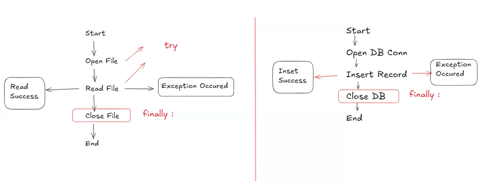

---

# Complete `try-except-else-finally` Flow

```python
try:
    num1 = int(input("Enter first number: "))
    num2 = int(input("Enter second number: "))

    result = num1 / num2

except ValueError:
    print("Please enter valid numbers.")

except ZeroDivisionError:
    print("Cannot divide by zero.")

else:
    print("Result:", result)

finally:
    print("Calculation finished.")
```

### Case 1

Input:

```text
10
2
```

Output:

```text
# Output:
# Result: 5.0
# Calculation finished.
```

Flow:

```text
try succeeds
    ↓
except skipped
    ↓
else runs
    ↓
finally runs
```

### Case 2

Input:

```text
10
0
```

Output:

```text
# Output:
# Cannot divide by zero.
# Calculation finished.
```

Flow:

```text
try raises ZeroDivisionError
        ↓
matching except runs
        ↓
else skipped
        ↓
finally runs
```

### Case 3

Input:

```text
abc
```

Output:

```text
# Output:
# Please enter valid numbers.
# Calculation finished.
```

Flow:

```text
try raises ValueError
       ↓
matching except runs
       ↓
else skipped
       ↓
finally runs
```

---

# `raise` Keyword

The `raise` keyword is used to deliberately raise an exception.

Normally Python raises exceptions automatically.

Example:

```python
print(10 / 0)

# Python automatically raises:
# ZeroDivisionError
```

But sometimes our own business rules require an error.

Example:

```text
Voting age must be at least 18.
```

Python does not automatically know this business rule.

So we can manually raise an exception.

---

## Example

```python
age = int(input("Enter your age: "))

if age >= 18:
    print("You are old enough to vote")
else:
    raise Exception("Age must be 18 or above to vote")
```

If input is:

```text
18
```

```text
# Output:
# You are old enough to vote
```

If input is:

```text
15
```

```text
# Output:
# Exception: Age must be 18 or above to vote
```

### Concept

```text
Python detects technical problem
        ↓
Automatic exception

Programmer detects business-rule problem
        ↓
raise
        ↓
Manual exception
```

---

# Better `raise` Example Using `ValueError`

Instead of always raising the generic `Exception`, use a meaningful built-in exception when appropriate.

```python
def set_age(age):
    if age < 0:
        raise ValueError("Age cannot be negative")

    print("Age:", age)


set_age(25)

# Output:
# Age: 25
```

If:

```python
set_age(-5)
```

then:

```text
# Output:
# ValueError: Age cannot be negative
```

This is better because:

```text
Wrong value
    ↓
ValueError
```

describes the problem more clearly.

---

# Custom Exception

Sometimes built-in exception types do not clearly represent a business-specific problem.

Then we can create our own exception class.

A custom exception normally inherits from:

```python
Exception
```

---

## Custom Exception Example

```python
class InvalidAgeError(Exception):
    pass


try:
    age = int(input("Enter your age: "))

    if age < 18:
        raise InvalidAgeError("You are not old enough to vote")

    print("You are old enough to vote")

except InvalidAgeError as e:
    print("Invalid Age Error:", e)

except ValueError as ve:
    print("Invalid Input:", ve)

finally:
    print("Program Execution Completed")
```

If input is:

```text
15
```

```text
# Output:
# Invalid Age Error: You are not old enough to vote
# Program Execution Completed
```

If input is:

```text
18
```

```text
# Output:
# You are old enough to vote
# Program Execution Completed
```

If input is:

```text
abc
```

```text
# Example Output:
# Invalid Input: invalid literal for int() with base 10: 'abc'
# Program Execution Completed
```

---

# How the Custom Exception Works

This:

```python
class InvalidAgeError(Exception):
    pass
```

means:

```text
Exception
    ↓
Parent Class

InvalidAgeError
    ↓
Child Class
```

This directly connects to the **Inheritance** concept from OOP.

```text
OOP Inheritance
       ↓
Exception Inheritance
       ↓
class InvalidAgeError(Exception)
```

Then:

```python
raise InvalidAgeError("You are not old enough to vote")
```

creates and raises an object of the custom exception class.

Then:

```python
except InvalidAgeError as e:
```

catches that exception object.

### Concept Connection

```text
Class
   ↓
InvalidAgeError

Object
   ↓
InvalidAgeError("message")

Inheritance
   ↓
InvalidAgeError(Exception)

raise
   ↓
Generate exception

except
   ↓
Catch exception
```

So custom exceptions are another practical use of OOP.

---

# More Valuable Example: Bank Withdrawal

Suppose we have a bank account.

A user should not be allowed to withdraw more money than the available balance.

This is a business rule.

```python
class InsufficientBalanceError(Exception):
    pass


class BankAccount:

    def __init__(self, balance):
        self.balance = balance

    def withdraw(self, amount):
        if amount > self.balance:
            raise InsufficientBalanceError(
                "Insufficient balance"
            )

        self.balance -= amount

        print("Withdrawal successful")
        print("Remaining Balance:", self.balance)


account = BankAccount(5000)


try:
    account.withdraw(2000)

except InsufficientBalanceError as e:
    print("Transaction Failed:", e)

# Output:
# Withdrawal successful
# Remaining Balance: 3000
```

Now:

```python
account = BankAccount(5000)

try:
    account.withdraw(7000)

except InsufficientBalanceError as e:
    print("Transaction Failed:", e)

# Output:
# Transaction Failed: Insufficient balance
```

### Concepts Combined

```text
Class
+
Object
+
Constructor
+
Instance Variable
+
Instance Method
+
Inheritance
+
Custom Exception
+
raise
+
try-except
```

---

# Exception Handling with a Loop

A useful real-world pattern is to keep asking until the user gives valid input.

```python
while True:
    try:
        age = int(input("Enter your age: "))

        print("Your age is:", age)

        break

    except ValueError:
        print("Please enter a valid integer.")
```

Example interaction:

```text
Enter your age: abc
Please enter a valid integer.

Enter your age: hello
Please enter a valid integer.

Enter your age: 25
Your age is: 25
```

### Connection to Previous Concept

This combines:

```text
while Loop
+
break
+
try-except
```

Flow:

```text
Ask for input
     ↓
Valid?
 /        \
No         Yes
↓           ↓
except     print age
↓           ↓
Repeat     break
```

---

# Exception Propagation

An exception does not have to be handled inside the same function where it occurs.

Example:

```python
def divide(a, b):
    return a / b


def calculate():
    return divide(10, 0)


try:
    print(calculate())

except ZeroDivisionError as e:
    print("Error:", e)

# Output:
# Error: division by zero
```

Flow:

```text
calculate()
    ↓
divide(10, 0)
    ↓
ZeroDivisionError
    ↓
divide() does not handle it
    ↓
calculate() does not handle it
    ↓
Exception moves upward
    ↓
try-except catches it
```

This movement of an exception through function calls is commonly called:

```text
Exception Propagation
```

---

# `return` and `finally`

A useful advanced point:

```python
def test():
    try:
        return "From try"

    finally:
        print("Finally executed")


print(test())

# Output:
# Finally executed
# From try
```

Even though the `try` contains:

```python
return
```

the `finally` block executes before the function completely returns.

### Important

Avoid writing `return` inside `finally` unless you specifically understand the consequences, because it can override earlier return values or interfere with exceptions.

---

# Difference Between Syntax Error and Exception

| Syntax Error | Exception |
|---|---|
| Code violates Python syntax | Problem occurs during execution |
| Usually detected before normal execution | Raised while executing code |
| Normally must be corrected | Can often be handled |
| Example: missing `)` | Example: divide by zero |
| `SyntaxError` / `IndentationError` | `ValueError`, `TypeError`, etc. |

---

# Difference Between Logical Error and Exception

| Logical Error | Exception |
|---|---|
| Program runs | Program encounters an abnormal condition |
| Output may be incorrect | Normal flow is interrupted |
| No exception necessarily raised | Exception object is raised |
| Must correct logic | Can use exception handling where appropriate |

---

# Difference Between `except` and `finally`

### `except`

```text
Runs when its matching exception occurs.
```

Purpose:

```text
Handle the exception
```

### `finally`

```text
Designed to run whether an exception occurs or not.
```

Purpose:

```text
Cleanup
```

---

# Difference Between `raise` and `except`

### `raise`

```text
Creates/raises an exception
```

Example:

```python
raise ValueError("Invalid age")
```

### `except`

```text
Catches and handles an exception
```

Example:

```python
except ValueError as e:
    print(e)
```

Flow:

```text
raise
  ↓
Exception
  ↓
except
```

---

# Difference Between `else` and `finally`

### `else`

Runs only if the `try` block succeeds without an exception.

### `finally`

Runs after the exception-handling flow regardless of whether the `try` succeeded or an exception was handled.

```text
try succeeds
   ↓
else
   ↓
finally
```

```text
try fails
   ↓
except
   ↓
finally
```

---

# Complete Exception Handling Structure

```python
try:
    # Code that may raise an exception
    pass

except ValueError:
    # Handle ValueError
    pass

except ZeroDivisionError:
    # Handle ZeroDivisionError
    pass

except Exception as e:
    # Handle other normal exceptions
    pass

else:
    # Execute only if try succeeds
    pass

finally:
    # Cleanup code
    pass

# Output:
# No output
```

---

# Exception Handling Concept Map

```text
Exception Handling
│
├── try
│     ↓
│   Risky Code
│
├── except
│     ↓
│   Handle Exception
│
├── else
│     ↓
│   Runs when try succeeds
│
├── finally
│     ↓
│   Cleanup / always part of final flow
│
└── raise
      ↓
    Raise exception manually
```

---

# Connection With Previous Python Concepts

## Functions

```text
Function
   ↓
Exception occurs inside function
   ↓
Handle inside function
OR
Propagate to caller
```

---

## Loops

```text
Loop
 +
try-except
   ↓
Keep asking until valid input
```

---

## Dictionaries

```text
dictionary["missing_key"]
          ↓
        KeyError
```

---

## Lists / Tuples / Strings

```text
Invalid index
    ↓
IndexError
```

---

## Type Conversion

```text
int("abc")
    ↓
ValueError
```

---

## OOP

```text
Exception
   ↓
Base Exception Class

CustomException(Exception)
   ↓
Inheritance

raise CustomException(...)
   ↓
Create/Raise Exception Object
```

---

## Modules

```text
Import Module
     ↓
Problem importing
     ↓
ImportError / ModuleNotFoundError
```

---

# Important Points

- An exception interrupts normal program flow.
- An unhandled exception normally terminates the program.
- Exception handling helps programs respond gracefully to runtime problems.
- `try` contains code that may raise an exception.
- `except` handles matching exceptions.
- `else` executes when the `try` block completes successfully.
- `finally` is used for cleanup and executes as part of the final exception-handling flow.
- `raise` is used to raise an exception manually.
- `Exception` is the common parent class for most application-level built-in exceptions.
- Handle specific exceptions before generic exceptions.
- Prefer meaningful exception types.
- Avoid bare `except:` in normal application code.
- Syntax errors usually need to be corrected before the program can execute.
- `IndentationError` is a type of `SyntaxError`.
- A missing dictionary key can raise `KeyError`.
- An invalid sequence index can raise `IndexError`.
- Invalid conversion can raise `ValueError`.
- Incompatible types can raise `TypeError`.
- Missing variables can raise `NameError`.
- Missing attributes can raise `AttributeError`.
- Missing files can raise `FileNotFoundError`.
- `ModuleNotFoundError` is related to `ImportError`.
- Custom exceptions are commonly created by inheriting from `Exception`.
- Custom exceptions connect directly with OOP inheritance.
- Exception objects can be stored using `as e`.
- `finally` is commonly used for cleanup activities.
- Do not catch exceptions simply to hide problems.
- Show meaningful error messages.
- Catch only exceptions that you know how to handle appropriately.

---

# Final Flow to Remember

```text
Risky Code
    ↓
   try
    ↓
Did an exception occur?
   /             \
 Yes              No
  ↓                ↓
except            else
  \                /
   \              /
       finally
          ↓
   Continue / Finish
```

And when we want to create an error ourselves:

```text
Business Rule Fails
        ↓
      raise
        ↓
Exception Object
        ↓
Matching except
        ↓
Handle Error
```

---

# One-Line Revision

```text
Exception          → Problem/event that interrupts normal execution
try                → Contains risky code
except             → Handles matching exception
else               → Runs when try succeeds
finally            → Cleanup/final execution block
raise              → Raises an exception manually
ValueError         → Invalid value
TypeError          → Incompatible type/operation
ZeroDivisionError  → Division by zero
IndexError         → Invalid sequence index
KeyError           → Missing dictionary key
NameError          → Undefined name
AttributeError     → Missing attribute/method
FileNotFoundError  → Requested file not found
ImportError        → Import operation failed
ModuleNotFoundError→ Module cannot be found
MemoryError        → Memory allocation failed
Custom Exception   → User-defined exception class
```
---
## **What is File Handling?**
---
**File handling is used to create, read, write, update and delete files using Python Program.**
**A file is used to store data permanently.**
**Normal variables store data temporarily.**
**Files store data permanently in system storage.**
Example :
-- Student records
-- Employee details
-- Course details
-- Logs
-- Reports
-- Configuration data
---
## **Types of Files**
---
Python mainly works with two types of files:
1) Text Files
2) Binary Files
---
## **Text Files**
---
Text files store data in readable text format.
Examples :
.txt
.csv
.json
.py
.html
Example :
students.txt
courses.txt
employees.csv
---
## **Binary Files**
---
Binary files store data in binary format.
Examples :
Images
Videos
Audio files
PDF files
Example :
photo.jpg
video.mp4
resume.pdf
---
## **File Handling Steps**
---
File handling usually contains 3 steps:
Step-1 : Open File / Create File
Step-2 : Perform Operation
Step-3 : Close File
---
## **open() Function**
---
1) open ( ) : It is used to open a file
Syntax : open("file_name", "mode")
=> File modes are used to specify the operation.
r - read
w - write
a - append
x - create
r+ - read and write mode
w+ - write and read mode
a+ - append and read mode
rb - read binary file
wb - write binary file
ab - append binary file
## **read ( )  : It reads complete file data at a time.**
## **read(number) : reads specific number of characters.**
## **readline( ) : It reads one line at a time**
## **readlines() : It reads all lines and returns a list**
## **write ( ) :**
## **writelines( ) :**
---
## **Reading file using for loop**
---
```python
file = open("students.txt", "r")
for line in file:
    print(line)
file.close()
```
---
## **write() Method**
---
write() is used to write data into file.
Example :
```python
file = open("courses.txt", "w")
file.write("Python\n")
file.write("Java\n")
file.write("DevOps\n")
file.close()
Output :
courses.txt file will contain course names.
```
---
## **writelines() Method**
---
writelines() is used to write multiple lines into file.
Example :
```python
courses = ["Python\n", "Java\n", "DevOps\n"]
file = open("courses.txt", "w")
file.writelines(courses)
file.close()
Output :
courses.txt file will contain all courses.
Important:
writelines() does not add new line automatically.
We should add \n manually.
```
---
## **close() Method**
---
close() is used to close the file.
Example :
```python
file = open("students.txt", "r")
data = file.read()
print(data)
file.close()
Important:
Always close the file after file operation.
```
---
## **Why close() is Important?**
---
close() is important because:
It releases system resources.
It saves pending data into file.
It avoids file corruption.
It is a good programming practice.
---
## **File Handling Using "with"**
---
**with statement is the best way to handle files.**
**It automatically closes file after operation.**
Syntax :
with open("filename", "mode") as file:
    file operation
Example :
with open("students.txt", "r") as file:
    data = file.read()
    print(data)

with open("courses.txt", "w") as file:
    file.write("JAVA\n")
    file.write("PYTHON\n")
    file.write("GEN AI\n")
---
## **Check File Exists**
---
We can check whether file exists or not using os module.
Example :
```python
import os
if os.path.exists("students.txt"):
    print("File exists")
else:
    print("File not found")
```
---
## **Delete File**
---
We can delete file using os.remove().
Example :
```python
import os
i)f os.path.exists("students.txt"):
    os.remove("students.txt"
    print("File deleted")
else:
    print("File not found")
```
---
## **Rename File**
---
We can rename file using os.rename().
Example :
```python
import os
os.rename("students.txt", "student_details.txt")
print("File renamed successfully")
```
---
## **Create Folder**
---
We can create folder using os.mkdir().
Example :
```python
import os
os.mkdir("reports")
print("Folder created successfully")

```
## **seek to move cursor**
with open("students.txt", "w+") as file:
    file.write("101-Raj\n102-Rani\n")

    file.seek(0)

    data = file.read()

    print(data)

# **101-Raj**
# **102-Rani**
file.seek(0) moves the file cursor back to the beginning of the file.
After write(), the cursor is at the end. Without file.seek(0), this line would read nothing:
data = file.read()
"w+" means write and read mode. It creates the file if needed, but removes old file content if it already exists.

ex:2 seek

with open("students.txt", "w+") as file:
    file.write("101-Raj\n102-Rani\n")

    print("File Pointer Position:", file.tell())
    # File Pointer Position: 18

    file.seek(0)

    print("File Pointer Position:", file.tell())
    # File Pointer Position: 0

    data = file.read()

    print(data)
    # 101-Raj
    # 102-Rani
- file.tell() returns the current file pointer position.
- After writing 18 characters, the pointer is at position 18.
- file.seek(0) moves the pointer to the beginning, position 0.
- Then read() reads the complete file content.

# **Copy data from one file to another file**
with open("source.txt", "r") as source_file:
    data = source_file.read()

with open("destination.txt", "w") as destination_file:
    destination_file.write(data)

print("File copied successfully")
# **File copied successfully**
- "source.txt" is opened in read mode.
- Its content is stored in data.
- "destination.txt" is opened in write mode.
- The data is written into the destination file.
If destination.txt already exists, "w" mode overwrites its old content.

Another method to copy file

```python
import shutil

shutil.copy("source.txt", "destination.txt")

print("File copied successfully")
# File copied successfully
```
---
## **What is Database Connectivity?**
---
**Database connectivity means connecting a Python application to a database to perform operations**
such as:
**Insert data**
**Read data**
**Update data**
**Delete data**
**These four operations are called CRUD Operations.**
    C == Create
    R == Read
    U == Update
    D == Delete
---
## **Types of Databases**
---
=> Databases are mainly divided into two types:
1) Relational Databases
2) Non-Relational Databases
**Relational databases store data in table format.**
Ex : MySQL, Oracle, PostGres SQL, SQL Server, SQLite...
**Non-relational databases store data in document, key-value, graph or other formats.**
Ex : MongoDB, Redis, Casandara, FireBase...
---
## **What is SQLite?**
---
**SQLite is a lightweight database.**
Note: SQLite does not require:
1) DB Server installation
2) Username and Password
3) Port Number
4) Seperate Configuration
SQLite manages the data by storing that in file
Note: It stores the complete database inside a single file.
**** Python provides built-in support for SQLite using the "sqlite3 module". *****
--------------------------create db table-------------------------------
```python
import sqlite3

# Establish database connection.
# Creates students.db if it does not already exist.
connection = sqlite3.connect("students.db")

# Create a cursor object to execute SQL queries.
cursor = connection.cursor()

# Create the students table if it does not already exist.
cursor.execute("""
    CREATE TABLE IF NOT EXISTS students (
        student_id INTEGER PRIMARY KEY AUTOINCREMENT,
        student_name TEXT,
        student_email TEXT UNIQUE,
        student_course TEXT,
        student_fee REAL
    )
""")

connection.commit()
connection.close()

print("Student table created successfully.")
# Student table created successfully.
- AUTOINCREMENT automatically generates student IDs: 1, 2, 3, and so on.
- UNIQUE prevents duplicate email addresses.
- commit() permanently saves the table creation.

| Part | Meaning |
|---|---|
| `CREATE TABLE` | Creates a new database table. |
| `IF NOT EXISTS` | Prevents an error if the `students` table already exists. |
| `students` | The table name. |
| `student_id INTEGER` | Creates a whole-number ID column. |
| `PRIMARY KEY` | Makes `student_id` unique for every student. |
| `AUTOINCREMENT` | Automatically generates IDs such as `1`, `2`, `3`. |
| `student_name TEXT` | Stores the student's name as text. |
| `student_email TEXT UNIQUE` | Stores email as text and prevents duplicate emails. |
| `student_course TEXT` | Stores the course name as text. |
| `student_fee REAL` | Stores decimal values, such as `1500.50`. |

| student_id | student_name | student_email | student_course | student_fee |
|---:|---|---|---|---:|
| 1 | Ashok | ashok@gmail.com | Python | 5000.0 |
----------------------------- insert record----------------------------
import sqlite3
#Establishing DB Connection
connection = sqlite3.connect("students.db")
# Create cursor object to execute SQL Queries
cursor = connection.cursor()
# Read student information
student_name = input("Enter Student Name: ")
student_email = input("Enter Student Email: ")
student_course   = input("Enter Student Course: ")
student_fee = float(input("Enter Student Fee: "))
sql = "insert into students(student_name, student_email, student_course, student_fee) values(?, ?, ?, ?)"
cursor.execute(sql, (student_name, student_email, student_course, student_fee))
connection.commit()
print("Student inserted Successfully")
connection.close()

The ? symbols are placeholders. Python safely replaces them with the values provided in the tuple.

Your program inserted this student record successfully:
Name: Gita
Email: gita@gmail.com
Course: DevOps
Fee: 1300.0

---------------------------- Retrieve students ---------------------------------
import sqlite3
#Establishing DB Connection
connection = sqlite3.connect("students.db")
# Create cursor object to execute SQL Queries
cursor = connection.cursor()
# Fetch all student records
sql = "select * from students"
cursor.execute(sql)
students  = cursor.fetchall()
print(type(students))
for student in students:
    print(student)

Example output:
(1, 'Gita', 'gita@gmail.com', 'DevOps', 1300.0)
fetchall() returns all database rows as a list. Each student row is a tuple.

explanation:
sql = "SELECT * FROM students"
Stores an SQL query in the sql variable.
- SELECT means retrieve data.
- * means retrieve all columns.
- FROM students means retrieve data from the students table.
cursor.execute(sql)
Sends the SQL query to SQLite for execution.
students = cursor.fetchall()
Gets all records returned by the query and stores them in students.
print(type(students))
# <class 'list'>
fetchall() returns a list.
Example:
students = [
    (1, "Gita", "gita@gmail.com", "DevOps", 1300.0),
    (2, "Ashok", "ashok@gmail.com", "Python", 5000.0)
]
for student in students:
    print(student)
The for loop prints one student tuple at a time:
(1, 'Gita', 'gita@gmail.com', 'DevOps', 1300.0)
(2, 'Ashok', 'ashok@gmail.com', 'Python', 5000.0)
-------------------------- single record ------------------------------
import sqlite3
# Establish database connection
connection = sqlite3.connect("students.db")
# Create cursor object to execute SQL queries
cursor = connection.cursor()
# Read student ID
student_id = int(input("Enter Student ID: "))
# Fetch one student record using student ID
sql = "SELECT * FROM students WHERE student_id = ?"
cursor.execute(sql, (student_id,))
student = cursor.fetchone()
print(student)
connection.close()

If the user enters 1:
(1, 'Gita', 'gita@gmail.com', 'DevOps', 1300.0)

fetchone() returns one matching row. If no student exists with that ID, it returns:
None
```
---
---
## **Python with MySQL Database**
---
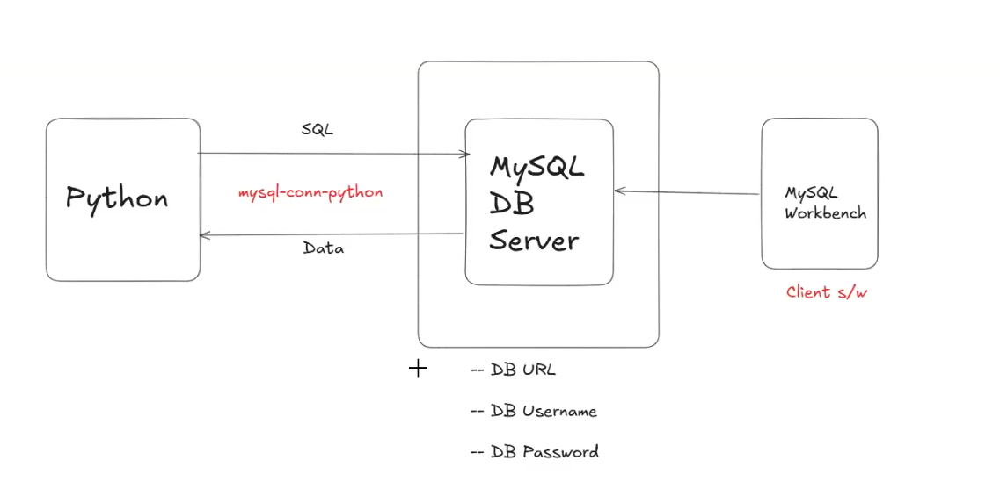

@@@@ MySQL DB Server & Workbench Setup : https://www.youtube.com/watch?v=EsAIXPIsyQg

Step 1: Install MySQL Connector in a Virtual Environment
python -m venv venv
Activate the virtual environment on Windows:
venv\Scripts\activate
Install the MySQL connector:
pip install mysql-connector-python
Or add this to requirements.txt:
mysql-connector-python
Then install all required libraries:
pip install -r requirements.txt
Step 2: Create a Python File
Create a file named student_db.py with these methods:
```python
def get_connection():
    pass
def create_table():
    pass
def add_student():
    pass
def view_students():
    pass
- get_connection() connects Python with MySQL.
- create_table() creates the student table.
- add_student() inserts a student record.
- view_students() displays all student records.

```
### **virtual environment**
A virtual environment creates an isolated space for one Python project’s libraries.
For example, Project A may need:
FastAPI 0.100
while Project B may need:
FastAPI 0.115
Without a virtual environment, installing one version can replace the other version on your computer.
With a virtual environment:
- Each project has its own installed libraries.
- Prevents package-version conflicts between projects.
- Keeps the system Python installation clean.
- Makes sharing projects easier through requirements.txt.
python -m venv venv
venv\Scripts\activate
pip install mysql-connector-python
After activation, packages install only inside that project’s venv folder.

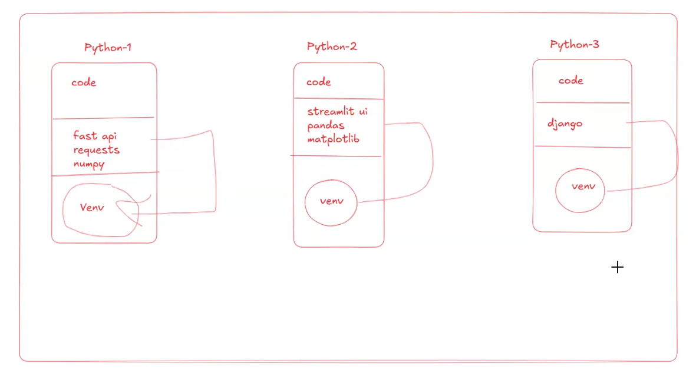

requirements.txt file:
numpy
pandas
matplotlib
mysql-connector-python

Install all libraries with:
pip install -r requirements.txt

After installation, these packages will be available only inside the active venv environment.

-------------------------------py-mysql-app.py------------------------------------
```python
import mysql.connector
def get_connection():
    try:
        connection = mysql.connector.connect(
                        host="localhost",
                        port = "3306",
                        user="root",
                        passwd="root",
                        database="student")
        return connection
    except mysql.connector.Error as error:
        print("database conn failed:", error)
        return None
def create_table():
    connection = get_connection()
    if connection is None:
        return
    cursor = None
    try:
        cursor = connection.cursor()
        sql = """
        CREATE TABLE IF NOT EXISTS students (
                student_id INT PRIMARY KEY AUTO_INCREMENT,
                student_name VARCHAR(100) NOT NULL,
                student_email VARCHAR(100) UNIQUE NOT NULL,
                student_course VARCHAR(100) NOT NULL,
                student_fee DECIMAL(10, 2) NOT NULL
            )
        """
        cursor.execute(sql)
        connection.commit()
    except Exception as error:
        print("Error while creating table,", error)
def add_student():
    connection = get_connection()
    cursor = connection.cursor()
    student_name = input("Enter student name: ").strip()
    student_email = input("Enter student email: ").strip()
    student_course = input("Enter student course: ").strip()
    student_fee = float(input("Enter student fee: "))
    sql = """
          INSERT INTO students
              (student_name, student_email, student_course, student_fee)
          VALUES (%s, %s, %s, %s) \
          """
    values  = (
        student_name,
        student_email,
        student_course,
        student_fee
    )
    cursor.execute(sql, values)
    connection.commit()
    print("Student Inserted....")
    connection.close()
def view_all_students():
    connection = get_connection()
    cursor = connection.cursor()
    sql = "select * from students"
    cursor.execute(sql)
    students = cursor.fetchall()
    for student in students:
        print(student)
# create_table()
add_student()
print("-------------------------------")
view_all_students()

Ensure the MySQL database named student already exists before running this program.

Example output:
(1, 'Ashok', 'ashok@gmail.com', 'Python', Decimal('1200.00'))
(2, 'John', 'john@ibm.com', 'DevOps', Decimal('4500.00'))
```
---
## **Assignment**
---
Develop a menu-driven Student Management System using Python and MySQL.
The application should connect to a MySQL database and perform the following CRUD operations:
1) Add a new student
2) View all student2
3) View a student by ID
4) Update student details
5) Delete a student
6) Exit the application

Create the MySQL database once:
CREATE DATABASE student_db;
Then create student_management.py:
```python
import mysql.connector
from mysql.connector import Error

def get_connection():
    try:
        connection = mysql.connector.connect(
            host="localhost",
            port=3306,
            user="root",
            password="root",
            database="student_db"
        )

        return connection

    except Error as error:
        print("Database connection failed:", error)
        return None

def create_table():
    connection = get_connection()

    if connection is None:
        return

    cursor = connection.cursor()

    try:
        sql = """
            CREATE TABLE IF NOT EXISTS students (
                student_id INT PRIMARY KEY AUTO_INCREMENT,
                student_name VARCHAR(100) NOT NULL,
                student_email VARCHAR(100) UNIQUE NOT NULL,
                student_course VARCHAR(100) NOT NULL,
                student_fee DECIMAL(10, 2) NOT NULL
            )
        """

        cursor.execute(sql)
        connection.commit()

        print("Student table is ready.")

    except Error as error:
        print("Error while creating table:", error)

    finally:
        cursor.close()
        connection.close()

def add_student():
    connection = get_connection()

    if connection is None:
        return

    cursor = connection.cursor()

    try:
        student_name = input("Enter student name: ").strip()
        student_email = input("Enter student email: ").strip()
        student_course = input("Enter student course: ").strip()
        student_fee = float(input("Enter student fee: "))

        sql = """
            INSERT INTO students
            (student_name, student_email, student_course, student_fee)
            VALUES (%s, %s, %s, %s)
        """

        cursor.execute(
            sql,
            (student_name, student_email, student_course, student_fee)
        )

        connection.commit()

        print("Student added successfully.")

    except ValueError:
        print("Fee must be a valid number.")

    except Error as error:
        print("Error while adding student:", error)

    finally:
        cursor.close()
        connection.close()

def view_all_students():
    connection = get_connection()

    if connection is None:
        return

    cursor = connection.cursor()

    try:
        cursor.execute("SELECT * FROM students")

        students = cursor.fetchall()

        if len(students) == 0:
            print("No students found.")
            return

        print("\nID | Name | Email | Course | Fee")
        print("-" * 70)

        for student in students:
            print(student)

    except Error as error:
        print("Error while viewing students:", error)

    finally:
        cursor.close()
        connection.close()

def view_student_by_id():
    connection = get_connection()

    if connection is None:
        return

    cursor = connection.cursor()

    try:
        student_id = int(input("Enter student ID: "))

        cursor.execute(
            "SELECT * FROM students WHERE student_id = %s",
            (student_id,)
        )

        student = cursor.fetchone()

        if student is None:
            print("Student not found.")
        else:
            print(student)

    except ValueError:
        print("Student ID must be a number.")

    except Error as error:
        print("Error while viewing student:", error)

    finally:
        cursor.close()
        connection.close()

def update_student():
    connection = get_connection()

    if connection is None:
        return

    cursor = connection.cursor()

    try:
        student_id = int(input("Enter student ID to update: "))
        student_name = input("Enter new name: ").strip()
        student_email = input("Enter new email: ").strip()
        student_course = input("Enter new course: ").strip()
        student_fee = float(input("Enter new fee: "))

        sql = """
            UPDATE students
            SET student_name = %s,
                student_email = %s,
                student_course = %s,
                student_fee = %s
            WHERE student_id = %s
        """

        cursor.execute(
            sql,
            (student_name, student_email, student_course, student_fee, student_id)
        )

        connection.commit()

        if cursor.rowcount == 0:
            print("Student not found.")
        else:
            print("Student updated successfully.")

    except ValueError:
        print("Student ID and fee must be valid numbers.")

    except Error as error:
        print("Error while updating student:", error)

    finally:
        cursor.close()
        connection.close()

def delete_student():
    connection = get_connection()

    if connection is None:
        return

    cursor = connection.cursor()

    try:
        student_id = int(input("Enter student ID to delete: "))

        cursor.execute(
            "DELETE FROM students WHERE student_id = %s",
            (student_id,)
        )

        connection.commit()

        if cursor.rowcount == 0:
            print("Student not found.")
        else:
            print("Student deleted successfully.")

    except ValueError:
        print("Student ID must be a number.")

    except Error as error:
        print("Error while deleting student:", error)

    finally:
        cursor.close()
        connection.close()

def display_menu():
    print("\n================================")
    print("   Student Management System")
    print("================================")
    print("1. Add Student")
    print("2. View All Students")
    print("3. View Student by ID")
    print("4. Update Student")
    print("5. Delete Student")
    print("6. Exit")
    print("================================")

def main():
    create_table()

    while True:
        display_menu()

        choice = input("Enter your choice: ").strip()

        if choice == "1":
            add_student()

        elif choice == "2":
            view_all_students()

        elif choice == "3":
            view_student_by_id()

        elif choice == "4":
            update_student()

        elif choice == "5":
            delete_student()

        elif choice == "6":
            print("Thank you for using Student Management System.")
            break

        else:
            print("Invalid choice. Enter a number from 1 to 6.")

if __name__ == "__main__":
    main()
Update user, password, and database in get_connection() to match your MySQL setup.

```
---
## **Functional Requirements**
---
-- Use mysql-connector-python to connect Python with MySQL.
-- Create the database table automatically if it does not exist.
-- Use separate functions for each CRUD operation.
-- Use parameterized queries with %s placeholders.
-- Display a proper message when a student record is not found.
-- Prevent duplicate email addresses.
-- Handle database connection errors and invalid user input.
-- Ask for confirmation before deleting a student.
-- Close the cursor and database connection after every operation.

---
## **Python Multithreading**
---

## **What Is a Thread?**
**A thread is a small unit of execution inside a program.**

Normally, a Python program executes instructions one after another. This is called
single-threaded execution.

For example:

print("Download file")
print("Send email")
print("Save report")

Python executes these tasks sequentially:

Download file
      ↓
Send email
      ↓
Save report

### **Example-1:**
print("Download file")
print("Send email")
print("Save report")

Python executes these tasks sequentially:

Download file
      ↓
Send email
      ↓
Save report

Example-2:

```python
def task1():
    print("task-1")

def task2():
    print("task-2")

task1()
task2()

Note: If task1() is taking 5 mins time to complete execution, then task2() has to wait for that.

```
---
## **Real-Life Example**
---

Imagine a restaurant with only one employee.

The employee must:

Take the customer's order
Prepare the food
Serve the food
Collect payment

The second customer must wait until all the work for the first customer is completed.

This is similar to single-threaded execution.

Now imagine the restaurant has multiple employees:

One employee takes orders
One employee prepares food
One employee serves food
One employee collects payments

Multiple activities can happen at the same time. This is similar to multithreading.

---
## **What Is Multithreading?**
---

**Multithreading means executing multiple threads within the same process.**

**Each thread performs a separate task.**

**For example, a web application may use different threads to:**

    1) Download files
    2) Send emails
    3) Read data from API
    4) Upload images
    5) Handle user requests

---
## **Process vs Thread**
---

**A process is a program that is currently running.**

Examples:

    1) Chrome browser
    2) PyCharm
    3) Notepad
    4) Zoom meeting
    5) Edge browser

**Every process has its own memory.**

**A thread is a unit of execution inside a process.**

**One process can contain multiple threads.**

        Python Application
              |
              | -- Main Thread
              |
              | -- Download Image Thread
              |
              | -- Email Thread

**Threads inside the same process share resources such as:**

    -- Variables
    -- Memory
    -- Files
    -- Objects

---
## **Creating Threads in Python**
---

**Python provides the "threading" module for multithreading.**

**We need to import the threading module for multithreading.**

**A thread can be created using the "Thread" class.**

Syntax:

    thread = threading.Thread(target=function_name)

Here:

    -- Thread creates a new thread.
    -- target specifies the function the thread should execute.
```python
import threading
import time

def task_one():
    print("Task-1 Started")
    time.sleep(3)
    print("Task-1 Completed")

def task_two():
    print("Task-2 Started")
    time.sleep(2)
    print("Task-2 Completed")

# Normal function calls: execute one after another
task_one()
task_two()
import threading
import time

def task_one():
    print("Task-1 Started")
    time.sleep(3)
    print("Task-1 Completed")

def task_two():
    print("Task-2 Started")
    time.sleep(2)
    print("Task-2 Completed")

thread1 = threading.Thread(target=task_one)
thread2 = threading.Thread(target=task_two)

thread1.start()
thread2.start()

print("All tasks completed")
import threading

class MyThread(threading.Thread):

    def run(self):
        print("Run() method started...")
        print("Thread Name:", threading.current_thread().name)

thread3 = MyThread()

thread3.start()
Example output:
Run() method started...
Thread Name: Thread-3
The thread name can differ depending on how many threads were created earlier.

Explanation:

MyThread is a custom thread class created by inheriting from threading.Thread.
class MyThread(threading.Thread):
This means MyThread gets all features of Python’s built-in Thread class.
def run(self):
run() contains the code that the thread should execute.
print("Run() method started...")
Prints a message when the thread begins execution.
print("Thread Name:", threading.current_thread().name)
- threading.current_thread() returns the currently running thread object.
- .name returns its name, such as Thread-1.
thread3 = MyThread()
Creates an object of the MyThread class.
thread3.start()
Starts a new thread. Python automatically calls its run() method.
It works like this internally:
thread3.start()
# Python creates a new thread.
# Python calls thread3.run().
Example output:
Run() method started...
Thread Name: Thread-1

.name returns its name, such as Thread-1.

why thread-1??
Python automatically gives a default name to every new thread.
thread3 = MyThread()
When this thread object is created, Python may assign a name such as:
Thread-1
The next thread may be named:
Thread-2
You can set your own thread name:
thread3 = MyThread(name="Download Thread")

thread3.start()

# Run() method started...
# Thread Name: Download Thread
thread3 is only a variable name. The thread’s actual name is stored in:
thread3.name

########### Another way of creating thread ############

class MyThread(threading.Thread):

    def run(self):
        print("Run() method started..")
        print("Thread Name:", threading.current_thread().name)

thread3 = MyThread()
thread4 = MyThread()

thread3.start()
thread4.start()
Note-1: We are overriding the run() method to provide our own implementation.

Note-2: When we call the start() method, internally it executes the run() method.

explanation:

start() is a method inherited from threading.Thread.
When you call:
thread3.start()
Python creates a new thread, then internally calls the overridden run() method:
# Simplified internal flow
thread3.start()
# Creates a new thread
# Calls thread3.run() inside that new thread
Because MyThread has its own run() method:
def run(self):
    print("Run() method started...")
that method runs automatically.
thread3.run()
also executes run(), but it does not create a new thread. It runs like a normal function in the main thread.
Use start() when you want actual multithreading.

```
---
## **1. What is a Program?**
---
**A program is a set of instructions written to perform a particular task.**
Examples:
Calculator program
Banking application
YouTube application
File downloader
Chat application
**When we execute a Python program, the operating system creates a process.**
---
## **2. What is a Process?**
---
**A process is a program that is currently running.**
For example, when you open:
Google Chrome
PyCharm
Visual Studio Code
Spotify
Zoom
Notepad
**each application runs as a separate process.**
A process has its own:
Memory
Variables
Resources
Execution environment
---
## **What is a Thread?**
---
**A thread is a small unit of execution inside a program/process.**
**A single process can contain one or more threads.**
=> For example, consider a web browser.
=> A browser may use separate threads for:
**Loading web page**
**Playing video**
**Download a file**
**Checking user input**
**Display animations**
=> All these activities happen inside the same browser process.
---
## **Process vs Thread**
---
**Process**
-- A process is a running program
-- Every process will have seperate memory
-- Creating process is expensive
-- Communication between process is slower (one application to another application)
-- One process can contain multiple threads

**Thread**
-- A thread is a unit of execution inside a process
-- Threads share the process memory
-- Creating a thread is lightweight
-- Communication between threads is faster(as threads are going share the memory of process )
-- A thread always belongs to a process
-- no process -> no thread
---
## **What is Multitasking?**
---
**Multitasking means performing multiple tasks during the same period.**
**There are two major types of multitasking:**

######## 1) Process Based Multi Tasking ##########
**Multiple programs run at the same time**
    -- Playing music
    -- Writing code in pycharm
    -- Browsing internet
**Each application usaly runs as seperate process.**

########  2) Thread Based Multi Tasking ########
**Multiple tasks run inside the same program.**
Example:
A Python application may:
    -- Download a file
    -- Show progress
    -- Receive user input
    -- Save information to a database
**These tasks can be handled using different threads.**
---
## **What is Multithreading**
---
**Multi-threading means executing multiple threads within the same process.**
**In Python, multithreading is mainly used when a program has multiple independent tasks, especially tasks that spend time waiting.**
    -- Downloading multiple files
    -- Calling Multiple REST APis
    -- Reading Multiple files
    -- Database operations
    -- Send Emails
    -- Chat Applications
    -- Network communications

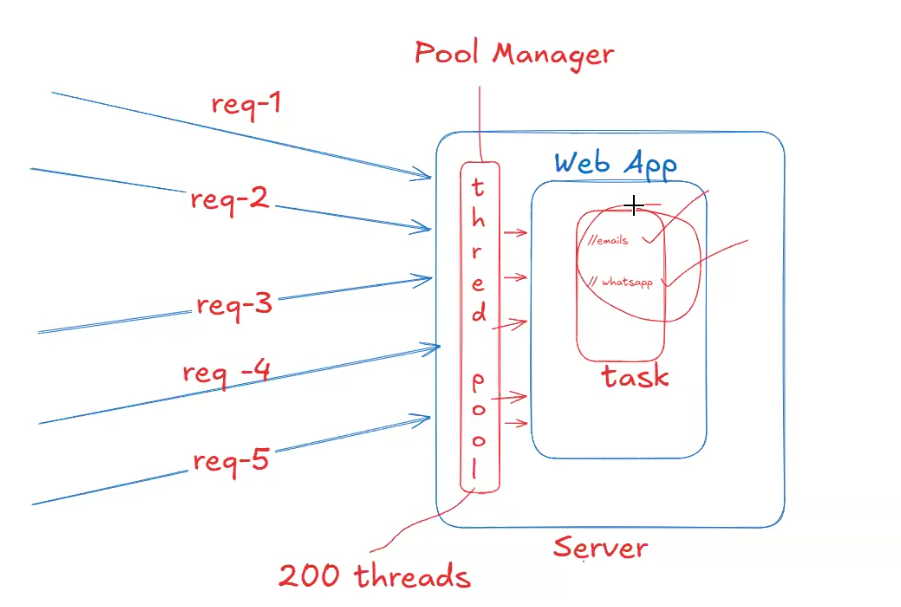

server application responsiblity to create thread pool/pool manager like tomacat server, php server,etc
every web application runs under application server

- Application servers often manage a pool of workers for handling requests.
- Tomcat uses a request-handling thread pool.
- PHP-FPM generally uses a pool of processes, not a thread pool.
- In Python, servers such as Gunicorn or Uvicorn can use worker processes and, depending on configuration, threads.
A more accurate statement is:
A web application runs through a web server or application server.
The server manages workers, such as threads or processes, to handle multiple user requests.
For example:
Browser -> Tomcat server -> Java web application
Browser -> Nginx -> Gunicorn/Uvicorn -> Python web application
Browser -> Nginx/Apache -> PHP-FPM -> PHP application
---
## **Real-Life Example**
---
Imagine a restaurant with only one employee.
The employee must:
Take the customer's order
Prepare the food
Serve the food
Collect payment
The second customer must wait until all the work for the first customer is completed.
This is similar to single-threaded execution.
Now imagine the restaurant has multiple employees:
employee-1 takes orders
employee-2 prepares food
employee-3 serves food
employee-4 collects payments
Multiple activities can happen at the same time. This is similar to Multi Threading.
**Multiple tables are served during the same period. This is similar to multithreading.**
**Each employee represents one thread.**
---
## **Main Thread**
---
**Every Python program starts with one default thread called the main thread.**
**Python provides the "threading" module for multithreading.**
---
```python
import threading
print("Current Thread:", threading.current_thread())
print("Thread Name:", threading.current_thread().name)
print("Thread Identifier:", threading.current_thread().ident)
print("Active Thread Count:", threading.active_count())
----
```
---
## **Creating Threads in Python**
---
**Python provides the "threading" module for multithreading.**
**We need to "import threading" module for multi threading...**
**A thread can be created using the "Thread" class.**
Syntax :
```python
thread = threading.Thread(target=function_name)
Here
-- Thread creates a new thread.
-- target specifies the function the thread should execute.
-- start () method starts the new thread (worker thread)
Ex--1:
import threading
import time
def task_one():
    print("Task-1 Started")
    time.sleep(3)
    print("Task-1 Completed")
def task_two():
    print("Task-2 Started")
    time.sleep(2)
    print("Task-2 Completed")
thread1 = threading.Thread(target=task_one)
thread2 = threading.Thread(target=task_two)
thread1.start()
thread2.start()
########### Another way of creating thread ##################
class MyThread(threading.Thread):
    def run(self):
        print("Run() method started..")
        print("Thread Name :", threading.current_thread().name)
thread3 = MyThread()
thread3.start()
Note-1 : we are overriding run() method to provide our own implementation.
Note-2: When we call start() method internally it executes run() method.
```
---
## **Important Thread Methods**
---
1) start()
2) join()
3) is_alive()
---
## **what is start( )**
---
**The start() method begins the execution of a thread.**
t1.start ( )
**Python internally calls the target function in a separate thread.**
**Do not call the run() method directly when you want separate thread execution.**
t1.run ( )
Note : Calling run() directly executes the function using the current thread. It does not start a new thread.
---
## **what is join( )**
---
**The join() method makes the current thread wait until another thread completes its execution.**
Scenario :
Thread-1 : Download a file
Thread-2 : Read data from downloaded file
Example :
```python
def download_file():
    print("Download file started..")
    time.sleep(3)
    print("Download completed")
t5 = threading.Thread(target=download_file)
t5.start()
t5.join()
print("Read data from downloaded file...")

Note: Without join(), the main thread may continue before the worker thread finishes.
```
---
## **what is is_alive( )**
---
**The is_alive() method checks whether a thread is currently running.**
Example :
```python
def process_data():
    time.sleep(3)
thread = threading.Thread(target=process_data)
thread.start()
print(thread.is_alive())
thread.join()
print(thread.is_alive())
```
---
## **Thread Scheduling**
---
**When multiple threads are available, the operating system decides:**
-- which thread should execute
-- how long it should execute
-- when execution should switch to another thread
**This process is called thread scheduling.**
**Because scheduling is controlled by the operating system, thread execution order is not guaranteed.**
---
## **What is Race Condition**
---
**When multiple threads try to access and modify shared data at the same time may produce an incorrect result which is called as Race Condition.**
Ex :
Consider a bank account.
Two threads are trying to withdraw money from the same account at the same.
---
```python
import threading
import time
balance = 1000
def withdraw(amount):
    global balance
    if balance >= amount:
        current_balance = balance
        time.sleep(1)
        balance = current_balance - amount
        print("Withdraw successfully")
        print("Remaining Balance:", balance)
    else:
        print("Insufficient Balance")
t1 = threading.Thread(target=withdraw, args=(700,))
t2 = threading.Thread(target=withdraw, args=(700,))
t1.start()
t2.start()
t1.join()
t2.join()
print("Final Balance :", balance)

Correct output:
Withdrawal successful
Remaining Balance: 300
Insufficient balance
Final Balance: 300
with lock: allows only one thread to check and update balance at a time.

lock is like a key for the shared balance variable.
lock = threading.Lock()
When a thread enters this block:
with lock:
it takes the key. Other threads must wait until the current thread leaves that block.
with lock:
    if balance >= amount:
        balance = balance - amount
Step by step:
1. t1 enters with lock: and locks the balance.
2. t2 reaches with lock: but must wait.
3. t1 withdraws 700; balance becomes 300.
4. t1 exits the block and releases the lock.
5. t2 enters the block and checks balance.
6. 300 >= 700 is False, so it prints "Insufficient balance".
with lock: automatically releases the lock, even if an error occurs inside the block.
```
---
**Both threads may read the original balance as 1000.**
**Both threads may then allow a withdrawal of 700.**
**This creates incorrect account processing.**
**The exact result depends on thread scheduling, which makes race-condition bugs difficult to**
reproduce.
---
## **What is Thread Synchronization**
---
**Thread synchronization means controlling multiple threads so that only one thread accesses a**
critical shared resource at a time.
**Python provides synchronization tools such as:**
    -- Lock
    -- RLock
    -- Semaphore
    -- Event
    -- Condition
Note: For beginners, the most important tool is Lock.
**A Lock allows only one thread at a time to execute a protected section of code.**
```python
lock = threading.Lock()
**Before accesing shared resource we need to accquire lock like below**
lock.accquire()
**After completing the work we need to release the lock like below**
lock.release()
```
---
```python
import threading
import time
balance = 1000
lock = threading.Lock()
def withdraw(amount):
    global balance
    lock.acquire()
    try:
        if balance >= amount:
            print(
                threading.current_thread().name,
                "is processing withdrawl"
            )
            current_balance = balance
            time.sleep(1)
            balance = current_balance - amount
            print("Remaining Balance:", balance)
        else:
            print("insufficient balance")
    finally:
        lock.release()
t1 = threading.Thread(target=withdraw, args=(700,), name="Customer-1")
t2 = threading.Thread(target=withdraw, args=(700,), name="Customer-2")
t1.start()
t2.start()
t1.join()
t2.join()
print("Final Balance:", balance)

Expected output:
Customer-1 is processing withdrawal
Remaining Balance: 300
Customer-2 - Insufficient balance
Final Balance: 300
finally ensures lock.release() runs even if an error occurs while processing the withdrawal.
```
---
## **implement Lock by using with keyword**
---
**The recommended way to use a lock is with the "with" statement.**
Syntax :
with lock:
# **Critical section**
**Python automatically acquires and releases the lock.**
---
```python
import threading
import time
balance = 1000
lock = threading.Lock()
def withdraw(amount):
    global balance
    with lock:
        if balance >= amount:
            print(
                threading.current_thread().name,
                "is processing withdrawl"
            )
            current_balance = balance
            time.sleep(1)
            balance = current_balance - amount
            print("Remaining Balance:", balance)
        else:
            print( threading.current_thread().name, "- Insufficient balance" )
t1 = threading.Thread(target=withdraw, args=(700,), name="Customer-1")
t2 = threading.Thread(target=withdraw, args=(700,), name="Customer-2")
t1.start()
t2.start()
t1.join()
t2.join()
print("Final Balance:", balance)

Expected output:
Customer-1 is processing withdrawal
Remaining Balance: 300
Customer-2 - Insufficient balance
Final Balance: 300
with lock: is the shorter, safer alternative to using lock.acquire() and lock.release().
```
---
---
## **Python Code Debugging Using PyCharm**
---
**Debugging is the process of finding, understanding, and fixing errors in a program.**
**When we write a Python program, it may not always produce the expected result. The program may:**
    -- Stop suddenly
    -- Display an error message
    -- Produce an incorrect output
    -- Execute the wrong block of code
    -- Get stuck in an infinite loop
**Debugging helps us understand:**
    -- which line is executing
    -- what values variables contain
    -- why a condition is true or false
    -- where the error occured
    -- how the program reached that point
####### Debugging means executing a program step by step to identify and fix problems which comes in program. ######
---
## **Why Should We Use a Debugger**
---
**Using a debugger, we can:**
    -- pause program execution
    -- execute one line at a time
    -- inspect variable values
    -- enter inside functions
    -- skip function execution
    -- evaluate expression
    -- identify logical errors
    -- understand program execution flow
Normally, we execute the program using the Run option.
To debug it, we use the Debug option.

---
## **What is a Breakpoint?**
---
**A breakpoint tells PyCharm:**
    -- Pause the program before executing this line.
**when the debugger stopped at break point, we can control program execution using below debugging shortcuts..**
Shift + F9 : Start Debugging
F7 : step into (enter inside function)
F8 : step over (move to next line)
F9 : Move to next break point in the flow (Resume program)
Shift + F8 : Step Out (Complete function and come out and return to the called
line)
Alt + F9 : Run to cursor (move the debugger to the line where our cursor is
pointed)
Ctrl + F2 : Stop Debugging
**When program in under debugging mode, we can change variable values in the runtime for testing**
some special scenarios...
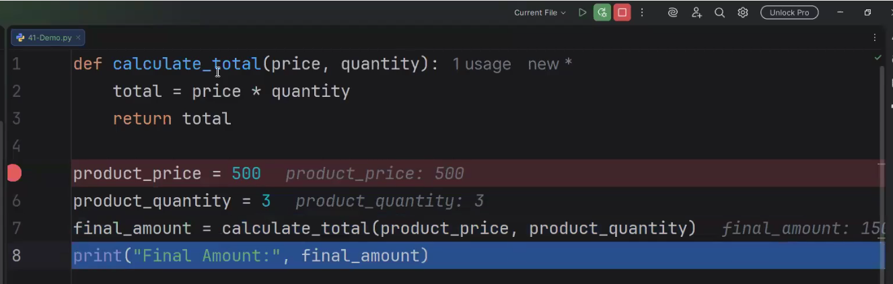

---
## **What is a Python Library?**
---
=> Imagine writing a calculator.
**Without libraries: You write every mathematical function yourself.**
**With libraries: Someone already wrote those functions, you simply use them.**
### **without library ###**
```python
def square(num):
    return num*num
print(square(10))
```
### **Using library ###**
```python
import math
print(math.sqrt(100))
**Library = Ready-made code.**
```
---
## **Real-Life Example**
---
## **Suppose you are constructing a house.**
Without Library, You manufacture
Bricks
Cement
Steel
Doors
Windows
Then build house (This is impossible becuase manfacturing is very difficult for me)..
**Instead of manfacturing everything, we can purchase ready-made material required for house**
construction.
**Programming is same, Libraries are ready-made building blocks.**
---
## **What is a Library?**
---
**Collection of packages**
Example : Numpy Library
=> Contains
- Linear Algebra
- Random
- Statistics
- Matrix
=> package means collection of modules.
=> Module means python file.
---
## **Types of Python Libraries**
---
1) Standard Libraries (Already available, we no need to install)
- math
- random
- datetime
- os
- sys
- json
2) Third Party Libraries (we need to install)
- numpy
- pandas
- matplotlib
- flask
- django
- tensorflow
- fast-api
- scikit-learn
- streamlit
Using : using pip we can install third party libraries.
Note: Better to use virtual environment to install project specific libraries.
---
### **Numpy :**
- Purpose : Numerical Computing
- Used For : Arrays, Matrix Operations, Linear Algebra
- Projects: AI, ML, Scientific Computing
### **Pandas :**
- Purpose : Data Analysis
- Used For : Reading CSV/Excel, Data Cleaning, Data Manipulation
- Projects : Data Science, Business Intelligence
### **Matplotlib :**
- Purpose : Data Visualization
- Used For : Line, Bar, Pie, Graph, Scatter Charts
- Projects : Reports, Dashboards
## **Flask :**
- Purpose : Web Framework
- Used For : REST APIs, Small Web applications
- Projects : Backend services, Microservices
## **Django :**
- Purpose : Fullstack Web Framework
- Used For : Large Scale Enterprise web applications
- Projects : ECommcer, ERP, CRM
## **Scikit-Learn :**
- Purpose : Machine Learning
- Used For : Classification, Regression, Clusttering
- Projects : Predication Systems, Recommendation Systems
## **TensorFlow :**
- Purpose : Deep Learning
- Used For : Neural Networks, Computer Vision, NLP
- Projects : Image Recognization
## **FAST-API :**
- Purpose : High Performance API framework
- Used For : REST APIs for AI/ML/GEN AI/Agentic AI projects
- Projects : Backend REST APIs
## **Streamlit :**
- Purpose : Web Apps for Data Science
- Used For : Build interactive Dashboards
- Projects : AI Chatbot demos, data Visualization
## **Hugging Face :**
- Purpose : AI Model hub
- Used For : LLMs, Text generation, image genration, AI model deployment
- Projects : ChatGPT-Like application, AI Assistants, Translation systems
---
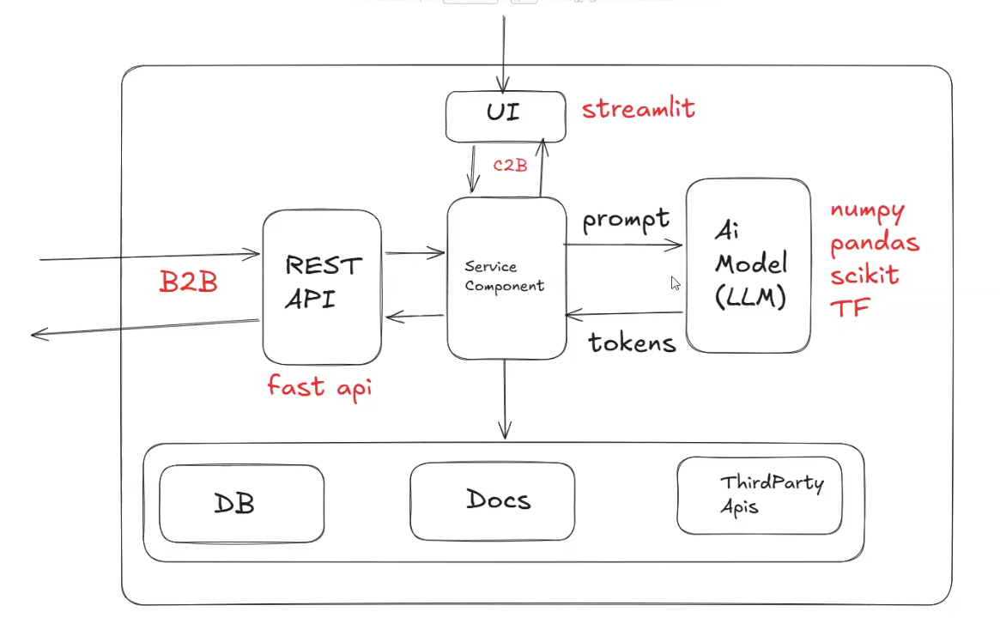
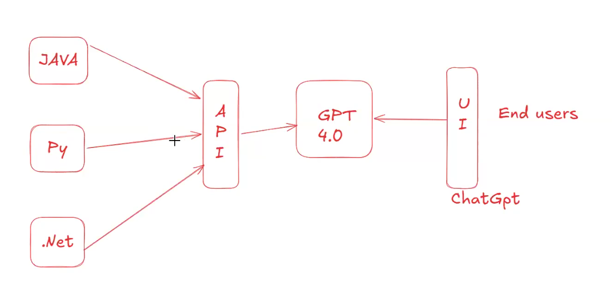
---
## **1) What is Webservice ?**
---
=> Webservices are used to develop distributed applications.
=> If one application is communicating with another application then we will call it as
distributed application.
Passport <------------> AADHAR App
MakeMyTrip <----------> IRCTC App
GPay <---------------> Banking App
=> Every Distributed application should maintain intereoperability.
JAVA App <----------> Python App
Python App <---------> .Net App
.Net App <---------> Java App
Angular App <--------> JAVA / Python / DOT NET / Node JS
React App <--------> JAVA / Python / DOT NET / Node JS
=> Intereoperability means irrespective of the platform and language if applications are
communicating then we will call them as Intereoperable applications.

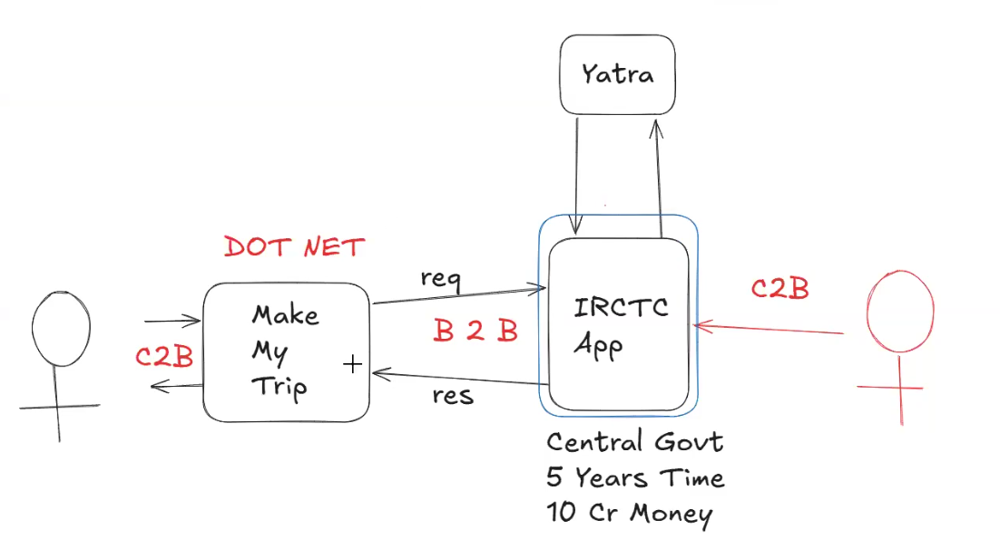
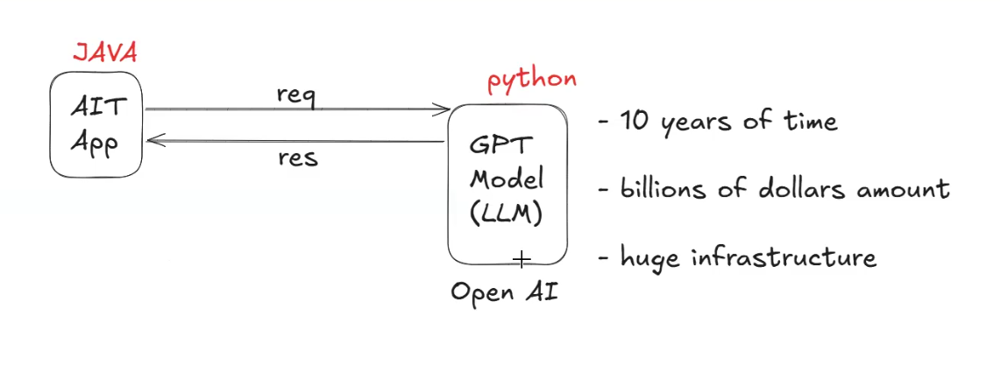
---
## **Q)  Why we should develop Distributed application?**
---
-> Distributed applications are used for Business to Business Communication ( B 2 B )
-> We can resue the functionality of one project in another project.
Ex-1:
-> IRCTC project contains business logic to book train tickets.
-> MakeMyTrip application will communicate with IRCTC to book train tickets.
Note: In this scenario, MakeMyTrip application is re-using IRCTC application logic to book train
tickets.
Ex-2 :
-> OPEN AI company developed GPT Model (LLM)
-> Other applications can use use GPT Model for AI implementation.
############### Distributed applications can be developed in 2 ways
1) SOAP Webservices (Outdated)
2) RESTFul Services (Trending)
---
## **What is REST API ?**
---
**API stands for Application programming interface.**
**REST stands for Representational State Transfer.**
**REST API defines set of rules to establish business to business communication.**
**Using REST API we can provide business services to other applications.**
**REST API defines how to access one application from another application**
-- What is the URL Pattern
-- What type of request
-- Request Data
-- Response Data
---
## **REST API Architecture**
---
1) Provider
2) Consumer
=> Provider means the application which is providing business services to other applications.
=> Consumer means the application which is accessing business services from other applications.
Ex: IRCTC is a provider and MakeMyTrip & Yatra are consmers.
OPEN AI GPT Project is a provider, Ashok IT Web App is a consumer.
Note: We will use JSON to exchange data between provider & consumer.
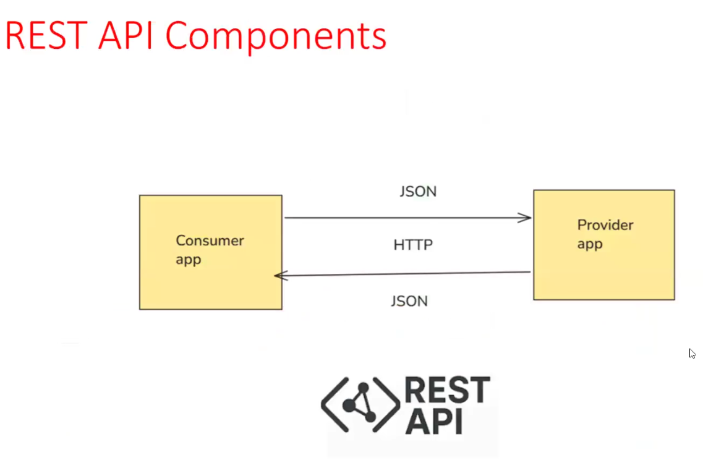
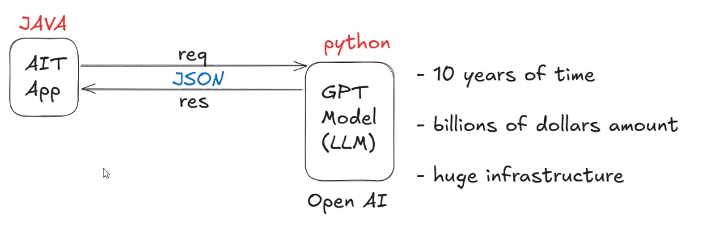
======
JSON
======
=> JSON stands for Java Script Object Notation.
=> JSON represents data in key-value format.
Ex:
{
"id" : 101,
"name" : "Ashok",
"phone" : 8686868
}
=> JSON is very light weight.
=> JSON is platform independent & language independent.
=> JSON is used to transfer data over a network.
=> Distributed applications will use JSON data for request & response.
Note: To work with json data in python, we have "json" module (in-built)
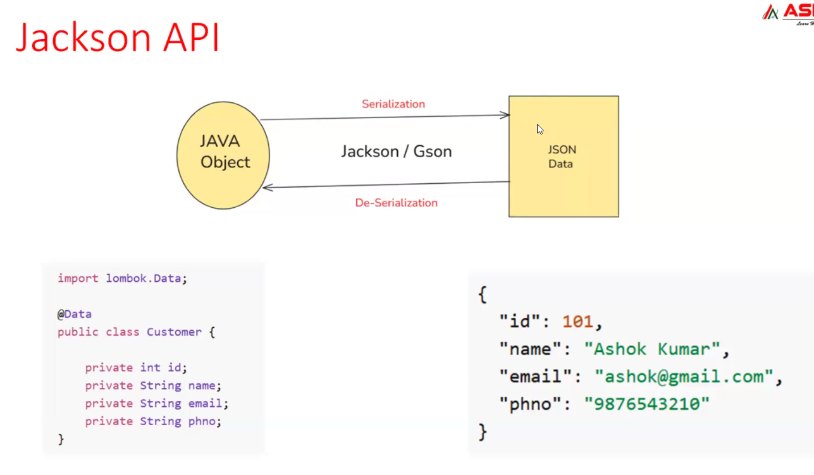
json.dumps() : Converts Python object into JSON string
json.dump() : Writes Python object into JSON file
json.loads() : Converts JSON string into Python object
json.load () : Reads JSON file and converts into Python object
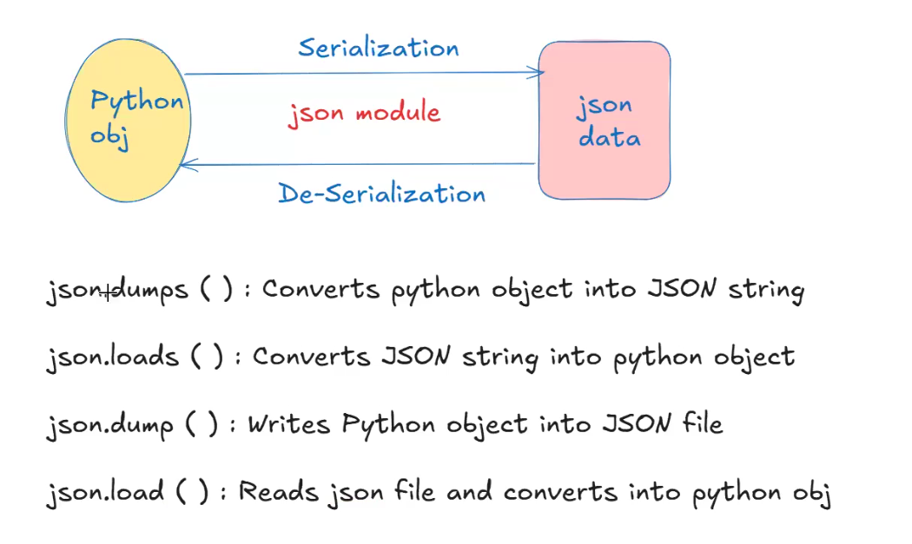
---
```python
import json
student = {
    "id": 101,
    "name": "Ravi",
    "course": "Python",
    "fee": 15000
}
student_json = json.dumps(student, sort_keys=True, indent=4)
print(student_json)
print(type(student_json))
print("--------------------------------")
student = json.loads(student_json)
print(student)
print(type(student))
print("--------------------------------")
with open("student.json", "w") as file:
    json.dump(student, file, indent=10)
print("JSON file created successfully")
print("--------------------------------")
with open("student.json", "r") as file:
    student = json.load(file)
    print(student)
```
---
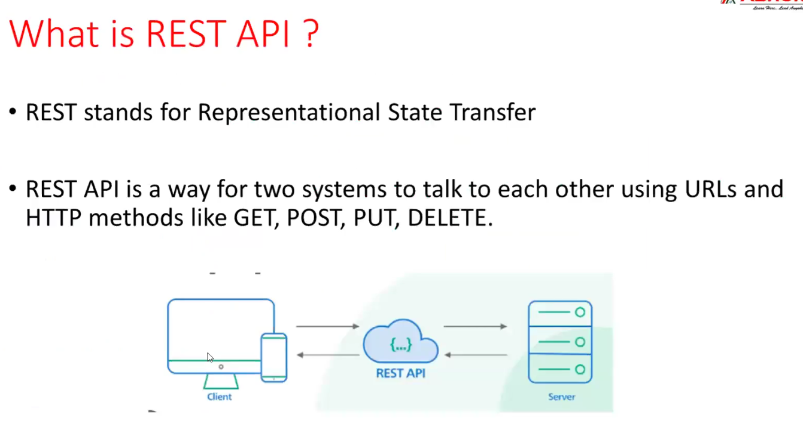
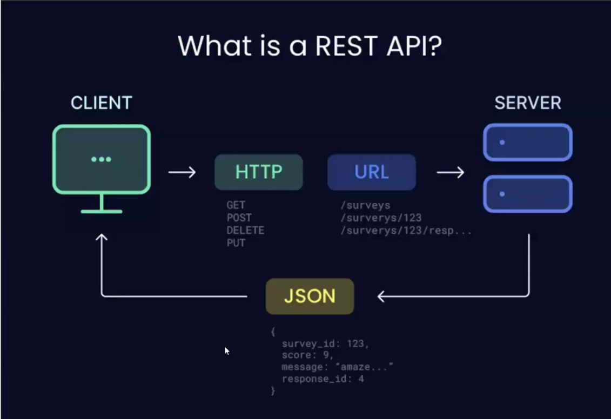
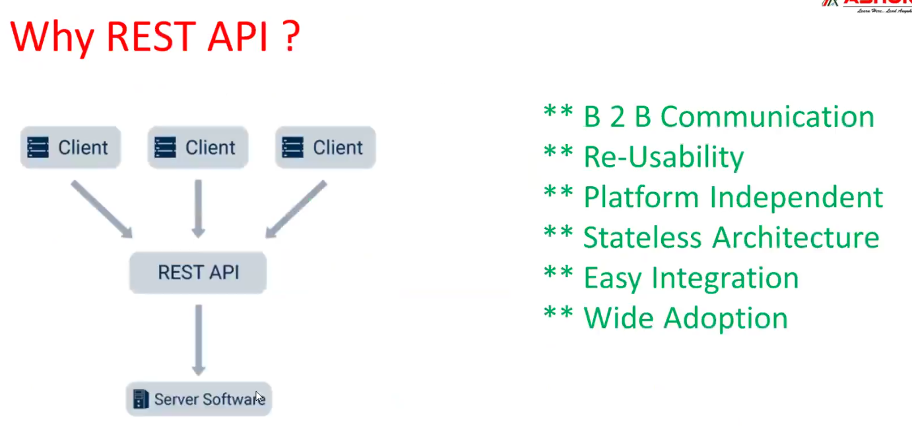
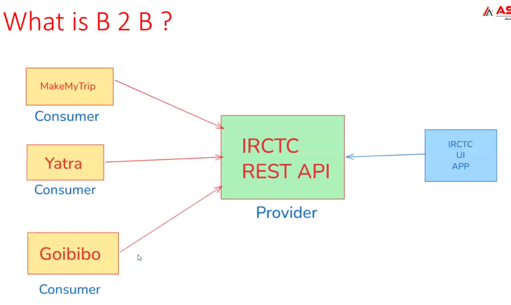
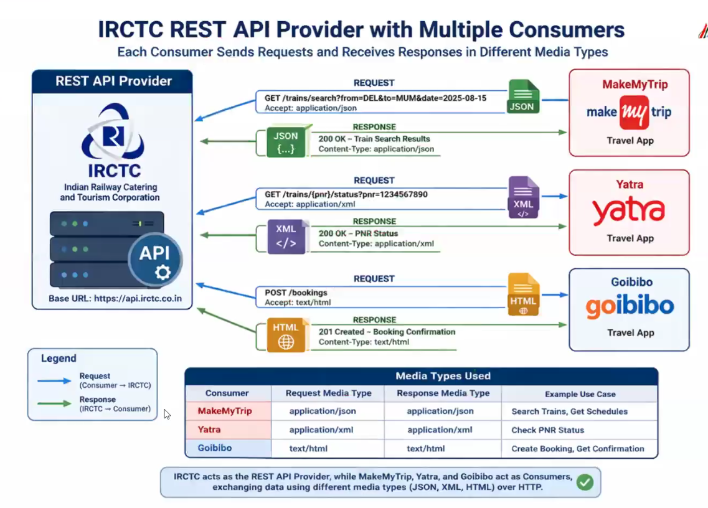

---
## **What is HTTP**
---
=> HTTP stands for Hyper Text Transfer Protocol.
=> HTTP acts as mediator between Client & Server.
=> HTTP is stateless protocol
(can't remember converstation happend between client & server)
=> To develop REST APIs we need to know below concepts of HTTP
1) HTTP Request Structure
2) HTTP Response Structure
3) HTTP Methods
4) HTTP Status Codes
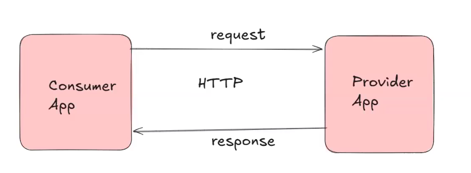
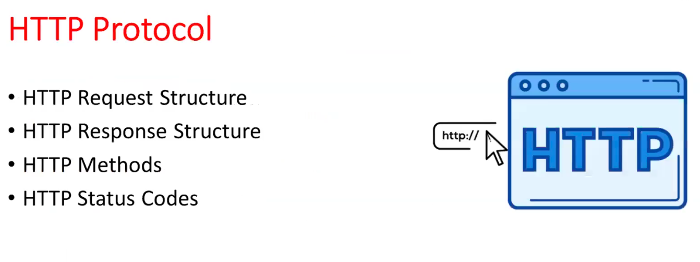
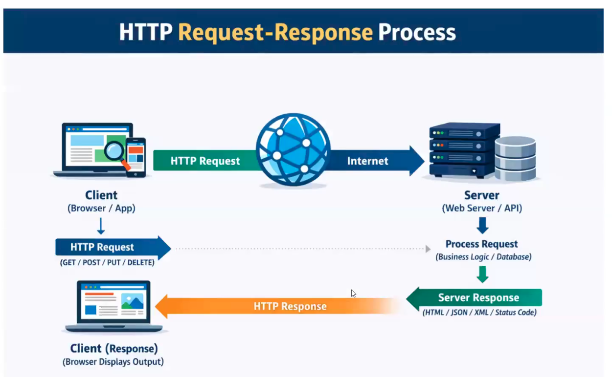
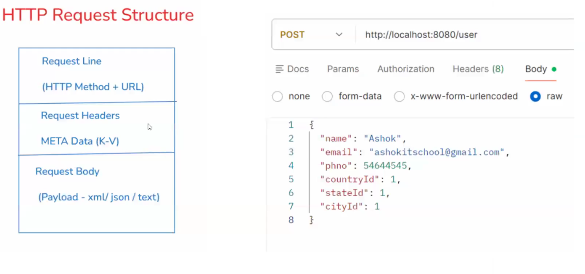
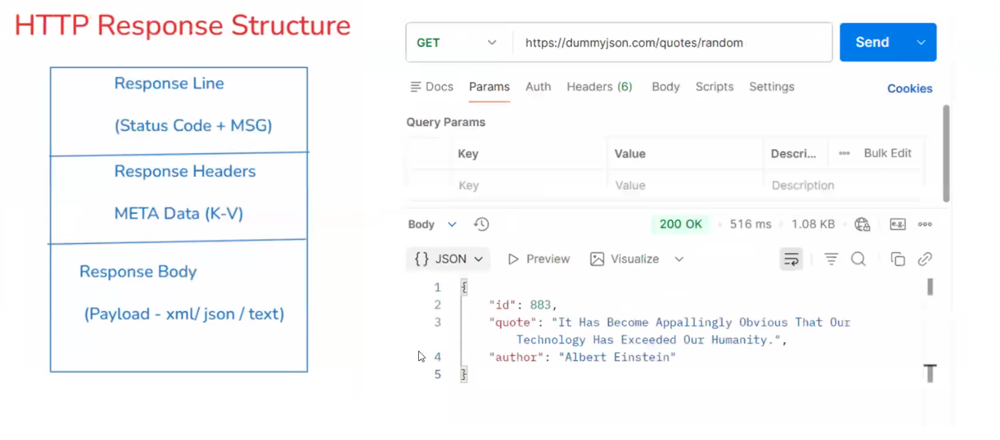

Postman API is used for testing API
---
## **HTTP Request Structure**
---
=> It contains below parts
        1) Request Line ( HTTP Method + Server URL )
        2) Request Headers (Metadata) ==> (KEY - VALUE format)
        3) Request Body (Payload ---> text  / xml / json)
---
## **HTTP Response Structure**
---
=> It contains below parts
        1) Response Line (Status Code + Status MSG)
        2) Response Headers  (Metadata - K & V)
        3) Response Body (Payload - text / xml / json)
---
## **HTTP Methods**
---
1) GET
2) POST
3) PUT
4) PATCH
5) DELETE
=> GET method is used to get data from server (no request body)
get request we send data in the url itself. All other methos send body
=> POST method is used to send data to server (it creates new record at server)
=> PUT method is used to update the record (complete record update)
=> PATCH method is used for record partial update
=> DELETE method is used to delete record at server
---
## **HTTP Status Codes**
---
2xx (200 to 299) : Success
4xx (400 to 499) : Client Error
5xx (500 to 599) : Server Error
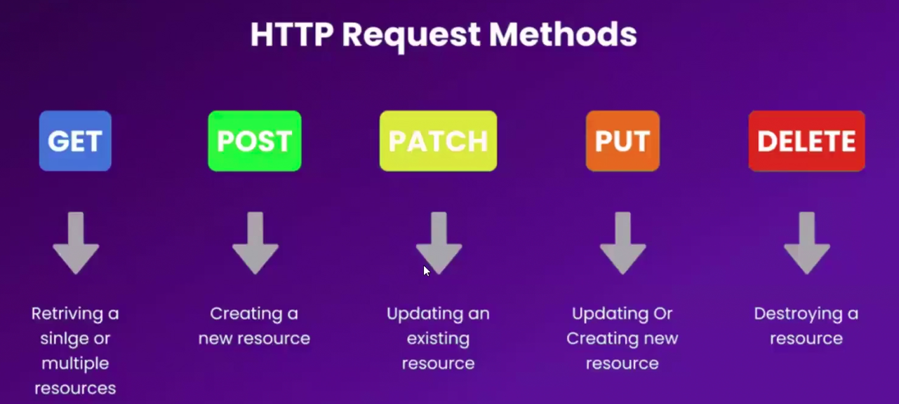
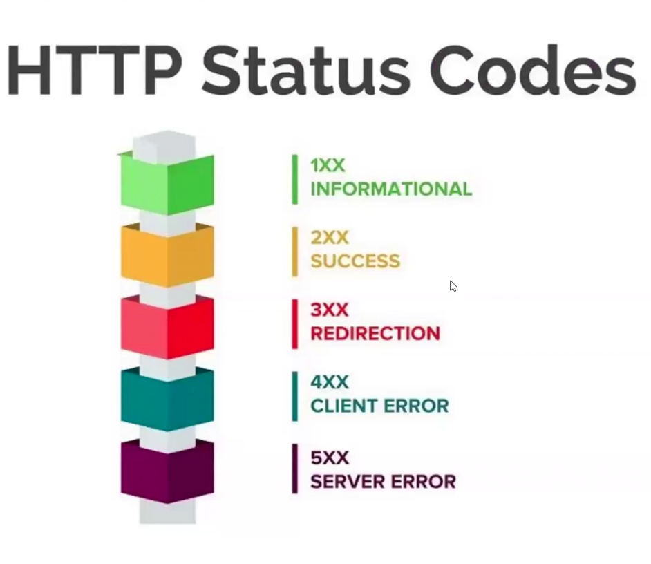
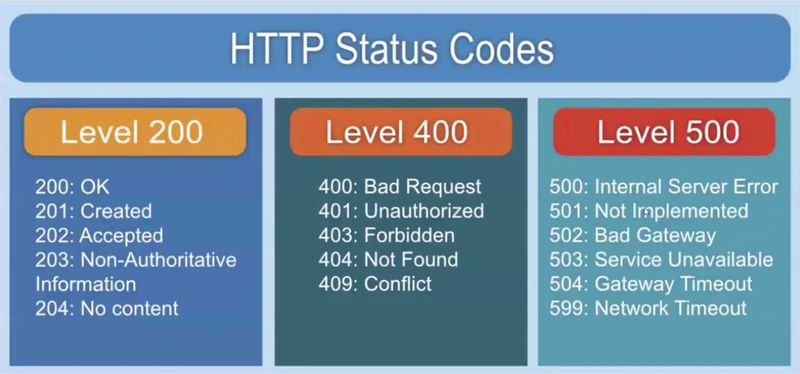

---
## **Develop REST API Using FAST API**
---

If you are python app provider:
FAST API => to create API
Uvicorm will provide server
Pydantic is used to validate the APIs
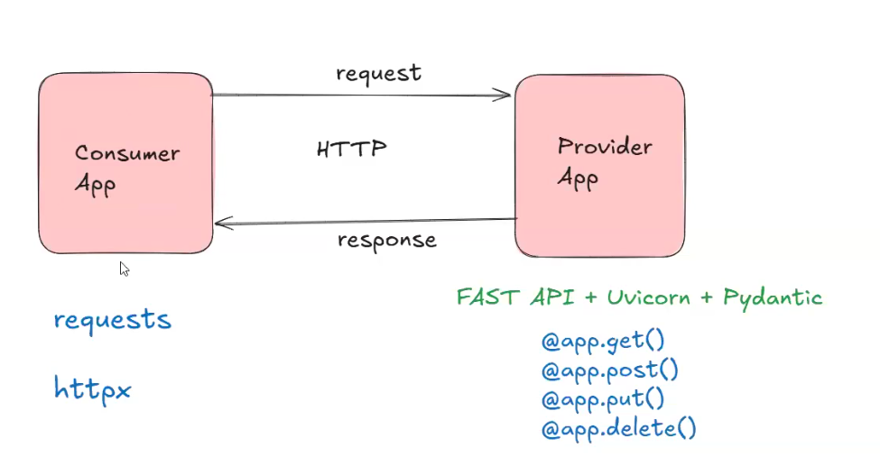
If you are python app consumer:
The consumer application is a application which reads/consumes data from other application
requests library and httpx library
---
Step-1 : Create Python Project
Step-2 : Create "requirements.txt" file inside the project
Step-3 : Configure required libraries in 'requirements.txt' file
            - fastapi
            - uvicorn
Step-4 : Create Virtual Environment and Activate it
Step-5 : Install the libraries in venv using 'pip'
        $ pip install -r requirements.txt
Step-6 : create app.py file with "rest endpoint" methods

```python
from fastapi import FastAPI
app = FastAPI()
@app.get("/")
def get_welcome_msg():
    return {"message": "Welcome to FastAPI"}

When you open:
http://127.0.0.1:8000/
the API returns:
{
  "message": "Welcome to FastAPI"
}
Step-7 : Run the application using uvicorn
    Ex : uvicorn main:app --reload
Step-8 : Test the application using swagger documentation
URL : http://localhost:8000/docs
```
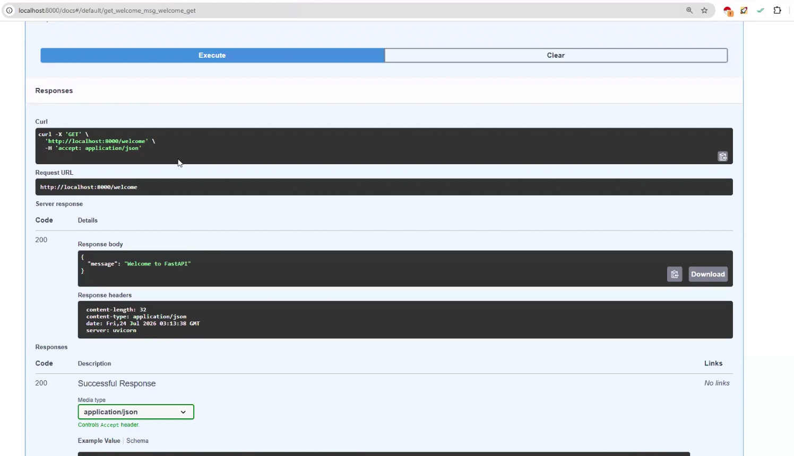
Note: When we hit above url, FastAPI automatically generates API documentation.
**With API documentation we can understand, What endpoints available, our APi methods mapped to**
which type of HTTP requests, what are the request parameters, request data format, response data
format.
**Using Swagger Documentation we can test the REST Endpoints also.**
Note: We can use POSTMAN also for API testing (it won't give documentation, we need to provide api
details to postman to send the request.)
---
```python
from fastapi import FastAPI
app = FastAPI()
@app.get("/welcome")
def get_welcome_msg():
    return {"message" : "Welcome to FastAPI"}
@app.get("/greet")
def get_greet_msg():
    return {"message" : "Good Morning"}
```
---

Use a different path for the second endpoint:
```python
from fastapi import FastAPI
app = FastAPI()
@app.get("/")
def get_welcome_msg():
    return {"message": "Welcome to FastAPI"}

@app.get("/greet")
def get_greet_msg():
    return {"message": "Hello"}
Now:
GET http://localhost:8000/
Response:
{"message": "Welcome to FastAPI"}
GET http://localhost:8000/greet
Response:
{"message": "Hello"}
```
---
## **GET API Example**
---
=> GET API is used to fetch data from the server.
---
```python
from fastapi import FastAPI
app = FastAPI()
@app.get("/course")
def get_course():
    return {
        "course": "Gen AI with Python",
        "duration": "3 Months",
        "trainer": "Ashok"
    }
```
---
## **URL : http://127.0.0.1:8000/course**
---
=> When we are using GET request we can send data to server in the URL...
=> We have 2 options to send data in the URL
    1) Path Parameter
    2) Query Parameter
---
### **What is Path Parameter**
---
-- Used to send data in URL directley
-- Need to represent its position in url template
---
```python
from fastapi import FastAPI, HTTPException
from courses import courses

app = FastAPI()

# Get all courses
@app.get("/courses")
def get_courses():
    return courses
# Get one course using course ID
@app.get("/courses/{course_id}")
def get_course(course_id: int):
    course = courses.get(course_id)

    if course is None:
        raise HTTPException(
            status_code=404,
            detail="Course not found"
        )

    return course
Example courses.py:
courses = {
    1: {"name": "Python", "fee": 5000},
    2: {"name": "Java", "fee": 6000},
    3: {"name": "Gen AI", "fee": 10000}
}
GET /courses/1
Response:
{
  "name": "Python",
  "fee": 5000
}
If course ID 10 does not exist:
{
  "detail": "Course not found"
}

From the folder that contains course.py, run:
venv\Scripts\activate
uvicorn runapp:app --reload
Then open:
http://127.0.0.1:8000
API documentation:
http://127.0.0.1:8000/docs
```
---
---
### **What is Query Parameter**
---
=> Query parameter means passing value after ? in the URL.
Ex : http://localhost:8000/courses?name=genai&trainer=ashok
=> Query Parameters starts with ? and seperated by "&"
=> Query Parameters should present only at the end of the URL
---
```python
from fastapi import FastAPI, HTTPException
from courses import courses

app = FastAPI()

# Get all courses
@app.get("/courses")
def get_courses():
    return courses

# Get one course using course ID
@app.get("/courses/{course_id}")
def get_course(course_id: int):
    course = courses.get(course_id)

    if course is None:
        raise HTTPException(
            status_code=404,
            detail="Course not found"
        )

    return course

# Search courses by name
@app.get("/course-search")
def search_course(search: str):
    result = []

    for course_id, course in courses.items():
        if search.lower() in course["name"].lower():
            result.append({
                "course_id": course_id,
                **course
            })

    return result

GET /course-search?search=ai
Response:
[
  {
    "course_id": 3,
    "name": "Gen AI",
    "fee": 10000
  }
]
```
---
http://localhost:8000/course-search?search=stack
---
---
## **POST API with Request Body**
---
=> POST API is used to send data to the server.
=> FastAPI uses Pydantic models to receive and validate request body data.
---
```python
from fastapi import FastAPI, HTTPException
from pydantic import BaseModel

from courses import courses

app = FastAPI()

# Request body model for creating a course
class Course(BaseModel):
    course_id: int
    course_name: str
    course_price: int

# Get all courses
@app.get("/courses")
def get_courses():
    return courses

# Get one course using course ID
@app.get("/courses/{course_id}")
def get_course(course_id: int):
    course = courses.get(course_id)

    if course is None:
        raise HTTPException(
            status_code=404,
            detail="Course not found"
        )

    return course

# Search courses by name
@app.get("/course-search")
def search_course(search: str):
    result = []

    for course_id, course in courses.items():
        if search.lower() in course["name"].lower():
            result.append({
                "course_id": course_id,
                **course
            })

    return result

# Create a new course
@app.post("/course", status_code=201)
def create_course(course: Course):
    return {
        "message": "Course created",
        "course": course
    }
Use the /docs page to send this JSON request to POST /course:
{
  "course_id": 4,
  "course_name": "DevOps",
  "course_price": 7000
}
Response:
{
  "message": "Course created",
  "course": {
    "course_id": 4,
    "course_name": "DevOps",
    "course_price": 7000
  }
}

```
---
@@@ Assignment : Develop a REST API to perform CRUD operations using MYSQL Database.

D:\AIT NOTES\student-CURD-api
---
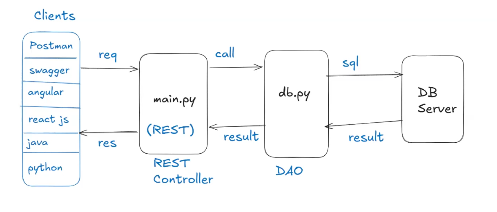
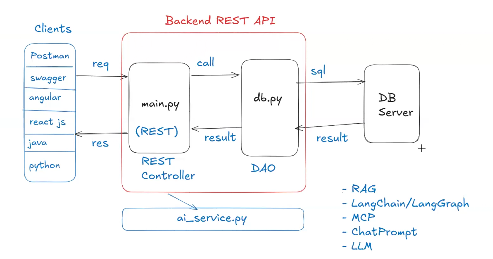
```python
DAO=> Data access object => responsible for perform db related operation

```
---

main.py
```python
from fastapi import FastAPI
from pydantic import BaseModel

import db

app = FastAPI()

# Runs once when the application starts
@app.on_event("startup")
def startup():
    db.create_table()

class Student(BaseModel):
    name: str
    course: str
    fee: float

@app.post("/student", status_code=201)
def create_student(student: Student):
    return db.create_student(student)

@app.get("/students")
def get_all_students():
    return db.get_students()

@app.get("/students/{student_id}")
def get_student_by_id(student_id: int):
    return db.get_student_by_id(student_id)

main.py
from fastapi import FastAPI
from pydantic import BaseModel

import db

app = FastAPI()

API = "/api"

# Runs once when the application starts
@app.on_event("startup")
def startup():
    db.create_table()

class Student(BaseModel):
    name: str
    course: str
    fee: float

@app.post(f"{API}/student", status_code=201)
def create_student(student: Student):
    return db.create_student(student)

@app.get(f"{API}/students")
def get_all_students():
    return db.get_students()

@app.get(f"{API}/students/{{student_id}}")
def get_student_by_id(student_id: int):
    return db.get_student_by_id(student_id)

db.py

import mysql.connector

def get_connection():
    return mysql.connector.connect(
        host="localhost",
        user="root",
        password="root",
        database="pydb"
    )

def create_table():
    connection = get_connection()
    cursor = connection.cursor()

    query = """
        CREATE TABLE IF NOT EXISTS students (
            id INT AUTO_INCREMENT PRIMARY KEY,
            name VARCHAR(100) NOT NULL,
            course VARCHAR(100) NOT NULL,
            fee DECIMAL(10, 2) NOT NULL
        )
    """

    cursor.execute(query)

    cursor.close()
    connection.close()

    print("Student table is ready...")

def create_student(student):
    conn = get_connection()
    cursor = conn.cursor()

    query = "INSERT INTO students(name, course, fee) VALUES(%s, %s, %s)"

    cursor.execute(
        query,
        (student.name, student.course, student.fee)
    )

    conn.commit()

    cursor.close()
    conn.close()

    return {
        "success": True,
        "message": "Student created",
        "data": student
    }

def get_students():
    conn = get_connection()
    cursor = conn.cursor(dictionary=True)

    query = "SELECT * FROM students"

    cursor.execute(query)

    students = cursor.fetchall()

    cursor.close()
    conn.close()

    return {
        "success": True,
        "message": "Student fetched successfully",
        "data": students
    }

def get_student_by_id(id: int):
    conn = get_connection()
    cursor = conn.cursor(dictionary=True)

    query = "SELECT * FROM students WHERE id = %s"

    cursor.execute(query, (id,))

    student = cursor.fetchone()

    cursor.close()
    conn.close()

    if student:
        return {
            "success": True,
            "message": "Student found",
            "data": student
        }

    else:
        return {
            "success": False,
            "message": "Student not found",
            "data": None
        }

requirements.txt
    fastapi
    uvicorn
    mysql-connector-python

applying limit on fields:
from fastapi import FastAPI
from pydantic import BaseModel

import db

app = FastAPI()

API = "/api"

# Runs once when the application starts
@app.on_event("startup")
def startup():
    db.create_table()

class Student(BaseModel):
    name: str = Field(..., min_length=3, max_length=15)
    course: str = Field(..., min_length=3, max_length=15)
    fee: float = Field(..., gt=0)

@app.post(f"{API}/student", status_code=201)
def create_student(student: Student):
    return db.create_student(student)

@app.get(f"{API}/students")
def get_all_students():
    return db.get_students()

@app.get(f"{API}/students/{{student_id}}")
def get_student_by_id(student_id: int):
    return db.get_student_by_id(student_id)

Field(...) means the value is required.
- name and course must contain 3 to 15 characters.
- fee must be greater than 0.

uvicorn main:app --reload

├── main.py
├── db.py
└── requirements.txt

=> requirements.txt contains the libraries needed for this project.

=> db.py contains all database-related logic.

=> main.py contains FastAPI logic (REST endpoints).

```
---

---
## **How to Consume REST APIs Using Python**
---

**Python provides the popular "requests" library to send HTTP requests.**

**The Requests library supports operations such as:**

    1) Send HTTP requests programmatically

    2) Access response content

    3) JSON processing

    4) Passing headers, etc.

Note: We need to install the "requests" library.

requirements.txt
    requests

python -m venv .venv
.venv\Scripts\activate
pip install -r requirements.txt
main.py
```python
import requests

api_url = "https://jsonplaceholder.typicode.com/users"

response = requests.get(api_url)

print(response)
print("Status Code:", response.status_code)
print(response.text)
print(response.json())

```
---

# **GET Request with Query Parameters**
```python
import requests

city = "Hyderabad"

api_url = "https://geocoding-api.open-meteo.com/v1/search"

params = {
    "name": city,
    "count": 1
}

response = requests.get(api_url, params=params)

print(response.text)
params adds query parameters to the URL:
https://geocoding-api.open-meteo.com/v1/search?name=Hyderabad&count=1

```
---

```python
import requests

latitude = 17.38405
longitude = 78.45636

url = "https://api.open-meteo.com/v1/forecast"

params = {
    "latitude": latitude,
    "longitude": longitude,
    "current": "temperature_2m,relative_humidity_2m,wind_speed_10m",
    "timezone": "auto"
}

response = requests.get(url, params=params)

print(response.text)
This request returns the current temperature, humidity, and wind speed for Hyderabad.

```
---
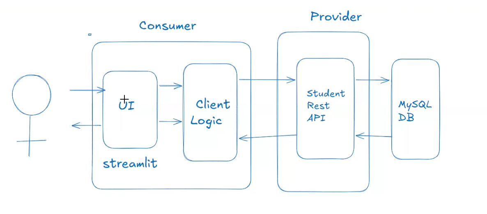
---
## **What is Streamlit?**
---

**Streamlit is a Python framework used to create web applications very easily.**

**In Gen AI projects, Streamlit is commonly used to create simple UIs for:**

    1) AI Chatbot

    2) Code Generator

    3) Text Summarizer

    4) Resume Analyzer

    5) Image Generation

**Streamlit is very useful for Python developers because we can create a UI without learning HTML, CSS, or JavaScript.**

---
## **Why Streamlit**
---

Streamlit is useful because:

    1) Easy to learn

    2) Less code required

    3) Good for AI/ML/GenAI project demos

    4) No frontend knowledge required

    5) Automatic refresh when UI code changes

    6) Good for classroom demos and mini projects

---
## **Install Streamlit**
---

=> We need to install this using pip command

$ pip install streamlit

---
requirements.txt
streamlit

Commands:
go to the folder
python -m venv .venv
.venv\Scripts\activate
pip install -r requirements.txt

```python
import streamlit as st

st.title("Welcome to Streamlit")

st.write("This is my First Streamlit UI Application")

st.header("Course Details")

st.subheader("Streamlit UI")

st.markdown("### This is markdown text")

name = st.text_input("Enter Student Name")
email = st.text_input("Enter Student Email")
course = st.selectbox(
    "Select Course",
    ["JAVA", "Python", "DevOps", "AI & ML"]
)

uploaded_file = st.file_uploader(
    "Upload Your Resume :",
    type=["pdf", "docx"]
)

if st.button("Submit"):
    st.write("Given Name: ", name)
    st.write("Given Email: ", email)
    st.write("Selected Course: ", course)

if uploaded_file is not None:
    st.success("File uploaded successfully")
    st.write("File Name:", uploaded_file.name)

Run the application:
streamlit run app.py

```
---
## **Important Streamlit Functions**
---

1) st.title() : Display page title

2) st.write() : Displays text/data

3) st.text_input() : Takes single-line input using a textbox

4) st.text_area() : Takes multi-line input

5) st.button() : Creates a button

6) st.selectbox() : Creates a dropdown

7) st.file_uploader() : Upload files

8) st.chat_input() : Creates chatbot input box

9) st.spinner() : Shows loading message

---
D:\AIT NOTES\Student-Crud-API
D:\AIT NOTES\Student-Crud-UI

---
---
## **What is NumPy?**
---

**NumPy stands for Numerical Python.**

**NumPy is a Python library used for numerical and scientific calculations.**

**NumPy is mainly used to work with arrays.**

**Array means collection of values.**

**NumPy arrays are faster than normal Python lists.**

---
## **Why NumPy?**
---

NumPy is used for:

1) Working with large data

2) Mathematical calculations

3) Scientific calculations

4) Data Analysis

5) Machine Learning

6) Deep Learning

7) Matrix operations

8) Statistical operations

---
## **NumPy Installation**
---

NumPy is an external library.

We need to install it using pip.

Command:

pip install numpy

---
## **What is NumPy Array?**
---

**NumPy array is a special data structure used to store multiple values.**

**It is similar to a list, but faster and more powerful.**

**List**

    -- List is a built-in data structure.
    -- List can store different data types.
    -- List is slower for numerical operations.
    -- List does not support direct math operations.

**NumPy Array**

    -- NumPy array comes from the NumPy library.
    -- NumPy array usually stores the same type of data.
    -- NumPy array is faster.
    -- NumPy array supports direct mathematical operations.

```python
import numpy as np

arr = np.array([10, 20, 30])

print(arr)
    [10 20 30]**
print(arr * 2)
    [20 40 60]**
list_data = [10, 20, 30]

print(list_data * 2)
    [10, 20, 30, 10, 20, 30]**
```
---
ndim  : Used to check the number of dimensions of an array.

shape : Used to check the rows and columns of an array.

size  : Used to check the total number of elements in an array.

dtype : Used to check the data type of array elements.
---

```python
import numpy as np

arr1 = np.array([10, 20, 30])

arr2 = np.array([
    [10, 20, 30],
    [40, 50, 60]
])

arr3 = np.array([
    [[10, 20], [30, 40]],
    [[50, 60], [70, 80]]
])

print(arr1.ndim)
    1**
print(arr2.ndim)
    2**
print(arr3.ndim)
    3**
print(arr2.shape)
# (2, 3)
print(arr2.size)
    6**
print(arr2.dtype)
# int64
arr4 = np.array([10, 20, 30, 40, 50, 60], dtype=float)

print(arr4)
    [10. 20. 30. 40. 50. 60.]**
print(arr4[0])
    10.0**
print(arr4[-1])
    60.0**
print(arr2[0, 0])
    10**
print(arr4[0:4])
    [10. 20. 30. 40.]**
```
---
zeros()  : Creates an array with all zero values.

ones()   : Creates an array with all one values.

full()   : Creates an array with the same specified value.

arange() : Creates an array with a range of values.

NumPy has a random module to generate random numbers.

randint() : Generates random integer numbers based on a given range and size.

rand() : Generates random decimal values between 0 and 1 based on the given size.

---

```python
import numpy as np

arr = np.zeros(5)
print(arr)
    [0. 0. 0. 0. 0.]**
arr = np.zeros((2, 3))
print(arr)
    [[0. 0. 0.]**
    [0. 0. 0.]]**
arr = np.ones(5)
print(arr)
    [1. 1. 1. 1. 1.]**
arr = np.ones((2, 3))
print(arr)
    [[1. 1. 1.]**
    [1. 1. 1.]]**
arr = np.full(5, 10)
print(arr)
    [10 10 10 10 10]**
arr = np.full((2, 3), 8)
print(arr)
    [[8 8 8]**
    [8 8 8]]**
arr = np.arange(1, 11)
print(arr)
    [ 1  2  3  4  5  6  7  8  9 10]**
arr = np.arange(1, 11, 2)
print(arr)
    [1 3 5 7 9]**
arr = np.arange(1, 13, 2).reshape(2, 3)
print(arr)
    [[ 1  3  5]**
    [ 7  9 11]]**
arr = np.random.randint(1, 9, 5)
print(arr)
# Example: [4 7 2 8 1]
# Output changes every time.
arr = np.random.rand(5)
print(arr)
# Example: [0.42 0.87 0.15 0.63 0.09]
# Output changes every time.
```
---
# **reshape() is used to change the array shape.**
```python
arr = np.arange(1, 13, 2)

arr = arr.reshape(2, 3)

print(arr)
    [[ 1  3  5]**
    [ 7  9 11]]**
# flatten() converts a multi-dimensional array into a 1D array.
arr = arr.flatten()

print(arr)
    [ 1  3  5  7  9 11]**
```
---

```python
import numpy as np

# NumPy supports direct mathematical operations on arrays.
arr = np.array([10, 20, 30])

print(arr + 5)
    [15 25 35]**
print(arr - 5)
    [ 5 15 25]**
print(arr * 2)
    [20 40 60]**
print(arr / 2)
    [ 5. 10. 15.]**
# Array-to-array operations
a = np.array([10, 20, 30])
b = np.array([1, 2, 3])

print(a + b)
    [11 22 33]**
print(a - b)
    [ 9 18 27]**
print(a * b)
    [10 40 90]**
print(a / b)
    [10. 10. 10.]**
```
---
NumPy statistical functions:

1) sum()    : Returns the total of all values.
2) mean()   : Returns the average value.
3) median() : Returns the middle value.
4) min()    : Returns the minimum value.
5) max()    : Returns the maximum value.
6) std() :Returns the standard deviation.
 Measures how much the data values are spread out from the mean (average).
7) var() :Returns the variance. Measures how far the values are spread from the mean, but instead of averaging the distances, it averages the squared distances.
```python
import numpy as np

arr = np.array([10, 20, 30, 40, 50])

print(np.sum(arr))
    150**
print(np.mean(arr))
    30.0**
print(np.median(arr))
    30.0**
print(np.min(arr))
    10**
print(np.max(arr))
    50**
print(np.std(arr))
    14.142135623730951**
print(np.var(arr))
    200.0**
```
---
explanation:
For this array:
arr = np.array([10, 20, 30, 40, 50])
Mean:
(10 + 20 + 30 + 40 + 50) / 5
= 150 / 5
= 30
Variance (var) measures how far values are from the mean.
Value   Difference from mean   Squared difference

10      10 - 30 = -20         (-20)² = 400
20      20 - 30 = -10         (-10)² = 100
30      30 - 30 = 0           0² = 0
40      40 - 30 = 10          10² = 100
50      50 - 30 = 20          20² = 400
```python
Variance = (400 + 100 + 0 + 100 + 400) / 5
         = 1000 / 5
         = 200
Standard deviation (std) is the square root of variance:
Standard deviation = √200
                   = 14.142135623730951
print(np.var(arr))
    200.0**
print(np.std(arr))
    14.142135623730951**
```
---
```python
import numpy as np

classA = np.array([48, 49, 50, 51, 52])  # Mean is 50
classB = np.array([20, 40, 50, 60, 80])

print(np.mean(classA))
    50.0**
print(np.mean(classB))
    50.0**
print(np.std(classA))
    1.4142135623730951**
print(np.std(classB))
    19.493588689617926**
Both classes have the same average (50), but Class A’s values are close to the mean, so its standard deviation is low. Class B’s values are more spread out, so its standard deviation is high.

```
---
```python
import numpy as np

p1_stock_returns = [10, 11, 9, 10, 10]
p2_stock_returns = [2, 20, -5, 25, 8]

print(np.mean(p1_stock_returns))
    10.0**
print(np.mean(p2_stock_returns))
    10.0**
print(np.std(p1_stock_returns))
    0.6324555320336759**
print(np.std(p2_stock_returns))
    11.117553...**
Both portfolios have the same average return (10), but Portfolio 1 is more stable because its standard deviation is low. Portfolio 2 has greater risk because its returns vary more.
```
---
**Variance and Standard Deviation are used to measure how much data varies from its average.**

**Standard deviation is preferred because it is in the same units as the original data, making it easier to interpret.**

**In real-world projects, they help identify consistency, detect anomalies, measure risk, monitor quality, and prepare data for machine learning models.**
---
copy() changes do not affect arr1.
view() changes affect both arr1 and arr2.
# **view() : view() creates a view of the original array.**
Note: Changes in a view can affect the original array.

```python
import numpy as np

# copy() creates a separate copy of an array.
arr1 = np.array([10, 20, 30])
arr2 = arr1.copy()

arr2[0] = 100

print(arr1)
    [10 20 30]**
print(arr2)
    [100  20  30]**
# view() shares the same data with the original array.
arr1 = np.array([10, 20, 30])
arr2 = arr1.view()

arr2[0] = 300

print(arr1)
    [300  20  30]**
print(arr2)
    [300  20  30]**
```
---

```python
import numpy as np

# Boolean indexing is used to filter data based on a condition.
arr = np.array([10, 20, 30, 40, 50])

result = arr[arr > 25]

print(result)
    [30 40 50]**
arr = np.array([1, 2, 3, 4, 5, 6])

even_numbers = arr[arr % 2 == 0]

print(even_numbers)
    [2 4 6]**
arr = np.array([40, 10, 30, 20])

result = np.sort(arr)

print(result)
    [10 20 30 40]**
```
---
---
## **Important Points**
---

**NumPy stands for Numerical Python.**

**NumPy is used for numerical calculations.**

**NumPy is mainly used for arrays.**

**NumPy arrays are faster than Python lists.**

**NumPy is an external library.**

**Install NumPy using: pip install numpy**

**np.array() creates a NumPy array.**

**ndim gives the number of dimensions.**

**shape gives rows and columns.**

**size gives the total number of elements.**

**dtype gives the data type of elements.**

**NumPy supports indexing and slicing.**

**zeros() creates an array with zeros.**

**ones() creates an array with ones.**

**full() creates an array with the same value.**

**arange() creates a range-based array.**

**reshape() changes the array shape.**

**flatten() converts a multi-dimensional array into 1D.**

**NumPy supports direct mathematical operations.**

**Boolean indexing is used for filtering.**

**copy() creates a separate copy.**

**view() creates a reference/view of original data.**

**NumPy is useful for Data Science, Machine Learning, and AI.**

---

---
## **What is Pandas?**
---

**Pandas is a Python library used for data analysis and data manipulation.**

**Pandas is mainly used to work with structured data.**

**Structured data means data stored in rows and columns.**

Examples:

1) Student marks data
2) Employee salary data
3) Sales data
4) Course enrollment data
5) CSV files
6) Excel files

---
## **Why Pandas?**
---

Pandas is used for:

**Reading data**
**Writing data**
**Cleaning data**
**Filtering data**
**Sorting data**
**Grouping data**
**Analyzing data**
**Working with CSV files**
**Working with Excel files**
**Handling missing values**

---
## **Pandas Installation**
---

Pandas is an external library.

Install it using pip:

pip install pandas

---
## **Main Data Structures in Pandas**
---

1) Series
2) DataFrame

---
## **What is Series?**
---

=> Series is a one-dimensional data structure in Pandas.

=> It is like a single column.

```python
import pandas as pd

# Series is a one-dimensional data structure in Pandas.
# It is like a single column.
marks = pd.Series([80, 90, 75, 60])

print(marks)
    0    80**
    1    90**
    2    75**
    3    60**
# dtype: int64
```
---
## **What is DataFrame?**
---

**DataFrame is a two-dimensional data structure in Pandas.**

**It stores data in rows and columns.**

**It is like an Excel sheet or database table.**

```python
import pandas as pd

# DataFrame is a two-dimensional data structure in Pandas.
# It stores data in rows and columns.
# It is like an Excel sheet or database table.
students = {
    "name": ["Ravi", "Sita", "Kiran"],
    "course": ["Python", "Java", "DevOps"],
    "marks": [80, 90, 75]
}

df = pd.DataFrame(students)

print(df)

# name  course  marks
# 0   Ravi  Python     80
# 1   Sita    Java     90
# 2  Kiran  DevOps     75
```
---

---
## **Difference Between Series and DataFrame**
---

**Series:**

    -- One-dimensional data
    -- Like a single column
    -- Created using pd.Series()

**DataFrame:**

    -- Two-dimensional data
    -- Rows and columns
    -- Like an Excel sheet or DB table
    -- Created using pd.DataFrame()
---
```python
import pandas as pd

# Create a Series with a custom index
courses = pd.Series(
    ["Python", "JAVA", "DevOps"],
    index=["C1", "C2", "C3"]
)

print(courses)

# C1    Python
# C2      JAVA
# C3    DevOps
# dtype: object
print(courses["C1"])
# Python
courses.to_csv("data.csv")
# to export data to data.csv file
```
---

---
## **Write DataFrame to CSV File**
---

**to_csv() function is used to write DataFrame data into a CSV file.**
```python
import pandas as pd

students = {
    "name": ["Ravi", "Sita", "Kiran"],
    "course": ["Python", "Java", "DevOps"],
    "marks": [80, 90, 75]
}

df = pd.DataFrame(students)

df.to_csv("students.csv", index=False)

print("CSV file created successfully")

```
---
## **Reading Data From CSV File**
---

**CSV means Comma Separated Values.**

**Pandas can read CSV files using read_csv().**

```python
import pandas as pd

df = pd.read_csv("students.csv")

print(df)

```
---
## **Working with Excel**
---

=> Install "openpyxl" to work with Excel files using Pandas.

pip install openpyxl

=> To work with Excel, we have the following functions:

1) to_excel()

2) read_excel()

```python
import pandas as pd

students = {
    "name": ["Ravi", "Sita", "Kiran"],
    "course": ["Python", "Java", "DevOps"],
    "marks": [80, 90, 75]
}

df = pd.DataFrame(students)

df.to_excel("Students.xlsx", index=False)

print("--------Excel Created Successfully--------")

df = pd.read_excel("Students.xlsx")

print(df)

```
---
## **Important Functions and Attributes**
---

1) head() : Displays the first 5 rows by default.

2) tail() : Displays the last 5 rows by default.

3) info() : Displays DataFrame information:

    -- Number of rows
    -- Number of columns
    -- Column names
    -- Data types
    -- Non-null values

4) describe() : Gives a statistical summary for numeric columns.
Note: use df.info() directly. print(df.info()) also prints None after the information.

```python
import pandas as pd

df.info()

print(df.shape)

print(df.columns)

print(df.dtypes)

print(df.describe())

Explanation:
commands show details about a Pandas DataFrame df.
df.info()
Shows a summary of the DataFrame:
- Number of rows
- Column names
- Data types
- Non-null values
- Memory usage
print(df.shape)
Shows the DataFrame size as:
# (number_of_rows, number_of_columns)
Example:
# (3, 3)
print(df.columns)
Shows all column names.
Example:
# Index(['name', 'course', 'marks'], dtype='object')
print(df.dtypes)
Shows the data type of every column.
Example:
# name      object
# course    object
# marks      int64
# dtype: object
print(df.describe())
Shows statistics for numeric columns, such as:
- count — number of values
- mean — average
- std — standard deviation
- min — smallest value
- 25%, 50%, 75% — percentile values
- max — largest value

```
---
```python
import pandas as pd

employees = {
    "EmpId": [101, 102, 103, 104, 105, 106],
    "Name": ["Ravi", "Sita", "Kiran", "Rahul", "Priya", "Anil"],
    "Department": ["IT", "HR", "IT", "Sales", "HR", "IT"],
    "Salary": [50000, 45000, 70000, 40000, 48000, 65000],
    "Experience": [2, 5, 8, 1, 4, 7]
}

df = pd.DataFrame(employees)

print(df)
# EmpId   Name Department  Salary  Experience
# 0    101   Ravi         IT   50000           2
# 1    102   Sita         HR   45000           5
# 2    103  Kiran         IT   70000           8
# 3    104  Rahul      Sales   40000           1
# 4    105  Priya         HR   48000           4
# 5    106   Anil         IT   65000           7
print(df.head(3))
# EmpId   Name Department  Salary  Experience
# 0    101   Ravi         IT   50000           2
# 1    102   Sita         HR   45000           5
# 2    103  Kiran         IT   70000           8
print(df.tail(3))
# EmpId   Name Department  Salary  Experience
# 3    104  Rahul      Sales   40000           1
# 4    105  Priya         HR   48000           4
# 5    106   Anil         IT   65000           7
print(df["Name"])
# 0     Ravi
# 1     Sita
# 2    Kiran
# 3    Rahul
# 4    Priya
# 5     Anil
# Name: Name, dtype: object
print(df[["Name", "Salary"]])
# Name  Salary
# 0   Ravi   50000
# 1   Sita   45000
# 2  Kiran   70000
# 3  Rahul   40000
# 4  Priya   48000
# 5   Anil   65000
print(df[df["Salary"] > 50000])
# EmpId   Name Department  Salary  Experience
# 2    103  Kiran         IT   70000           8
# 5    106   Anil         IT   65000           7
print(df[df["Department"] == "IT"])
# EmpId   Name Department  Salary  Experience
# 0    101   Ravi         IT   50000           2
# 2    103  Kiran         IT   70000           8
# 5    106   Anil         IT   65000           7
print(df[(df["Department"] == "IT") & (df["Salary"] > 60000)])
# EmpId   Name Department  Salary  Experience
# 2    103  Kiran         IT   70000           8
# 5    106   Anil         IT   65000           7
print(df[(df["Department"] == "IT") | (df["Salary"] > 60000)])
# EmpId   Name Department  Salary  Experience
# 0    101   Ravi         IT   50000           2
# 2    103  Kiran         IT   70000           8
# 5    106   Anil         IT   65000           7
print(df.sort_values("Salary"))
# EmpId   Name Department  Salary  Experience
# 3    104  Rahul      Sales   40000           1
# 1    102   Sita         HR   45000           5
# 4    105  Priya         HR   48000           4
# 0    101   Ravi         IT   50000           2
# 5    106   Anil         IT   65000           7
# 2    103  Kiran         IT   70000           8
print(df.sort_values(by="Salary", ascending=False))
# EmpId   Name Department  Salary  Experience
# 2    103  Kiran         IT   70000           8
# 5    106   Anil         IT   65000           7
# 0    101   Ravi         IT   50000           2
# 4    105  Priya         HR   48000           4
# 1    102   Sita         HR   45000           5
# 3    104  Rahul      Sales   40000           1
print(df.sort_values(["Department", "Salary"]))
# EmpId   Name Department  Salary  Experience
# 1    102   Sita         HR   45000           5
# 4    105  Priya         HR   48000           4
# 0    101   Ravi         IT   50000           2
# 5    106   Anil         IT   65000           7
# 2    103  Kiran         IT   70000           8
# 3    104  Rahul      Sales   40000           1
df["Bonus"] = df["Salary"] * 0.10

print(df)
# EmpId   Name Department  Salary  Experience   Bonus
# 0    101   Ravi         IT   50000           2  5000.0
# 1    102   Sita         HR   45000           5  4500.0
# 2    103  Kiran         IT   70000           8  7000.0
# 3    104  Rahul      Sales   40000           1  4000.0
# 4    105  Priya         HR   48000           4  4800.0
# 5    106   Anil         IT   65000           7  6500.0
df["Total Salary"] = df["Salary"] + df["Bonus"]

print(df)
# EmpId   Name Department  Salary  Experience   Bonus  Total Salary
# 0    101   Ravi         IT   50000           2  5000.0       55000.0
# 1    102   Sita         HR   45000           5  4500.0       49500.0
# 2    103  Kiran         IT   70000           8  7000.0       77000.0
# 3    104  Rahul      Sales   40000           1  4000.0       44000.0
# 4    105  Priya         HR   48000           4  4800.0       52800.0
# 5    106   Anil         IT   65000           7  6500.0       71500.0
df.drop(columns=["Bonus"], inplace=True)

print(df)
# EmpId   Name Department  Salary  Experience  Total Salary
# 0    101   Ravi         IT   50000           2       55000.0
# 1    102   Sita         HR   45000           5       49500.0
# 2    103  Kiran         IT   70000           8       77000.0
# 3    104  Rahul      Sales   40000           1       44000.0
# 4    105  Priya         HR   48000           4       52800.0
# 5    106   Anil         IT   65000           7       71500.0
print(df.groupby("Department")["Salary"].mean())
# Department
# HR       46500.000000
# IT       61666.666667
# Sales    40000.000000
# Name: Salary, dtype: float64
print(df.groupby("Department")["Salary"].max())
# Department
# HR       48000
# IT       70000
# Sales    40000
# Name: Salary, dtype: int64
print(df.groupby("Department")["Salary"].min())
# Department
# HR       45000
# IT       50000
# Sales    40000
# Name: Salary, dtype: int64
print(df.groupby("Department")["Salary"].sum())
# Department
# HR        93000
# IT       185000
# Sales     40000
# Name: Salary, dtype: int64
print(df["Department"].unique())
    ['IT' 'HR' 'Sales']**
print(df["Department"].nunique())
    3**
employees = {
    "Name": ["Ravi", "Sita", "Kiran", "Rahul"],
    "Salary": [50000, None, 65000, None]
}

df = pd.DataFrame(employees)

print(df)
# Name   Salary
# 0   Ravi  50000.0
# 1   Sita      NaN
# 2  Kiran  65000.0
# 3  Rahul      NaN
print(df.isnull())
# Name  Salary
# 0  False   False
# 1  False    True
# 2  False   False
# 3  False    True
ndf = df.copy()

ndf["Salary"] = ndf["Salary"].fillna(0)

print(ndf)

# Name   Salary
# 0   Ravi  50000.0
# 1   Sita      0.0
# 2  Kiran  65000.0
# 3  Rahul      0.0
# fillna(0) replaces missing values (NaN) in the Salary column with 0.
# This replaces every missing value (NaN) in the Salary column with 0, then prints the updated DataFrame.
```
---
=====================Assignment-1=====================

students = {
    "Name": ["Ravi", "Sita", "Kiran", "Rahul", "Priya"],
    "Course": ["Python", "Java", "Python", "DevOps", "Python"],
    "Marks": [85, 90, 75, 60, 95]
}

df = pd.DataFrame(students)

1) Show only Python students
2) Show students with marks > 80
3) Sort students based on marks
4) Find highest marks
5) Find average marks
6) Count students in each course
7) Add Grade column
8) Save student data into CSV
9) Read the CSV file
10) Store into Excel

---

```python
import pandas as pd

students = {
    "Name": ["Ravi", "Sita", "Kiran", "Rahul", "Priya"],
    "Course": ["Python", "Java", "Python", "DevOps", "Python"],
    "Marks": [85, 90, 75, 60, 95]
}

df = pd.DataFrame(students)

# 1. Show only Python students
print(df[df["Course"] == "Python"])

# 2. Show students with marks greater than 80
print(df[df["Marks"] > 80])

# 3. Sort students based on marks
print(df.sort_values("Marks"))

# 4. Find highest marks
print(df["Marks"].max())
    95**
# 5. Find average marks
print(df["Marks"].mean())
    81.0**
# 6. Count students in each course
print(df["Course"].value_counts())
# Course
# Python    3
# Java      1
# DevOps    1
# 7. Add Grade column
def get_grade(marks):
    if marks >= 90:
        return "A"
    elif marks >= 75:
        return "B"
    elif marks >= 60:
        return "C"
    return "D"

df["Grade"] = df["Marks"].apply(get_grade)

print(df)

# 8. Save student data into a CSV file
df.to_csv("students.csv", index=False)

# 9. Read the CSV file
csv_df = pd.read_csv("students.csv")

print(csv_df)

# 10. Store data into an Excel file
df.to_excel("students.xlsx", index=False)

print("CSV and Excel files created successfully")
To create the Excel file, install this once:
pip install openpyxl

```
---

---
## **What is Matplotlib?**
---

**Matplotlib is a Python library used for data visualization.**

**Data visualization means representing data using charts and graphs.**

**Matplotlib is mainly used to create:**

1) Line charts

2) Bar charts

3) Pie charts

4) Scatter plots

5) Histograms

---
## **Why Matplotlib?**
---

**Matplotlib is used for:**

1) Visualizing data

2) Understanding data easily

3) Comparing values

4) Finding trends

5) Finding patterns

6) Creating reports

7) Data analysis

---

```python
import matplotlib.pyplot as plt

months = ["Jan", "Feb", "Mar", "Apr"]
sales = [10000, 15000, 12000, 18000]

plt.plot(months, sales)

plt.show()
```
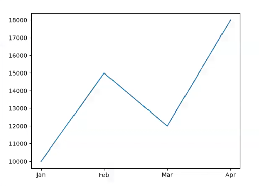
---
```python
import matplotlib.pyplot as plt

months = ["Jan", "Feb", "Mar", "Apr"]
sales = [10000, 15000, 12000, 18000]

plt.plot(
    months,
    sales,
    marker="o",
    linestyle="--",
    color="blue"
)

plt.title("Sales by Month")
plt.xlabel("Month")
plt.ylabel("Sales")

plt.show()
```

---
```python
import matplotlib.pyplot as plt

courses = ["Python", "Java", "DevOps", "AWS"]
students = [50, 40, 30, 35]

plt.barh(courses, students)

plt.title("Course Enrollment Report")
plt.xlabel("Course")
plt.ylabel("Students Count")

plt.show()
```
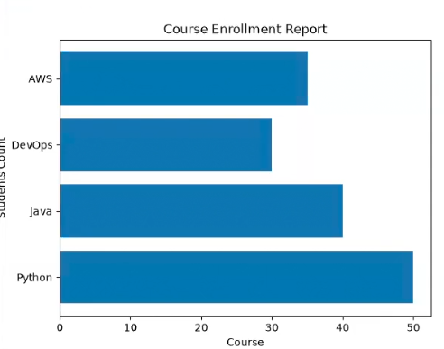

---
```python
import matplotlib.pyplot as plt

courses = ["Python", "Java", "DevOps", "AWS"]
students = [50, 40, 30, 35]

plt.bar(courses, students)

plt.title("Course Enrollment Report")
plt.xlabel("Course")
plt.ylabel("Students Count")

plt.show()
```
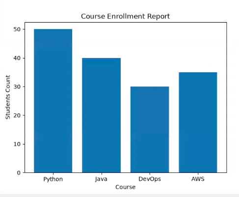

---
```python
import matplotlib.pyplot as plt

courses = ["Python", "Java", "DevOps", "AWS"]
students = [50, 40, 30, 35]

plt.pie(
    students,
    labels=courses,
    autopct="%1.1f%%"
)

plt.title("Course Enrollment Share")

plt.show()
```
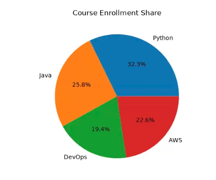
---
```python
import matplotlib.pyplot as plt

study_hours = [1, 2, 3, 4, 5]
marks = [35, 45, 60, 75, 90]

plt.scatter(study_hours, marks)

plt.title("Study Hours vs Marks")
plt.xlabel("Study Hours")
plt.ylabel("Marks")

plt.show()
```
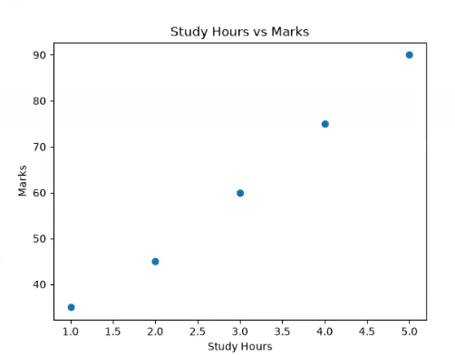
---
```python
import matplotlib.pyplot as plt

marks = [35, 45, 50, 60, 65, 70, 75, 80, 85, 90, 95]

plt.hist(marks)

plt.title("Marks Distribution")
plt.xlabel("Marks")
plt.ylabel("Number of Students")

plt.show()
```

---
```python
import matplotlib.pyplot as plt

months = ["Jan", "Feb", "Mar", "Apr"]

python_sales = [10000, 15000, 12000, 18000]
java_sales = [8000, 12000, 10000, 14000]

plt.plot(months, python_sales, marker="o", label="Python")
plt.plot(months, java_sales, marker="o", label="Java")

plt.title("Course Sales Comparison")
plt.xlabel("Months")
plt.ylabel("Sales")

plt.legend()

plt.show()
```
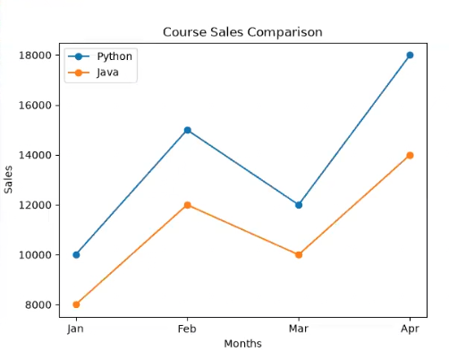
---
---
## **Important Points**
---

**Matplotlib is used for data visualization.**

**Data visualization means representing data using charts.**

**Matplotlib is an external library.**

**Install Matplotlib using: pip install matplotlib**

**pyplot is a commonly used module in Matplotlib.**

**Import pyplot using:**

```python
import matplotlib.pyplot as plt

**plot() creates a line chart.**

**bar() creates a bar chart.**

**barh() creates a horizontal bar chart.**

**pie() creates a pie chart.**

**scatter() creates a scatter plot.**

**hist() creates a histogram.**

**show() displays the chart.**

**title() adds a chart title.**

**xlabel() adds an x-axis label.**

**ylabel() adds a y-axis label.**

**legend() displays labels.**

**grid() displays grid lines.**

**Matplotlib is useful for Data Science, Machine Learning, and reports.**

```
---
